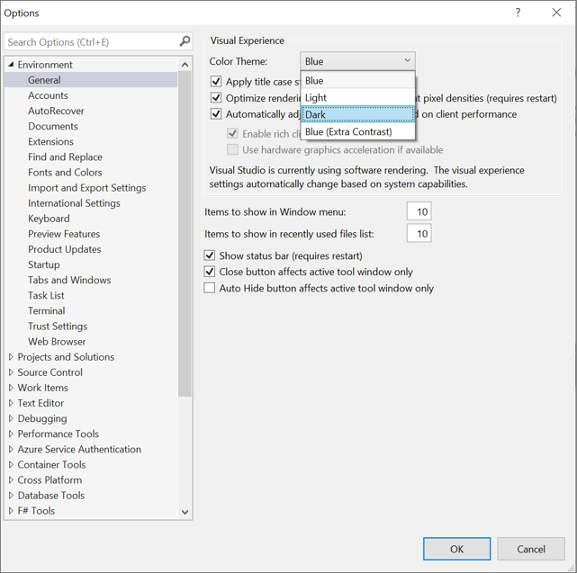

# How to: Change fonts, colors, and themes in Visual Studio

You can change the fonts and the colors in Visual Studio in many ways. For example, you can change the default blue color theme to the dark theme (also referred to as "dark mode"). You can also select a extra-contrast theme if that best suits your needs. And, you can change the default font and text size in both the IDE and the code editor.

## Change the color theme

Here's how to change the color theme of the IDE frame and the tool windows in Visual Studio.

1. On the menu bar, choose **Tools** > **Options**.

1. In the options list, choose **Environment** > **General**.

1. In the **Color theme** list, choose either the default **Blue** theme, the **Light** theme, the **Dark** theme, or the **Blue (Extra Contrast)** theme.

   

    > [!NOTE]
    > When you change a color theme, text in the IDE reverts to the default or previously customized fonts and sizes for that theme.

    :::moniker range="vs-2017"

    > [!TIP]
    > You can create and edit your own Visual Studio themes by installing the [Color Theme Editor for Visual Studio 2017](https://marketplace.visualstudio.com/items?itemName=VisualStudioPlatformTeam.VisualStudio2017ColorThemeEditor).

    :::moniker-end

    :::moniker range="vs-2019"

    > [!TIP]
    > You can create and edit your own Visual Studio themes by installing the [Visual Studio Color Theme Designer](https://marketplace.visualstudio.com/items?itemName=ms-madsk.ColorThemeDesigner).

    :::moniker-end

## Change fonts and text size

You can change the font and text size for all the IDE frame and tool windows, or for only certain windows or text elements. You can also change the font and text size in the editor, too.

### To change the font and text size in the IDE

1. On the menu bar, choose **Tools** > **Options**.

1. In the options list, choose **Environment** > **Fonts and Colors**.

1. In the **Show settings for** list, choose **Environment**.

   

    > [!NOTE]
    > If you want to change the font for tool windows only, in the **Show settings for** list, choose **All Text Tool Windows**.

1. Modify the **Font** and **Size** options to change the font and text size for the IDE.

1. Select the appropriate item in **Display items**, and then modify the **Item foreground** and **Item background** options.

### To change the font and text size in the editor

1. On the menu bar, choose **Tools** > **Options**.

1. In the options list, choose **Environment** > **Fonts and Colors**.

1. In **Show settings for** list, select **Text Editor**.

   

1. Modify the **Font** and **Size** options to change the font and text size for the editor.

1. Select the appropriate item in **Display items**, and then modify the **Item foreground** and **Item background** options.

For more information, see the [Change fonts and colors for the editor](../ide/reference/how-to-change-fonts-and-colors-in-the-editor.md) page.

## Accessibility options

There are color theme options for you if you experience low vision. You can use a high-contrast option for *all* the apps and UI on a computer, or an extra contrast option for Visual Studio only.

### Use Windows high contrast

Use either of the following procedures to toggle the Windows high contrast option:

- In Windows or in any Microsoft application, press the **Left Alt**+**Left Shift**+**PrtScn** keys.

- In Windows, choose **Start** > **Settings** > **Ease of Access** > **High contrast**.

    > [!WARNING]
    > The Windows high contrast setting affects all applications and UI on the computer.

### Use Visual Studio extra contrast

Use the following procedures to toggle the Visual Studio extra contrast option:

1. On the menu bar in Visual Studio, choose **Tools** > **Options**, and then, in the options list, choose **Environment** > **General**.

1. In the **Color theme** drop-down list, choose the **Blue (Extra Contrast)** theme, and then choose **OK**.

To learn more about other Visual Studio accessibility options available to you, see the [Accessibility features of Visual Studio](../ide/reference/accessibility-features-of-visual-studio.md) page.

> [!TIP]
> If there is an accessibility option for colors or fonts that you think might be useful but isn't currently available in Visual Studio, please let us know by selecting **Suggest a feature** in the [Visual Studio Developer Community](https://aka.ms/feedback/suggest?space=8). For more information about this forum and how it works, see the [Suggest a feature](../ide/suggest-a-feature.md) page.

## Next steps

To learn more details about all the user interface (UI) elements for which you can change font and color schemes, see the [Fonts and Colors, Environment, Options Dialog Box](../ide/reference/fonts-and-colors-environment-options-dialog-box.md) page.

## See also

- [How to: Change fonts and colors for the editor in Visual Studio](../ide/reference/how-to-change-fonts-and-colors-in-the-editor.md)
- [Features of the Visual Studio code editor](../ide/writing-code-in-the-code-and-text-editor.md)
- [Personalize the Visual Studio IDE and the editor](../ide/quickstart-personalize-the-ide.md)
