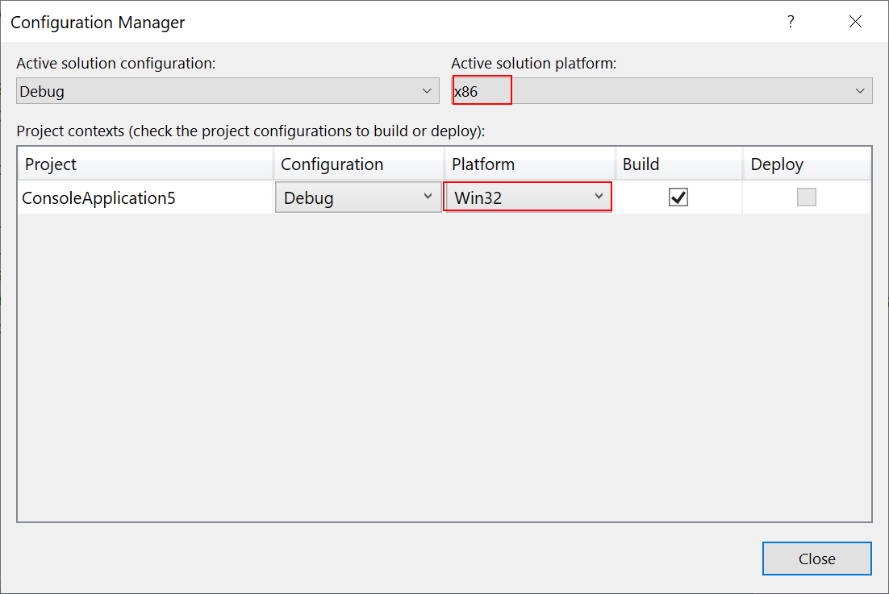

# How to: Configure projects to target platforms

 [!INCLUDE [Visual Studio](~/includes/applies-to-version/vs-windows-only.md)]

Visual Studio enables you to set up your application builds to target different platforms, including 64-bit platforms. For more information on 64-bit platform support in Visual Studio, see [64-bit applications](/dotnet/framework/64-bit-apps).

::: moniker range="vs-2022"
> [!NOTE]
> Visual Studio 2022 runs as a 64-bit application. This is totally separate from the platforms you can target for your projects in Visual Studio. You can use any version of Visual Studio to target both 32-bit and 64-bit platforms.
::: moniker-end
::: moniker range="<=vs-2019"
> [!NOTE]
> Visual Studio runs as a 32-bit application. This is totally separate from the platforms you can target for your projects in Visual Studio. You can use any version of Visual Studio to target both 32-bit and 64-bit platforms.
::: moniker-end

## Target platforms with the Configuration Manager

The **Configuration Manager** provides a way for you to quickly add a new platform to target with your project. If you select one of the platforms included with Visual Studio, the properties for your project are modified to build your project for the selected platform.

### To configure a project to target a 64-bit platform

1. On the menu bar, choose **Build** > **Configuration Manager**.

2. In the **Active solution platform** list, choose a 64-bit platform for the solution to target, and then choose the **Close** button.

    1. If the platform that you want doesn't appear in the **Active solution platform** list, choose **New**.

         The **New Solution Platform** dialog box appears.

    2. In the **Type or select the new platform** list, choose **x64**.

        > [!NOTE]
        > If you give your configuration a new name, you may have to modify the settings in the **Project Designer** to target the correct platform.

    3. If you want to copy the settings from a current platform configuration, choose it, and then choose the **OK** button.

The properties for all projects in your solution that target the 64-bit platform are updated, and the next build of the project will be optimized for 64-bit platforms.

> [!NOTE]
> The **Win32** platform name is used for C++ projects, and it means **x86**. Visual Studio considers both project-level platforms and solution-level platforms, and the project platforms come from the language-specific project systems. C++ projects use **Win32** and **x64**, but the solution platforms use **x86** and **x64**. When you choose **x86** as the solution configuration, Visual Studio selects the **Win32** platform for C++ projects. To see both project-level platform and solution-level platform settings, open **Configuration Manager** and note the two platform settings. The solution-level platform is shown in the **Active solution platform** dropdown, and the table shows the project-level platform for each project.
> 

## Target platforms in the Project Designer

The **Project Designer** also provides a way to target different platforms with your project. If selecting one of the platforms included in the list in the **New Solution Platform** dialog box does not work for your solution, you can create a custom configuration name and modify the settings in the **Project Designer** to target the correct platform.

Performing this task varies based on the programming language you are using. See the following links for more information:

- For Visual Basic projects, see [/platform (Visual Basic)](/dotnet/visual-basic/reference/command-line-compiler/platform).

- For C# projects, see [Build page, Project Designer (C#)](../ide/reference/build-page-project-designer-csharp.md).

- For C++/CLI projects, see [/clr (Common Language Runtime compilation)](/cpp/build/reference/clr-common-language-runtime-compilation).

## Manually editing the project file

Sometimes, you need to manually edit the project file for some custom configuration. An example is when you have conditions that can't be specified in the IDE, such as a reference that is different for two different platforms, as in the following example.

### Example: Referencing x86 and x64 assemblies and DLLs

You might have a .NET assembly or DLL that has both x86 and x64 versions. To set up your project to use these references, first add the reference, and then open the project file and edit it to add an `ItemGroup` with a condition that references both the configuration, and the target platform.  For example, suppose the binary you are referencing is ClassLibrary1 and there are different paths for Debug and Release configurations, as well as x86 and x64 versions.  Then, use four `ItemGroup` elements with all combinations of settings, as follows:

```xml
<Project Sdk="Microsoft.NET.Sdk">

  <PropertyGroup>
    <OutputType>Exe</OutputType>
    <TargetFramework>netcoreapp2.0</TargetFramework>
    <Platforms>AnyCPU;x64;x86</Platforms>
  </PropertyGroup>

  <ItemGroup Condition=" '$(Configuration)|$(Platform)' == 'Debug|x64'">
    <Reference Include="ClassLibrary1">
      <HintPath>..\..\ClassLibrary1\ClassLibrary1\bin\x64\Debug\netstandard2.0\ClassLibrary1.dll</HintPath>
    </Reference>
  </ItemGroup>

  <ItemGroup Condition=" '$(Configuration)|$(Platform)' == 'Release|x64'">
    <Reference Include="ClassLibrary1">
      <HintPath>..\..\ClassLibrary1\ClassLibrary1\bin\x64\Release\netstandard2.0\ClassLibrary1.dll</HintPath>
    </Reference>
  </ItemGroup>

  <ItemGroup Condition=" '$(Configuration)|$(Platform)' == 'Debug|x86'">
    <Reference Include="ClassLibrary1">
      <HintPath>..\..\ClassLibrary1\ClassLibrary1\bin\x86\Debug\netstandard2.0\ClassLibrary1.dll</HintPath>
    </Reference>
  </ItemGroup>
  
  <ItemGroup Condition=" '$(Configuration)|$(Platform)' == 'Release|x86'">
    <Reference Include="ClassLibrary1">
      <HintPath>..\..\ClassLibrary1\ClassLibrary1\bin\x86\Release\netstandard2.0\ClassLibrary1.dll</HintPath>
    </Reference>
  </ItemGroup>
</Project>
```

::: moniker range="vs-2017"
> [!NOTE]
> In Visual Studio 2017, you need to unload the project before you can edit the project file. To unload the project, right-click on the project node, and choose **Unload project**. When done editing, save your changes and reload the project by right-clicking the project node and choosing **Reload project**.
::: moniker-end

For more information about the project file, see [MSBuild project file schema reference](../msbuild/msbuild-project-file-schema-reference.md).

## See also

- [Understand build platforms](../ide/understanding-build-platforms.md)
- [/platform (C# compiler options)](/dotnet/csharp/language-reference/compiler-options/platform-compiler-option)
- [64-bit applications](/dotnet/framework/64-bit-apps)
- [Visual Studio IDE 64-Bit support](../ide/visual-studio-ide-64-bit-support.md)
- [Understanding the project file](/aspnet/web-forms/overview/deployment/web-deployment-in-the-enterprise/understanding-the-project-file)
