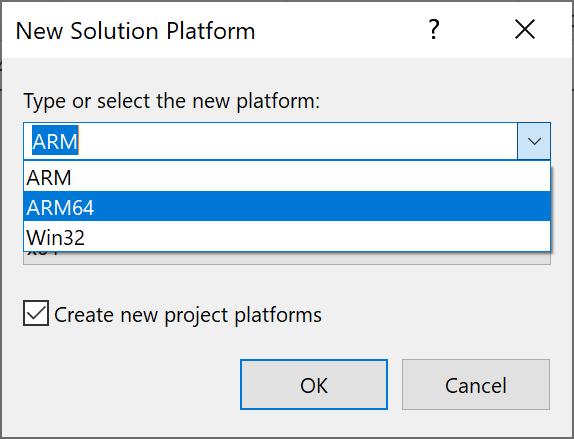
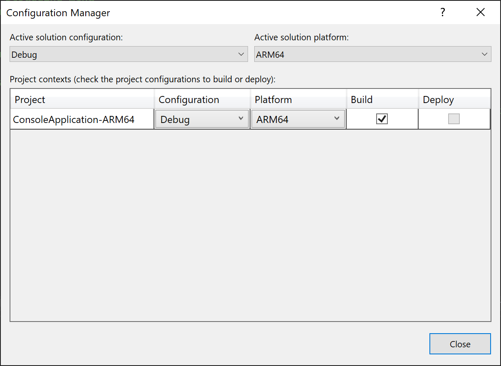

# Configure projects to target platforms

[!INCLUDE [Visual Studio](~/includes/applies-to-version/vs-windows-only.md)]

:::moniker range=">=vs-2022"
Visual Studio enables you to set up your application builds to target different platforms (processor architectures), including Arm64 and other platforms. You don't need to be running Visual Studio on a platform in order to build for that target platform. For more information about Arm64 support in Visual Studio, see [Visual Studio on ARM-powered devices](../install/visual-studio-on-arm-devices.md). For 64-bit platform support for .NET development, see [64-bit applications](/dotnet/framework/64-bit-apps).

> [!NOTE]
> Visual Studio 2022 runs as a 64-bit application. This is totally separate from the platforms you can target for your projects in Visual Studio. You can use any version of Visual Studio to target both 32-bit and 64-bit platforms.
::: moniker-end
::: moniker range="<=vs-2019"
Visual Studio enables you to set up your application builds to target different platforms (processor architectures), such as x86 and x64. For 64-bit platform support for .NET development, see [64-bit applications](/dotnet/framework/64-bit-apps).

> [!NOTE]
> Visual Studio runs as a 32-bit application. This is totally separate from the platforms you can target for your projects in Visual Studio. You can use any version of Visual Studio to target both 32-bit and 64-bit platforms.
::: moniker-end

## Target platforms with the Configuration Manager

The **Configuration Manager** provides a way for you to quickly add a new platform to target with your project. If you select one of the platforms included with Visual Studio, a configuration is set up to build your project for the selected platform.

:::moniker range=">=vs-2022"
To target some platforms in a native C++ project, you need to install the build tools for the platform. C++ build tools for x86, and x64 platforms are installed with the default C++ workload. If you're targeting another processor architecture, like Arm64, you need to use the Visual Studio Installer to install the build tools for the platform before continuing. See [Modify Visual Studio](../install/modify-visual-studio.md). You don't need to run Visual Studio on an Arm64 device to target Arm64. For Arm64, you can install Arm64 build tools or [ARM64EC](/windows/arm/arm64ec) build tools; see [Arm64 Visual Studio](https://devblogs.microsoft.com/visualstudio/arm64-visual-studio/).

For .NET development, .NET 6 or later is required to target the Arm64 platform. See [.NET Support for macOS 11 and Windows 11 for Arm64 and x64](https://github.com/dotnet/sdk/issues/22380).
:::moniker-end

:::moniker range=">=vs-2022"
### To configure a project to target Arm64 and other platforms

1. On the menu bar, choose **Build** > **Configuration Manager**.

1. In the **Active solution platform** list, choose a  platform for the solution to target, and then choose the **Close** button.

    1. If the platform that you want doesn't appear in the **Active solution platform** list, choose **New**. After you install the tools for a particular platform, you'll be able to add the new solution and project configurations targeting that platform.

         The **New Solution Platform** dialog box appears.

    1. In the **Type or select the new platform** list, choose the desired platform (processor architecture); for example, `ARM64`.

        

        > [!NOTE]
        > If you give your configuration a new name, you may have to modify the settings in the **Project Designer** to target the correct platform.

    1. If you want to copy the settings from a current platform configuration, choose it, and then choose the **OK** button.


:::moniker-end
:::moniker range="<=vs-2019"
### To configure a project to target a different platform

1. On the menu bar, choose **Build** > **Configuration Manager**.

1. In the **Active solution platform** list, choose a  platform for the solution to target, and then choose the **Close** button.

    1. If the platform that you want doesn't appear in the **Active solution platform** list, choose **New**. After you install the tools for a particular platform, you'll be able to add the new solution and project configurations targeting that platform.

         The **New Solution Platform** dialog box appears.

    1. In the **Type or select the new platform** list, choose the desired platform (processor architecture); for example, `x64`.

        > [!NOTE]
        > If you give your configuration a new name, you may have to modify the settings in the **Project Designer** to target the correct platform.

    1. If you want to copy the settings from a current platform configuration, choose it, and then choose the **OK** button.

:::moniker-end

> [!NOTE]
> The **Win32** platform name is used for C++ projects, and it means **x86**. Visual Studio considers both project-level platforms and solution-level platforms, and the project platforms come from the language-specific project systems. C++ projects use **Win32** and **x64**, but the solution platforms use **x86** and **x64**. When you choose **x86** as the solution configuration, Visual Studio selects the **Win32** platform for C++ projects. To see both project-level platform and solution-level platform settings, open **Configuration Manager** and note the two platform settings. The solution-level platform is shown in the **Active solution platform** dropdown, and the table shows the project-level platform for each project.
> 

## Target platforms in the Project Designer or Project Properties UI

The **Project Designer** or **Project Properties** UI also provides a way to target different platforms with your project. If selecting one of the platforms included in the list in the **New Solution Platform** dialog box doesn't work for your solution, you can create a custom configuration name and modify the settings in **Project Properties** to target the correct platform.

Performing this task varies based on the programming language you're using. See the following links for more information:

- For Visual Basic projects, see [/platform (Visual Basic)](/dotnet/visual-basic/reference/command-line-compiler/platform).

- For C# projects, see [Build page, Project Designer (C#)](../ide/reference/build-page-project-designer-csharp.md).

### Manually editing the project file

Sometimes, you need to manually edit the project file for some custom configuration. An example is when you have conditions that can't be specified in the IDE, such as a reference that is different for two different platforms, or an assembly that must be registered for a particular platform in order to expose it to COM. The tool that processes the project file is [MSBuild](msbuild.md).

> [!CAUTION]
> Manually editing a C++ project file that you're using in Visual Studio isn't recommended.

## COM registration

In the case where you are building a .NET assembly and exposing it to COM, Visual Studio registers the assembly with a particular platform architecture, since there are different registry locations for each platform. If your assembly already targets a specific platform, then that is used, but if you're registering a .NET assembly that’s built for `Any CPU`, MSBuild defaults to registering it for MSBuild's current runtime. If you specify a different `PlatformTarget`, MSBuild will respect that when registering. There is a property you can set to override this behavior, `RegisterAssemblyMSBuildArchitecture`. You can set `RegisterAssemblyMSBuildArchitecture` to the desired platform architecture (such as `x86` or `x64`) by adding it to a top-level `PropertyGroup` element in the project file.

## Referencing x86 and x64 assemblies and DLLs

You might have a .NET assembly or DLL that has both x86 and x64 versions. To set up your project to use these references, first add the reference, and then open the project file and edit it to add an `ItemGroup` with a condition that references both the configuration, and the target platform.  For example, suppose the binary you're referencing is ClassLibrary1 and there are different paths for Debug and Release configurations, as well as x86 and x64 versions.  Then, use four `ItemGroup` elements with all combinations of settings, as follows:

```xml
<Project Sdk="Microsoft.NET.Sdk">

  <PropertyGroup>
    <OutputType>Exe</OutputType>
    <TargetFramework>netcoreapp2.0</TargetFramework>
    <Platforms>AnyCPU;x64;x86</Platforms>
  </PropertyGroup>

  <ItemGroup Condition=" '$(Configuration)|$(Platform)' == 'Debug|x64'">
    <Reference Include="ClassLibrary1">
      <HintPath>..\..\ClassLibrary1\ClassLibrary1\bin\x64\Debug\netstandard2.0\ClassLibrary1.dll</HintPath>
    </Reference>
  </ItemGroup>

  <ItemGroup Condition=" '$(Configuration)|$(Platform)' == 'Release|x64'">
    <Reference Include="ClassLibrary1">
      <HintPath>..\..\ClassLibrary1\ClassLibrary1\bin\x64\Release\netstandard2.0\ClassLibrary1.dll</HintPath>
    </Reference>
  </ItemGroup>

  <ItemGroup Condition=" '$(Configuration)|$(Platform)' == 'Debug|x86'">
    <Reference Include="ClassLibrary1">
      <HintPath>..\..\ClassLibrary1\ClassLibrary1\bin\x86\Debug\netstandard2.0\ClassLibrary1.dll</HintPath>
    </Reference>
  </ItemGroup>
  
  <ItemGroup Condition=" '$(Configuration)|$(Platform)' == 'Release|x86'">
    <Reference Include="ClassLibrary1">
      <HintPath>..\..\ClassLibrary1\ClassLibrary1\bin\x86\Release\netstandard2.0\ClassLibrary1.dll</HintPath>
    </Reference>
  </ItemGroup>
</Project>
```

For more information about the project file, see [MSBuild project file schema reference](../msbuild/msbuild-project-file-schema-reference.md).

## See also

- [/platform (C# compiler options)](/dotnet/csharp/language-reference/compiler-options/platform-compiler-option)
- [64-bit applications](/dotnet/framework/64-bit-apps)
- [Visual Studio IDE 64-Bit support](../ide/visual-studio-ide-64-bit-support.md)
- [Understanding the project file](/aspnet/web-forms/overview/deployment/web-deployment-in-the-enterprise/understanding-the-project-file)
