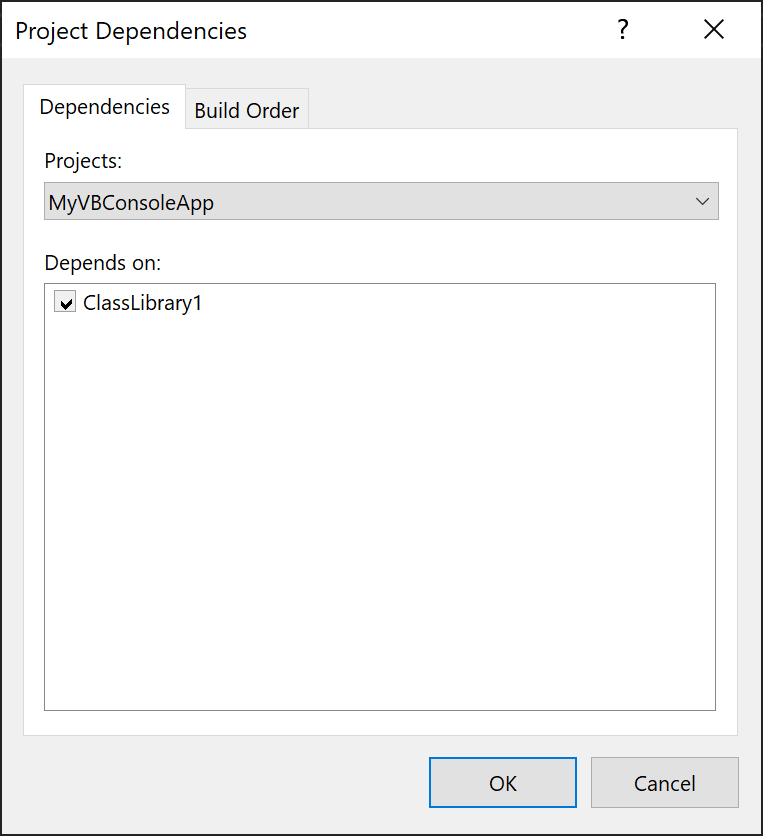
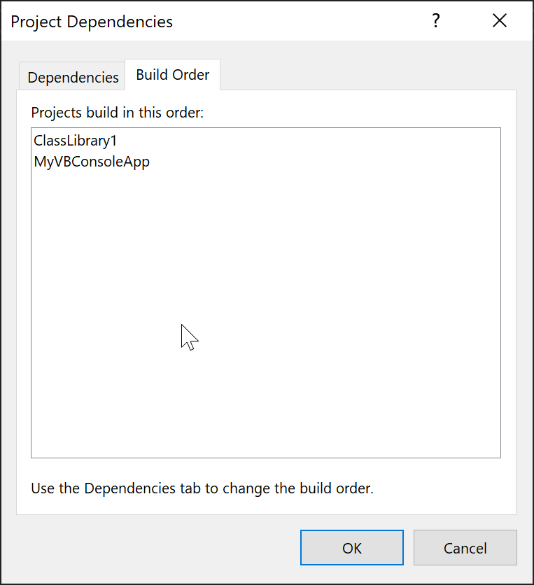

# How to: Create and remove project dependencies

 [!INCLUDE [Visual Studio](~/includes/applies-to-version/vs-windows-only.md)]

When building a solution that contains multiple projects, it can be necessary to build certain projects first, to generate code used by other projects. When a project consumes executable code generated by another project, the project that generates the code is referred to as a project dependency of the project that consumes the code. Such dependency relationships can be defined in the **Project Dependencies** dialog box.

A project dependency is automatically created when you add a project-to-project reference from one project to another project. Before you perform these steps, consider if you should instead create a project-to-project reference, which in addition to creating a dependency relationship between the projects, also creates a reference that you can use to build code that uses classes, interfaces, and other code entities from the other project. See [Managing references in a project](managing-references-in-a-project.md#project-to-project-references).

## To assign dependencies to projects

1. In **Solution Explorer**, select a project.

2. On the **Project** menu, choose **Project Dependencies**.

    The **Project Dependencies** dialog box opens.

    

3. On the **Dependencies** tab, select a project from the **Project** drop-down menu.

4. In the **Depends on** field, select the check box of any other project that must build before this project does.

   Your solution must consist of more than one project before you can create project dependencies.

## To remove dependencies from projects

1. In **Solution Explorer**, select a project.

2. On the **Project** menu, choose **Project Dependencies**.

     The **Project Dependencies** dialog box opens.

3. On the **Dependencies** tab, select a project from the **Project** drop-down menu.

4. In the **Depends on** field, clear the check boxes beside any other projects that are no longer dependencies of this project.

## To view the build order

From the **Project Dependencies** dialog, you can switch to the **Build order** tab to the view the build order for the solution.

To view the build order in a solution at any time, right-click on the solution node and choose **Project build order**.

You can use the **Build order** tab to view the order that projects will be built, but you can't directly change the order from this tab.

The order you see listed is the desired logical build order, but in practice, Visual Studio further optimizes the build process by building multiple projects in parallel. However, as long as you've specified the project dependencies, any dependent projects will not start building until after their dependencies have completed.

## See also

- [Build and clean projects and solutions in Visual Studio](../ide/building-and-cleaning-projects-and-solutions-in-visual-studio.md)
- [Compile and build](../ide/compiling-and-building-in-visual-studio.md)
- [Understand build configurations](../ide/understanding-build-configurations.md)
- [Manage project and solution properties](managing-project-and-solution-properties.md)
