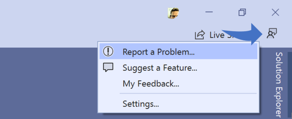
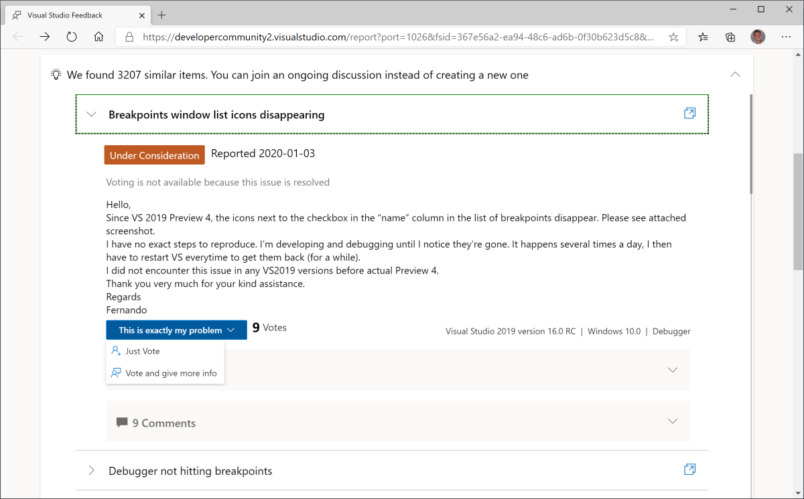
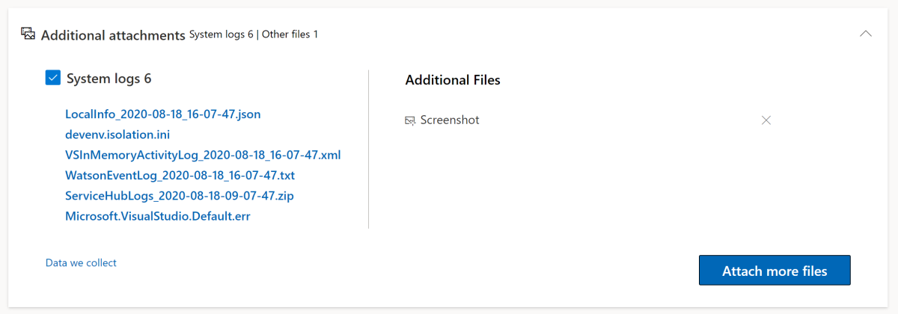

# How to report a problem with Visual Studio or Visual Studio Installer

> [!NOTE]
> For Visual Studio for Mac, see [How to report a problem in Visual Studio for Mac](/visualstudio/mac/report-a-problem).

You can report a problem from either Visual Studio or its installer. The built-in Feedback Tool allows you to easily add diagnostic information that helps the Visual Studio teams diagnose and fix the issues. Here are the steps to report a problem.

1. **In Visual Studio**, select the feedback icon in the upper-right corner and select Report a Problem. You can also access the feedback tool  from the menu **Help** > **Send Feedback** > **Report a Problem**.

Alternatively, report a problem in **Visual Studio Installer** if you can't install Visual Studio or are unable to access the feedback tool within Visual Studio.  In the Installer, select the feedback icon in the upper-right corner and select Report a Problem.

1. Clicking **Report a Problem** will open your default browser and sign you in using the same account you use to sign in to Visual Studio

   

1. Start by entering the descriptive title of your bug report. It must be at least 25 characters long.

    

1. Once you start typing, possible duplicates are shown under the title field

    

1. Select the possible duplicate bug reports to see if there is one matching your own problem. If there is, vote for it instead of creating your own ticket.

    

2. If no duplicates were found, continue by entering a description of the problem. It's important to be as clear as possible to increase the chances of us being able to reproduce the bug. Make sure to include clear reproduction steps.

3. If relevant to the bug report, take a screenshot by checking the *Include Visual Studio screenshot* checkbox.

    
    *Only Microsoft engineers can see the screenshot*

    You can even crop the screenshot directly in the browser to remove any sensitive or unrelated parts.

4. One of the best ways to help the Visual Studio engineering team solve the problem, is to provide a trace and heap dump files for them to look through. You can easily do that by recording the steps that resulted in the bug.

    
    *Only Microsoft engineers can see the recording*

5. Review the attached files and upload additional files if you believe it would help diagnose the issue.

    
    *Only Microsoft engineers can see the attached files*

6. The last step is to hit the **Submit** button. Submitting the report will send it directly into the internal Visual Studio bug reporting system awaiting triage.

## When further information is needed

When an issue is missing important information, we assign the **Needs More Info** state. We comment on the issue with the specific information we need, and you'll receive an email notification. If we don't receive the information within seven days, then we send you a reminder. After that, we close the ticket after 14 days of inactivity.

1. Follow the link in the email to the problem report or go to the home page to see all reports in the **Needs More Info** state.

    

1. Selecting the Provide More Info link on the problem report navigates you to a new screen. From here, you can see what info is being requested.

   

1. You can provide more information by adding comments, attachments, or recording steps. This experience is similar to reporting a new problem or providing additional information when voting on a problem.

1. The requesting Microsoft engineer receives a notification about the extra information provided. If they have enough information to investigate, the problem state changes. Otherwise, the engineer asks for even further information.

You can see these requests on the **My Feedback** screen along with all your other **Problems** and **Suggestions**.

## Search for solutions or provide feedback

If you don't want to or can't use Visual Studio to report a problem, there's a chance the problem has already been reported and a solution posted on the [Visual Studio Developer Community](https://developercommunity2.visualstudio.com/search?space=8) page.

If you don't have a problem to report but want to suggest a feature, there's a place for doing that too. For more information, see the [Suggest a feature](https://aka.ms/feedback/suggest?space=8) page.

## See also

* [Developer Community Guidelines](./developer-community-guidelines.md)
* [Report a problem with Visual Studio for Mac](/visualstudio/mac/report-a-problem)
* [Report a problem with C++](/cpp/how-to-report-a-problem-with-the-visual-cpp-toolset)
* [Visual Studio Developer Community](https://developercommunity.visualstudio.com/home)
* [Developer Community data privacy](developer-community-privacy.md)
