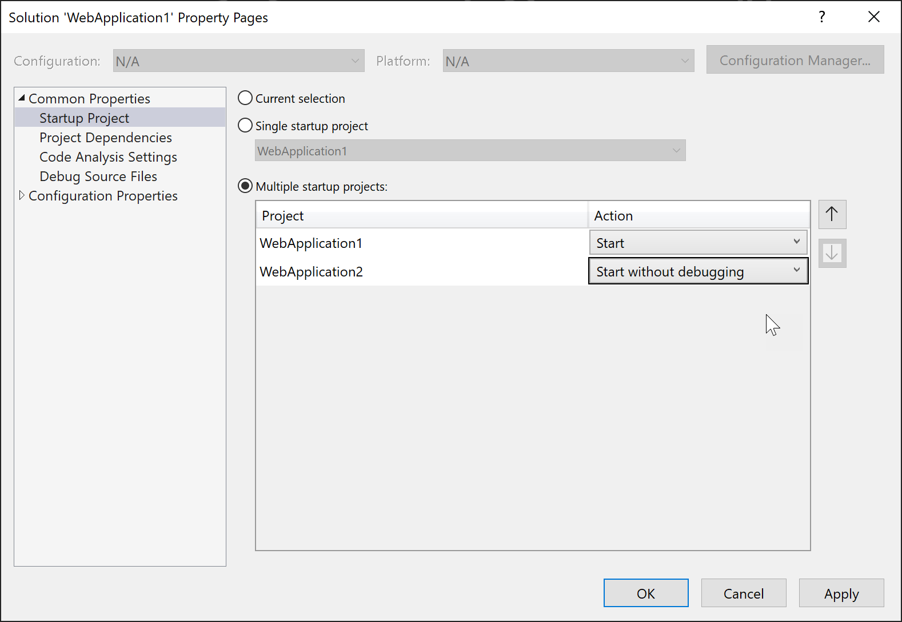
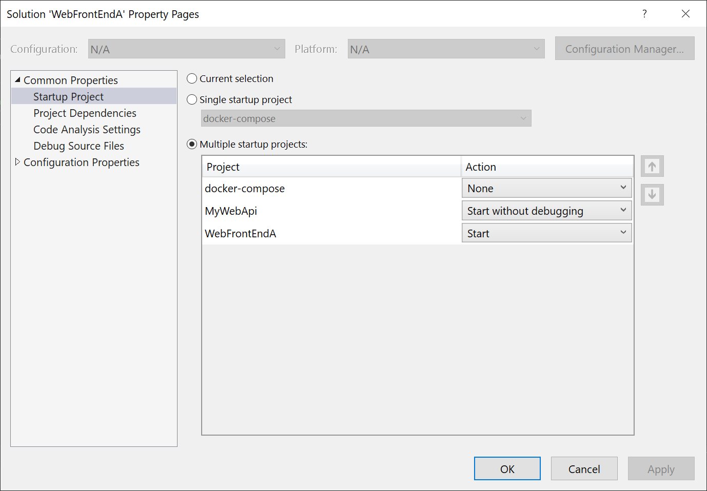

# Set multiple startup projects

Visual Studio allows you to specify how more than one project is run when you press **F5** (Start with Debugging), or **Ctrl**+**F5** (Start without debugging), or use the toolbar button to launch your application. In this way, you could start multiple sites, apps, or services that depend on each other to work correctly during a debug session or just running and testing locally.

Some project templates include multiple projects that are already configured to all be started when launched; for example, the **React and ASP.NET Core** project type includes both a client-side JavaScript project and a server-side ASP.NET Core project that both start when launched.

## To set multiple startup projects

1. In **Solution Explorer**, select the solution (the top node).

2. Choose the solution node's context (right-click) menu and then choose **Properties**. The **Solution Property Pages** dialog box appears.

   

3. Expand the **Common Properties** node, and choose **Startup Project**.

4. Choose the **Multiple Startup Projects** option and set the appropriate actions.

## With Docker Compose

When you're using Docker Compose to launch containerized projects on a local machine, you use a different method (launch profiles) to start multiple projects.

The following example shows a solution `WebFrontEndA` with three projects, a front-end web site, a Web API project, and a Docker Compose project. The following screenshot shows how to start two of the three projects, one with debugging and one without:

In this example and any other Docker Compose scenario, you choose `docker-compose` as the single startup project, but then you'll use a different way of specifying which projects or services to start. You'll use a Docker Compose launch profile to determine what services to start, and whether or not to attach the debugger, and there's a different dialog in Visual Studio for configuring it. See [Start a subset of services](../containers/launch-profiles.md). The **Solution Property Pages** dialog is only used for non-containerized solutions, or when you are *not* using Docker Compose to manage startup.

## Related content

- [Compile and build](../ide/compiling-and-building-in-visual-studio.md)
- [Work with solutions and projects](../ide/creating-solutions-and-projects.md)
- [Manage project and solution properties](../ide/managing-project-and-solution-properties.md)
