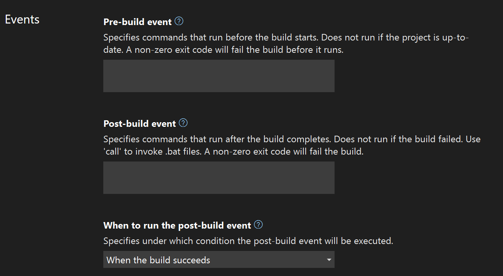
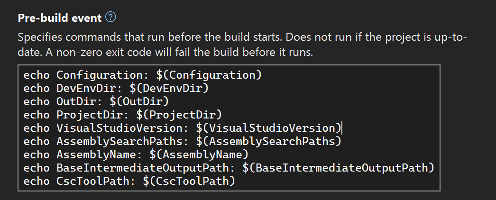

# How to: Specify build events (C#)

 [!INCLUDE [Visual Studio](~/includes/applies-to-version/vs-windows-only.md)]

Use build events to specify commands that run before the build starts or after the build finishes.

## Specify a build event

:::moniker range="<=vs-2019"

1. In **Solution Explorer**, select the project for which you want to specify the build event.

2. On the **Project** menu, click **Properties**.

3. Select the **Build Events** tab.

4. In the **Pre-build event command line** box, specify the syntax of the build event.

   > [!NOTE]
   > Pre-build events do not run if the project is up to date and no build is triggered.

5. In the **Post-build event command line** box, specify the syntax of the build event.

   > [!NOTE]
   > Add a `call` statement before all post-build commands that run *.bat* files. For example, `call MyFile.bat` or `call MyFile.bat call MyFile2.bat`. Paths can be absolute, or relative to the project folder.

6. In the **Run the post-build event** box, specify under what conditions to run the post-build event.

   > [!NOTE]
   > To add lengthy syntax, or to select any build macros from the [Pre-build event/post-build event command line dialog box](../ide/reference/pre-build-event-post-build-event-command-line-dialog-box.md), click the ellipsis button (**...**) to display an edit box.

:::moniker-end
:::moniker range=">=vs-2022"

1. In **Solution Explorer**, select the project for which you want to specify the build event.

2. On the **Project** menu, click **{ProjectName} Properties** (or from **Solution Explorer**, press **Alt**+**Enter**).

3. Select **Build > Events**.

   

4. In the **Pre-build event** section, specify the syntax of the build event.

   > [!NOTE]
   > Pre-build events do not run if the project is up to date and no build is triggered.

5. In the **Post-build event** section, specify the syntax of the build event.

   > [!NOTE]
   > Add a `call` statement before all post-build commands that run *.bat* files. For example, `call MyFile.bat` or `call MyFile.bat call MyFile2.bat`. Paths can be absolute, or relative to the project folder.

6. In the **When to run the post-build event** section, specify under what conditions to run the post-build event.

:::moniker-end

## Create the build event commands

The build event commands can include any command that is valid at a command prompt or in a *.bat* file. The name of a batch file should be preceded by `call` to ensure that all subsequent commands are executed. The batch file itself runs from the output folder, for example, `bin/Debug`. If you need the same batch file for all configurations, you could put it in the same folder as the project file and use a relative path to it, for example, `call ../../prebuild.bat`.

You can execute [PowerShell](/powershell/scripting/overview) scripts by entering a command like `PowerShell MyPowerShellScript.ps1`. The path to the PowerShell script may be absolute, or may be relative to the project directory. You would need to make sure that the execution policy for PowerShell scripts on your operating system is set appropriately in order to run the script. See [About execution policies](/powershell/module/microsoft.powershell.core/about/about_execution_policies).

If you want to use another shell, such as bash, you would generally use the same command syntax as you would use to launch a shell script from the Windows command prompt. Using third-party shells is beyond the scope of this documentation, but sites like Stack Overflow might be helpful.

## In the project file

When you perform the previous steps, Visual Studio modifies your project file by adding the `PreBuild` or `PostBuild` target and the necessary MSBuild code to execute the steps you provided.  You can open the project file and see the steps. Modifying the steps in the project file is fine. You'll see your changes in the **Build > Events** section of the project properties after you save changes.

```xml
<Target Name="PreBuild" BeforeTargets="PreBuildEvent">
  <Exec Command="call prebuild.bat" />
</Target>

<Target Name="PostBuild" AfterTargets="PostBuildEvent">
  <Exec Command="call postbuild.bat" />
</Target>
```

## Errors and other output

The output of your build events is written to the **Build** section of the **Output Window**. To open it, choose **View** > **Other Windows**, **Output Window**, or press **Ctrl**+**Alt**+**O**. In the dropdown next to **Show output from**, choose **Build**.

If your pre-build or post-build event does not complete successfully, you can terminate the build by having your event action exit with a code other than zero (0). A zero exit code indicates a successful action; any other exit code is considered an error.

If your pre-build event fails, you might see an error like this in the **Error List** window:

```output
MSB3073	The command "call c:\source\repos\prebuild.bat" exited with code 1.
```

If there's not enough information in the **Error List** window, you can try using the **Output Window** to view the full build output, including any output from batch files.

> [!TIP] 
> The **Error List** window is limited to just one line of output, the first line you entered for the event. If the **Error List** window output is important to you, then avoid putting more than one line in the event. Create a batch file from the Windows command prompt or in the operating system, and then just use `call mybatchfile.bat` for the event. Include the commands in the batch file itself.

For guidance on the commands you can use in batch files, see [Windows commands](/windows-server/administration/windows-commands/windows-commands).

## Macros

Commonly available "macros" (actually MSBuild properties) are listed at [MSBuild common properties](../msbuild/common-msbuild-project-properties.md). For .NET SDK projects (.NET Core or .NET 5 and later), additional properties are listed at [MSBuild properties for Microsoft.NET.Sdk](/dotnet/core/project-sdk/msbuild-props).

In your scripts for build events, you might want to reference the values of some project-level variables such as the name of the project or the location of the output folder. In prior versions of Visual Studio, these were called *macros*. The equivalent to macros in recent versions of Visual Studio are MSBuild properties. MSBuild is the build engine that Visual Studio uses to process your project file when it performs a build. A build event in the IDE results in an MSBuild [target](../msbuild/msbuild-targets.md) in the project file. You can use any MSBuild property that is available in the target in your project file (for example, `$(OutDir)` or `$(Configuration)`) . The MSBuild properties that are available to you in these events depend on the files implicitly or explicitly imported in a project file, such `.props` and `.targets` files, and properties set in your project file, such as in `PropertyGroup` elements. Be careful to use the exact spelling of each property. No error is reported if you misspell a property; instead, an undefined property evaluates to an empty string.

For example, suppose you specify a pre-build event as follows:



That pre-build event results in the following entry, called a `Target` in your project file:

```xml
  <Target Name="PreBuild" BeforeTargets="PreBuildEvent">
    <Exec Command="echo Configuration: $(Configuration)&#xD;&#xA;echo DevEnvDir: $(DevEnvDir)&#xD;&#xA;echo OutDir: $(OutDir)&#xD;&#xA;echo ProjectDir: $(ProjectDir)&#xD;&#xA;echo VisualStudioVersion: $(VisualStudioVersion)&#xD;&#xA;echo AssemblySearchPaths: $(AssemblySearchPaths)&#xD;&#xA;echo AssemblyName: $(AssemblyName)&#xD;&#xA;echo BaseIntermediateOutputPath: $(BaseIntermediateOutputPath)&#xD;&#xA;echo CscToolPath: $(CscToolPath)" />
  </Target>
```

The build event appears as a target that includes the [Exec task](../msbuild/exec-task.md) with the input you specified as the `Command`. Newlines are encoded in the XML.

When you build the project in this example, the pre-build event prints the values of some properties. In this example, `$(CscToolPath)` doesn't produce any output, because it's not defined. It is an optional property that you can define in your project file to give the path to a customized instance of the C# compiler (for example, if you were testing a different version of *csc.exe*, or an experimental compiler).

Output from your build events is written to the build output, which can be found in the **Output** window. In the **Show output from** dropdown, choose **Build**.

```output
Build started...
1>------ Build started: Project: ConsoleApp4, Configuration: Debug Any CPU ------
1>You are using a preview version of .NET. See: https://aka.ms/dotnet-core-preview
1>Configuration: Debug
1>DevEnvDir: C:\Program Files\Microsoft Visual Studio\2022\Preview\Common7\IDE\
1>OutDir: bin\Debug\net6.0\
1>ProjectDir: C:\source\repos\ConsoleApp4\ConsoleApp4\
1>VisualStudioVersion: 17.0
1>ALToolsPath:
1>AssemblySearchPaths: {CandidateAssemblyFiles};{HintPathFromItem};{TargetFrameworkDirectory};{RawFileName}
1>AssemblyName: ConsoleApp4
1>BaseIntermediateOutputPath: obj\
1>CscToolsPath:
1>Skipping analyzers to speed up the build. You can execute 'Build' or 'Rebuild' command to run analyzers.
1>ConsoleApp4 -> C:\source\repos\ConsoleApp4\ConsoleApp4\bin\Debug\net6.0\ConsoleApp4.dll
```

> [!NOTE]
> Some scenarios require more complex build actions than the build events are capable of. For example, for many common code-generation scenarios, you need to handle clean and rebuild operations, and you might want to enable incremental build for code-generation steps, so that the step only runs if the output is out-of-date with respect to the inputs. MSBuild is designed to intelligently handle all of those scenarios. Consider creating a [custom target](../msbuild/target-build-order.md) that specifies `AfterTargets` or `BeforeTargets` to run during a specific point in the build process, and for further control in advanced scenarios, consider creating a [custom task](../msbuild/task-writing.md), or review the different ways you can [Customize your build](../msbuild/customize-your-build.md).

## Example

1. Create a batch file named `postbuild.bat` in the project folder, with the following contents:

   ```batch
   echo Copying output file %1 to %1.copy
   copy %1 %1.copy
   ```

   Recall that in a batch file, `%1` refers to the first argument passed in.

1. Call the batch file in the **Post-build event** section of the project properties, and pass an argument using the MSBuild property `$(TargetPath)`.

    ```cmd
    call postbuild.bat $(TargetPath)
    ```

1. Build your project and check the output folder. You should see the copied file next to the built assembly. In the **Output Window**, in the **Build** section, you should see the batch file output:

   ```output
   1>Output file is C:\source\repos\ConsoleApp-BuildEvents\ConsoleApp-BuildEvents\bin\Debug\net6.0\ConsoleApp-BuildEvents.dll
   1>        1 file(s) copied.
   ========== Build: 1 succeeded, 0 failed, 0 up-to-date, 0 skipped ==========
   ========== Build started at 12:00 PM and took 00.723 seconds ==========
   ```

## See also

- [Build Events page, Project Designer (C#)](../ide/reference/build-events-page-project-designer-csharp.md)
- [Pre-build event/Post-build event command line dialog box](../ide/reference/pre-build-event-post-build-event-command-line-dialog-box.md)
- [How to: Specify build events (Visual Basic)](../ide/how-to-specify-build-events-visual-basic.md)
- [Compile and build](../ide/compiling-and-building-in-visual-studio.md)
