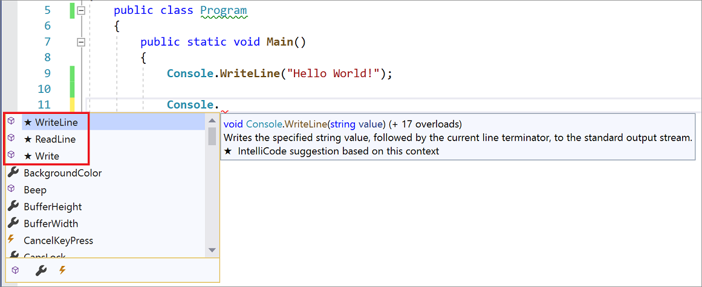

# IntelliCode: AI-assisted code development in Visual Studio

Visual Studio IntelliCode enhances software development using artificial intelligence, for instance by delivering [context-aware code autocompletions](#context-aware-code-autocompletions), including whole-line completions in gray text. IntelliCode is included by default in most Visual Studio workloads and is available through the Visual Studio installer. This feature predicts the most likely correct method or property for the developer to use instead of just an alphabetical list. It uses the developer's current code context and patterns to provide this dynamic list.

In addition to providing member suggestions, IntelliCode also provides *argument completion*. This capability stars the most likely argument names that you'll use when you call a method and places those suggestions at the top of the completion list. The completion list appears when you start typing inside the parentheses or press **Ctrl**+**Space**.

IntelliCode locally tracks your edits, detects when you're performing a repetitive action, and offers [suggestions](intellicode-suggestions.md) to apply that same action in other, similar places (C# only).
  

## Context-aware code autocompletions

IntelliCode provides AI-assisted IntelliSense for multiple languages. IntelliCode suggestions appear at the top of the completion list with a star icon next to them:

The completion list suggests the most likely correct API for a developer to use rather than presenting a simple alphabetical list of members. To provide this dynamic list, IntelliCode uses the developer's current code context and patterns based on thousands of highly rated, open-source projects on GitHub. The results form a model that predicts the most likely and most relevant API calls.

C# developers in Visual Studio 2022 and higher also benefit from [whole-line autocompletions](visual-studio-whole-line-completions.md), which predict the next chunk of your code based on your current code so far, and present it as an inline prediction. 

> [!NOTE]
> Some of IntelliCode's features are still in preview, meaning there's no guarantee of future support. Preview features are disabled by default. To enable or disable IntelliCode preview features, choose **Tools** > **Options** > **IntelliCode**. Under **Preview Features**, choose **Enable**, **Disable**, or **Default** to configure each feature.

## Install IntelliCode for Visual Studio

1. [Download Visual Studio](https://visualstudio.microsoft.com/downloads/?utm_medium=microsoft&utm_source=learn.microsoft.com&utm_campaign=inline+link&utm_content=download+vs2019) version 16.4 or later.
2. Install a [supported workload](#supported-languages--workloads), such as .NET desktop development. 
   Visual Studio IntelliCode is installed by default.

To turn starred IntelliSense recommendations off, disable the extension by choosing **Extensions** > **Manage Extensions** from the menu, find and select the IntelliCode extension, and then click **Disable**.

## Supported languages & workloads

The **supported languages** for AI-assisted IntelliSense completions are:

- C#
- XAML
- C++
- JavaScript and TypeScript, which require TypeScript 3.4.2 or later
- Visual Basic

IntelliCode is included in Visual Studio 2019 version 16.4 as part of any of the **following workloads**:

- Azure development
- .NET desktop development
- Mobile development with .NET
- Game development with Unity
- .NET Core cross-platform development
- ASP.NET and web development
- Visual Studio extension development
- Universal Windows Platform development
- Office/SharePoint development
- Desktop development with C++
- Game development with C++
- Mobile development with C++
- Linux development with C++
  
## Team completions

Previous versions of IntelliCode provided a way to train a model on your code, providing sorted method completions for team-specific API frameworks, libraries, and other user projects. This functionality has been replaced with a deep learning model that runs on your machine and is freely available for C# users. See [Upgrading from IntelliCode custom team completions models to deep learning](https://devblogs.microsoft.com/visualstudio/upgrading-from-intellicode-custom-team-completions-models-to-deep-learning/). IntelliCode is free for all Visual Studio users.

If you're a C++ user, you can subscribe to [GitHub Copilot](https://github.com/features/copilot) for AI-assisted code development. GitHub Copilot and Visual Studio IntelliSense work together to improve code completions; see [Visual Studio’s IntelliSense list can now steer GitHub Copilot code completions](https://devblogs.microsoft.com/visualstudio/github-copilot-visual-studio-intellisense/). GitHub Copilot requires a subscription, but you can evaluate it with a free trial.

## Troubleshoot IntelliCode errors in Visual Studio 

If you don't see any IntelliCode suggestions, you may have extensions installed that are overriding the IntelliSense UI. Such extensions can prevent the IntelliCode "starred" suggestions from appearing at the top of the list. You can verify if an extension is causing this behavior by turning them off, and then trying IntelliSense again. Or, if the extension supports it, turn off its auto-completion features.

If disabling extensions that override IntelliSense UI doesn't solve the problem for you, report it by using the Visual Studio [Report a Problem](how-to-report-a-problem-with-visual-studio.md) feature, and mention IntelliCode in your report.

## Telemetry

IntelliCode captures some anonymized usage and error-reporting data to help improve the product. No user-defined code is sent to Microsoft, but we do collect information about your use of the IntelliCode results.  For base model suggestions, which are open source or .NET types and members, we capture whether you selected an IntelliCode suggestion and log the name of the suggestion. Microsoft uses the data to monitor the quality of the base model. For custom models, we capture whether you selected an IntelliCode suggestion but *don't* log the names of your user-defined types or methods.

To turn off data collection for IntelliCode, opt out of the [Visual Studio Experience Improvement Program](visual-studio-experience-improvement-program.md). From the menu bar, select **Help** > **Send Feedback** > **Settings**. In the **Visual Studio Experience Improvement Program** dialog, select **No, I would not like to participate** and then select **OK**.

## See also

- [IntelliCode extension for Visual Studio Code](/visualstudio/intellicode/intellicode-visual-studio-code)
