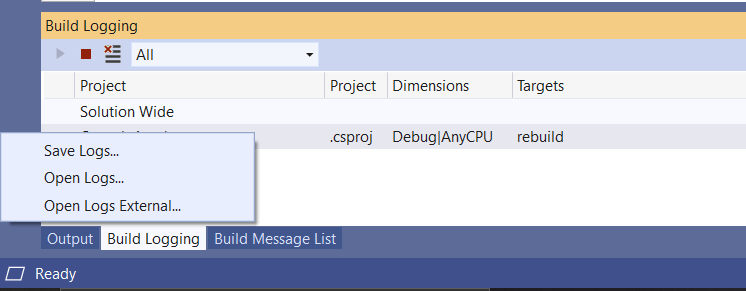

# Troubleshoot and create logs for MSBuild problems

 [!INCLUDE [Visual Studio](~/includes/applies-to-version/vs-windows-only.md)]

The following procedures can help you diagnose build problems in your Visual Studio project, and, if necessary, create a log to send to Microsoft for investigation.

## A property value is ignored

If a project property appears to be set to particular value, but has no effect on build, follow these steps:

1. Open the Visual Studio Developer Command Prompt that corresponds to your version of Visual Studio.
1. Run the following command, after substituting the values for your solution path, configuration, and project name:

    ```cmd
    msbuild /p:SolutionDir="c:\MySolutionDir\";Configuration="MyConfiguration";Platform="Win32" /pp:out.xml MyProject.vcxproj
    ```

    This command produces a "preprocessed" msbuild project file (out.xml). You can search that file for a specific property to see where it is defined.

The last definition of a property is what the build consumes. If property is set twice, the second value overwrites the first. Also, MSBuild evaluates the project in several passes:

- PropertyGroups and Imports
- ItemDefinitionGroups
- ItemGroups
- Targets

Therefore, given the following order:

```xml
<PropertyGroup>
   <MyProperty>A</MyProperty>
</PropertyGroup>
<ItemGroup>
   <MyItems Include="MyFile.txt"/>
</ItemGroup>
<ItemDefinitionGroup>
  <MyItems>
      <MyMetadata>$(MyProperty)</MyMetadata>
  </MyItems>
</ItemDefinitionGroup>
<PropertyGroup>
   <MyProperty>B</MyProperty>
</PropertyGroup>
```

The value of "MyMetadata" for "MyFile.txt" item will be evaluated to "B" during build (not "A" and not empty)

## Incremental build is building more than it should

If MSBuild is unnecessarily rebuilding a project or project item, create a detailed or binary build log. You can search the log for the file that was built or compiled unnecessarily. The output looks something like this:

```output
  Task "CL"

  Using cached input dependency table built from:

  F:\test\Project1\Project1\Debug\Project1.tlog\CL.read.1.tlog

  Outputs for F:\TEST\PROJECT1\PROJECT1\PROJECT1.CPP:
  F:\TEST\PROJECT1\PROJECT1\DEBUG\PROJECT1.OBJ
  Project1.cpp will be compiled because F:\TEST\PROJECT1\PROJECT1\PROJECT1.H was modified at 6/5/2019 12:37:09 PM.

  Outputs for F:\TEST\PROJECT1\PROJECT1\PROJECT1.CPP:
  F:\TEST\PROJECT1\PROJECT1\DEBUG\PROJECT1.OBJ

  Write Tracking Logs:
  Debug\Project1.tlog\CL.write.1.tlog
```

If you are building in the Visual Studio IDE (with detailed output window verbosity), the **Output Window** displays the reason why each project is not up-to-date:

```output
1>------ Up-To-Date check: Project: Project1, Configuration: Debug Win32 ------

1>Project is not up-to-date: build input 'f:\test\project1\project1\project1.h' was modified after the last build finished.
```

## Create a binary MSBuild log at the command prompt

1. Open the Developer Command Prompt for your version of Visual Studio

1. From the command prompt, run one of the following commands. (Remember to use your actual project and configuration values.):

   ```cmd
   Msbuild /p:Configuration="MyConfiguration";Platform="x86" /bl MySolution.sln
   ```

   or

   ```cmd
   Msbuild /p:SolutionDir="c:\MySolutionDir\";Configuration="MyConfiguration";Platform="Win32" /bl MyProject.vcxproj
   ```

An *msbuild.binlog* file gets created in the directory that you ran MSBuild from.

## Create a binary MSBuild log by using the Project System Tools extension

1. Download and install the [Project System Tools extension](https://marketplace.visualstudio.com/items?itemName=VisualStudioProductTeam.ProjectSystemTools).

1. Once the extension is installed, some new items appear in the **View** > **Other Windows** menu.

   

1. Select **View** > **Other Windows** > **Build Logging** to show the **Build Logging** window in Visual Studio. Choose the first toolbar icon to start recording both regular and design-time builds in the project system.

   

1. Once a build is recorded, it appears in the Build Logging window. Right-click the item and select **Save Logs** on the context menu to save your *.binlog* file.

   

You can view and search your *.binlog* files by using the [MSBuild Structured Log Viewer](http://www.msbuildlog.com/).

## Create a detailed log

1. From the Visual Studio main menu, go to **Tools** > **Options** > **Projects and Solutions** >**Build and Run**.
1. Set **Msbuild project build verbosity** to **Detailed** in both combo boxes. The top one controls build verbosity in the **Output Window** and the second one controls build verbosity in the \<projectname\>.log file that is created in each project's Intermediate directory during build.
2. From a Visual Studio developer command prompt, enter one of these commands, substituting your actual path and configuration values:

    ```cmd
    Msbuild /p:Configuration="MyConfiguration";Platform="x86" /fl MySolution.sln
    ```

    or

    ```cmd
    Msbuild /p:/p:SolutionDir="c:\MySolutionDir\";Configuration="MyConfiguration";Platform="Win32" /fl MyProject.vcxproj
    ```

    An Msbuild.log file will be created in the directory that you ran msbuild from.

## See also

- [Visual Studio troubleshooting](/troubleshoot/visualstudio/welcome-visual-studio/)
