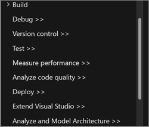
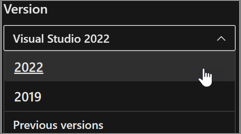

# About Visual Studio documentation

 [!INCLUDE [Visual Studio](~/includes/applies-to-version/vs-windows-only.md)]

This page provides information that might help you learn and use the Visual Studio Integrated Development Environment (IDE) for the Windows platform. You can reach this page by using the **Help > View Help** menu item in the Visual Studio IDE.

By default, the **Help > View Help** menu item takes you to the online documentation on learn.microsoft.com. You can also choose to install and use the documentation locally in the Help Viewer app. See [Install and view documentation locally](#install-and-view-documentation-locally).

Documentation for Visual Studio covers the functionality of the IDE. You can start with a [feature tour](quickstart-ide-orientation.md) and [overview of Visual Studio](../get-started/visual-studio-ide.md). The documentation includes [installation](../install/install-visual-studio.md), [settings in the IDE](./personalizing-the-visual-studio-ide.md), organizing code with [projects and solutions](./solutions-and-projects-in-visual-studio.md), [code editing](./writing-code-in-the-code-and-text-editor.md), [debugging](../debugger/debugger-feature-tour.md) and [performance analysis](../profiling/beginners-guide-to-performance-profiling.md) tools, [testing](../test/index.yml) tools, and more.

## Get started with tutorials

If you're looking to get started with Visual Studio by writing some kind of app, such as a console app or web app, try these pages to select an appropriate tutorial:

| Landing page | Description |
| - | - |
| [C# Tutorials](../get-started/csharp/index.yml) | Create C# console, Windows, and web apps. |
| [Visual Basic tutorials](../get-started/visual-basic/index.yml) | Create Visual Basic console, Windows, and web apps. |
| [F# tutorial](../get-started/tutorial-fsharp-web-app.md) | Get started with F#, a functional programming language for .NET. |
| [C++ tutorials](/cpp/build/vscpp-step-1-create) | Create "Hello, world" in C++ in Visual Studio. |

## Navigate the documentation

You can access major areas of the documentation from the main [Visual Studio hub page](../windows/index.yml), or by using landing pages for various subareas.

Landing pages for the following subareas may be helpful in finding what you're looking for:

| Landing page | Description |
| - | - |
| [IDE](index.yml) | Learn about the IDE and how to configure and customize it. |
| [Data](../data-tools/index.yml) | Learn about tools for accessing databases. |
| [Debugger](../debugger/index.yml) | Step through code as it's executing. |
| [Test](../test/index.yml) | Create and manage tests to validate functionality. |

The table of contents (TOC) is visible to the right on the desktop browser and in the offline Help Viewer. This treeview of links to articles encompasses the Visual Studio IDE content for the Windows platform. Many subareas of the Visual Studio documentation, such as the debugger, are in separate TOCs. Links to those separate TOCs are indicated in the main TOC with a ">>" symbol.

## Search the docs

You can always use Internet search engines to find content for all Microsoft technologies. Try adding `site:learn.microsoft.com` to your search queries in your favorite search engine if you know you're looking for Microsoft content.

In addition, you can use the search box at the top of the screen to search text just in articles on the Learn platform or scoped to certain Microsoft products and services. After you enter a query, you can narrow the search scope to Visual Studio or other documentation. See [Microsoft Search](/search/).

The TOC also has a search box just above it. It only searches the TOC, not the pages themselves.

## Contextual Help (F1)

Anytime you're using the IDE, you can try pressing F1 to get relevant documentation based on your current context, as determined by the window focus and cursor position. For example, when you're writing code, you can press F1 when your cursor is on the name of a type, method, or language keyword in the code editor to get right to the reference page for that program entity. You can click on most error codes in the Task List or Output Window to get to pages with suggestions for how to deal with the errors. You can click on the ? icon or press F1 on most dialog boxes or options pages to jump right to the documentation for that tool or settings page.

In some cases, when there isn't enough context to provide meaningful help, nothing happens when you press F1. Try moving the window focus or cursor position to get more specific help.

## Install and view documentation locally

You can install a local copy of the documentation. This is helpful for those who don't have a fast, high-bandwidth connection to the Internet on their development machines, or work in isolated networks for security or other reasons.

First, you need to install the Help Viewer, which is available in the Visual Studio Installer. Choose **Individual Components** and search for **Help Viewer**.

Not all documentation on the Learn platform is available locally. Available documentation includes Visual Studio, .NET, Windows APIs, SQL Server, and others. To see the full list of what you can install, choose the **View > Manage Help Content** menu item.

For more information about offline documentation, see [Microsoft Help Viewer](../help-viewer/overview.md).

## Versions

The documentation in this section applies to all quarterly updates of Visual Studio 2019 and Visual Studio 2022. You can use the version selector at the top left, above the TOC, to switch between versions or access documentation for [previous versions](/previous-versions/visualstudio).

Articles or sections that apply to current previews are marked as preview content.

## Next steps

If you're not finding what you wanted, let us know! If your feedback is about the product, use [Visual Studio Developer Community](https://developercommunity.visualstudio.com/VisualStudio) to report your concern or see what others have suggested. If your feedback is about the documentation, use the feedback link at the bottom of this page. The best feedback includes information about your situation, what you expected or wanted, and if possible, specific suggestions for us to consider improving or changing. See also [Report a problem](./how-to-report-a-problem-with-visual-studio.md).
