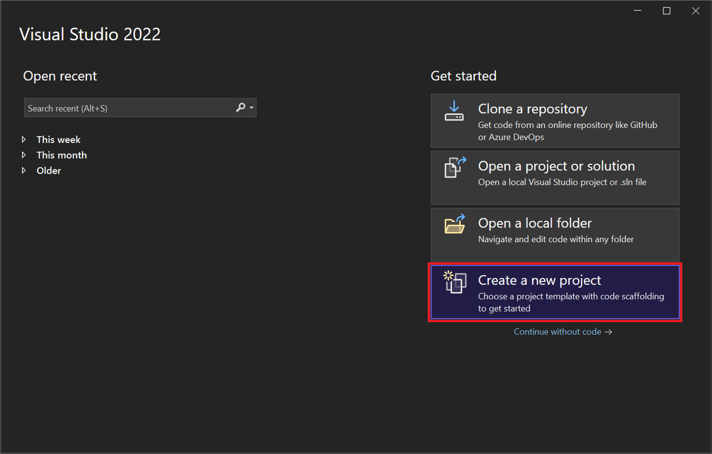
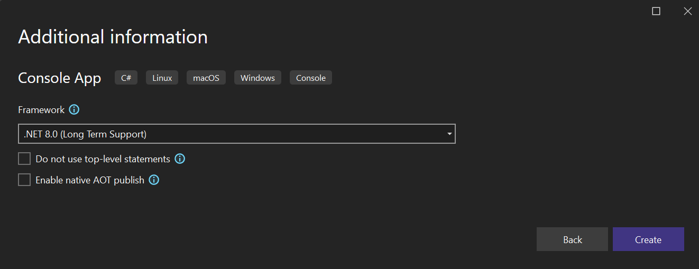

# Quickstart: Use Visual Studio to create your first C# console app

In this 5-10 minute introduction to the Visual Studio integrated development environment (IDE), you'll create a simple C# app that runs on the console.

::: moniker range="vs-2017"

If you haven't already installed Visual Studio, go to the [Visual Studio downloads](https://visualstudio.microsoft.com/vs/older-downloads/?utm_medium=microsoft&utm_source=docs.microsoft.com&utm_campaign=vs+2017+download) page to install it for free.

::: moniker-end

::: moniker range=">=vs-2019"

If you haven't already installed Visual Studio, go to the [Visual Studio downloads](https://visualstudio.microsoft.com/downloads) page to install it for free.

::: moniker-end

## Create a project

First, you'll create a C# application project. The project type comes with all the template files you'll need, before you've even added anything!

::: moniker range="vs-2017"

1. Open Visual Studio 2017.

1. From the top menu bar, choose **File** > **New** > **Project**.

1. In the **New Project** dialog box in the left pane, expand **C#**, and then choose **.NET Core**. In the middle pane, choose **Console App (.NET Core)**. Then name the project *HelloWorld*.

   

     If you don't see the **Console App (.NET Core)** project template, choose the **Open Visual Studio Installer** link in the left pane of the **New Project** dialog box.

   

     The Visual Studio Installer launches. Choose the **.NET Core cross-platform development** workload, and then choose **Modify**.

     

::: moniker-end

::: moniker range="vs-2019"

1. Open Visual Studio.

1. On the start window, choose **Create a new project**.

   

1. On the **Create a new project** window, enter or type *console* in the search box. Next, choose **C#** from the Language list, and then choose **Windows** from the Platform list. 

   After you apply the language and platform filters, choose the **Console App (.NET Core)** template, and then choose **Next**.

   

   > [!NOTE]
   > If you do not see the **Console App (.NET Core)** template, you can install it from the **Create a new project** window. In the **Not finding what you're looking for?** message, choose the **Install more tools and features** link.
   >
   >  
   > 
   > Then, in the Visual Studio Installer, choose the **.NET Core cross-platform development** workload.
   >
   > 
   >
   > After that, choose the **Modify** button in the Visual Studio Installer. You might be prompted to save your work; if so, do so. Next, choose **Continue** to install the workload. Then, return to step 2 in this "[Create a project](#create-a-project)" procedure.

1. In the **Configure your new project** window, type or enter *HelloWorld* in the **Project name** box. Then, choose **Create**.

   

   Visual Studio opens your new project.

::: moniker-end

::: moniker range=">=vs-2022"

1. Open Visual Studio.

1. On the start window, choose **Create a new project**.

   

1. On the **Create a new project** window, enter or type *console* in the search box. Next, choose **C#** from the Language list, and then choose **Windows** from the Platform list. 

   After you apply the language and platform filters, choose the **Console Application** template, and then choose **Next**.

   

   > [!NOTE]
   > If you don't see the **Console Application** template for .NET Core, you can install it from the **Create a new project** window:
   > - In the **Not finding what you're looking for?** message, choose the **Install more tools and features** link to launch the Visual Studio Installer.
   >
   >    
   > 
   > - In the Visual Studio Installer:
   >   - Choose the **.NET desktop development** workload.
   >
   >      
   >
   >   - Choose the **Modify** button. You might be prompted to save your work; if so, do so. 
   >   - Choose **Continue** to install the workload.
   > - Return to step 2 in this "[Create a project](#create-a-project)" procedure.

1. In the **Configure your new project** window, type or enter *HelloWorld* in the **Project name** box. Then, choose **Next**.

   

1. In the **Additional information** window, ensure that **.NET 6.0 (Preview)** is selected in the **Framework** dropdown menu, and then choose **Create**.

   

   Visual Studio opens your new project.
   
::: moniker-end

## Create the application

::: moniker range="vs-2017"

After you select your C# project template and name your project, Visual Studio creates a simple "Hello World" application for you.

::: moniker-end

::: moniker range="vs-2019"

Visual Studio includes default "Hello World" code in your project.

::: moniker-end

::: moniker range=">=vs-2022"

Visual Studio includes default "Hello World" code in your project. To view it in the editor, select the code file *Program.cs* in the Solution Explorer window, which is typically on the right-hand side of Visual Studio.

::: moniker-end

::: moniker range="<=vs-2019"

(To do so, it calls the <xref:System.Console.WriteLine%2A> method to display the literal string "Hello World!" in the console window.)

   

If you press **F5**, you can run the program in Debug mode. However, the console window is visible only for a moment before it closes.

(This behavior happens because the `Main` method terminates after its single statement executes, and so the application ends.)

::: moniker-end

::: moniker range=">=vs-2022"

The single code statement calls the <xref:System.Console.WriteLine%2A> method to display the literal string "Hello, World!" in the console window.

   

If you press **F5**, you can run the program in Debug mode. After the application runs in the debugger, the console window stays open. But, if the application is run outside the debugger, the console window is visible only for a moment before it closes. This is because the `Main` method terminates after its single code statement executes, and so the application ends. For more about running a console application outside the debugger, see [Publish a .NET console application](/dotnet/core/tutorials/publishing-with-visual-studio).

> [!NOTE]
> The single code line in the editor is a C# [top-level statement](/dotnet/csharp/whats-new/csharp-9#top-level-statements), and is a simplification of the boilerplate [Main](/dotnet/csharp/fundamentals/program-structure/main-command-line) method.

::: moniker-end

### Add some code

::: moniker range="<=vs-2019"

Let's add some code to pause the application so that the console window doesn't close until you press **ENTER**.

1. Add the following code immediately after the call to the <xref:System.Console.WriteLine%2A> method:

   ```csharp
   Console.ReadLine();
   ```

1. Verify that it looks like this in the code editor:

   

::: moniker-end

::: moniker range=">=vs-2022"

Let's add some code to pause the application so that the `main` method doesn't terminate until you press **ENTER**.

1. Add the following code immediately after the call to the <xref:System.Console.WriteLine%2A> method:

   ```csharp
   Console.ReadLine();
   ```

1. Verify that it looks like this in the code editor:

   

::: moniker-end

## Run the application

::: moniker range="<=vs-2019"

1. Choose the **HelloWorld** button on the toolbar to run the application in Debug mode. Or, you can press **F5**.

   

1. View your app in the console window.

   

::: moniker-end

::: moniker range=">=vs-2022"

1. Choose the **HelloWorld** button on the toolbar to run the application in Debug mode. (Or, you can press **F5**.)

   

1. View your app in the console window.

   

::: moniker-end

### Close the application

::: moniker range="<=vs-2019"

1. Press **ENTER** to close the console window.

1. Close the **Output** pane in Visual Studio.

   

1. Close Visual Studio.

::: moniker-end

::: moniker range=">=vs-2022"

1. Press **ENTER** to terminate the `main` method, and then press **ENTER** again to close the console window.

1. Close the **Output** pane in Visual Studio.

   

1. Close Visual Studio.

::: moniker-end

## Next steps

Congratulations on completing this Quickstart! We hope you learned a little bit about C# and the Visual Studio IDE. To learn more, continue with the following tutorials.

> [!div class="nextstepaction"]
> [Get started with a C# console app in Visual Studio](../get-started/csharp/tutorial-console.md)
