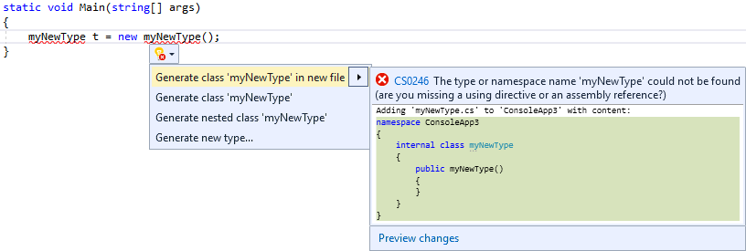

# Generate a class or type in Visual Studio

 [!INCLUDE [Visual Studio](~/includes/applies-to-version/vs-not-mac.md)]

This code generation applies to:

- C#

- Visual Basic

**What:** Lets you immediately generate the code for a class or type.

**When:** You introduce a new class or type and want to properly declare it, automatically.

**Why:** You could declare the class or type before using it, however this feature will generate the class or type automatically.

## How-to

1. Place your cursor on the line where there is a red squiggle. The red squiggle indicates a class that doesn't yet exist.

   - C#:

       

   - Visual Basic:

       

2. Next, do one of the following:

   - **Keyboard**
      - Press **Ctrl**+**.** to trigger the **Quick Actions and Refactorings** menu.
   - **Mouse**
      - Right-click and select the **Quick Actions and Refactorings** menu.
      - Hover over the red squiggle and click the  icon that appears.
      - Click the  icon that appears in the left margin if the text cursor is already on the line with the red squiggle.

      

3. Select one of the options from the drop-down menu:

   - Generate class '*TypeName*' in new file&mdash;Creates a class named *TypeName* in a file named *TypeName*.cs/.vb
   - Generate class '*TypeName*'&mdash;Creates a class named *TypeName* in the current file.
   - Generate nested class '*TypeName*'&mdash;Creates a class named *TypeName* nested inside the current class.
   - Generate new type...&mdash;Creates a new class or struct with all of the properties you specify.

   > [!TIP]
   > Use the **Preview changes** link at the bottom of the preview window [to see all of the changes](../../ide/preview-changes.md) that will be made before making your selection.

4. If you selected the **Generate new type** item, the **Generate Type** dialog box opens. Configure the accessibility, kind, and location of the new type.

   

   Selection | Description
   --- | ---
   Access | Set the type to have *Default*, *Internal* or *Public* access.
   Kind | This can be set as *class* or *struct*.
   Name | This cannot be changed and will be the name you already typed.
   Project | If there are multiple projects in your solution, you can choose where you want the class/struct to live.
   File Name | You can create a new file or you can add the type to an existing file.

The class or struct is created. For C#, a constructor is also created.

- C#

   

- Visual Basic

   

## See also

- [Code Generation](../code-generation-in-visual-studio.md)
- [Preview Changes](../../ide/preview-changes.md)
