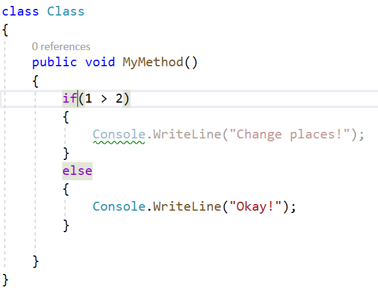
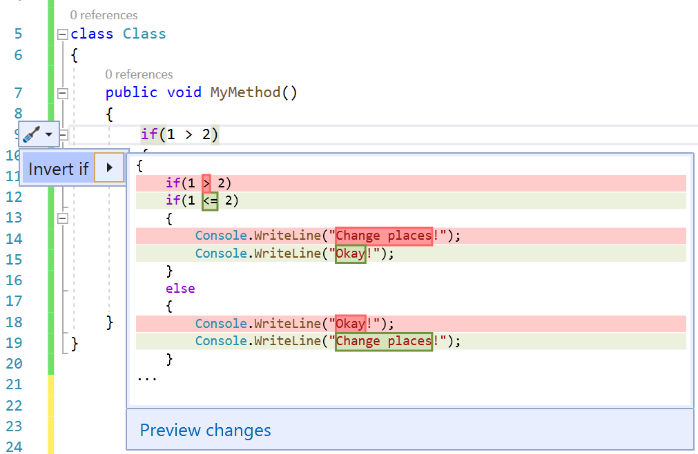
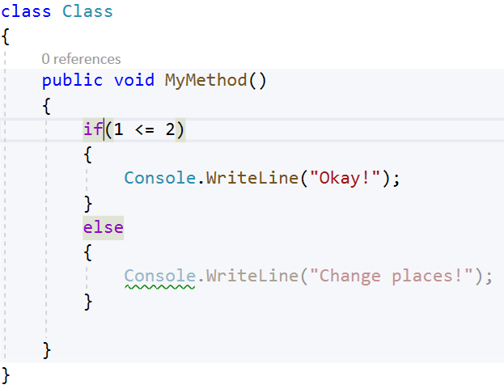

# Invert if statement

This refactoring applies to:

- C#
- Visual Basic

**What:** Lets you invert an `if` or `if else` statement without changing the meaning of the code.

**When:** When you have an `if` or `if else` statement that would be better understood when inverted.

**Why:** Inverting an `if` or `if else` statement by hand can take much longer and possibly introduce errors. This code fix helps you do this refactoring automatically.

## Invert if statement refactoring

1. Place your cursor in an `if` or `if else` statement.

    

2. Press **Ctrl**+**.** to trigger the **Quick Actions and Refactorings** menu.

    

3. Select **Invert if**.

    

## See also

- [Refactoring](../refactoring-in-visual-studio.md)
- [Tips for .NET Developers](../csharp-developer-productivity.md)
