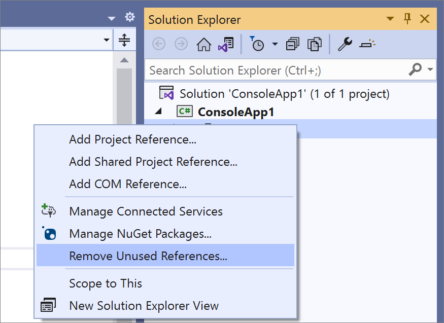
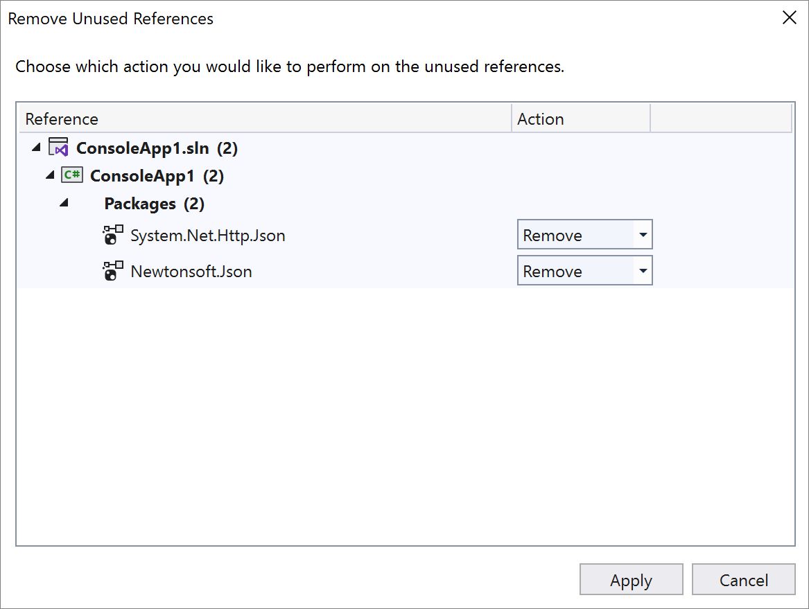

# Remove Unused References

This refactoring applies to:

- C#
- Visual Basic

**What:** Lets you remove unused references for [SDK style projects](/dotnet/core/project-sdk/overview).

**When:** You want to clean up project references and NuGet packages that have no usage.

**Why:** Removing project references that have no usage can help save space and reduce startup time of your application, because it takes time to load each module and avoids having the compiler load metadata that will never be used.

## How-to

1. Right click on a project name or dependencies node in Solution Explorer.

2. Select **Remove Unused References**.

    

3. The **Remove Unused References** dialog will open displaying references that have no usage in source code. Unused references will be pre-selected for removal with an option to preserve references by selecting `Keep` from the Action drop down.

    

5. Click `Apply` to remove selected references.

## See also

- [Refactoring](../refactoring-in-visual-studio.md)