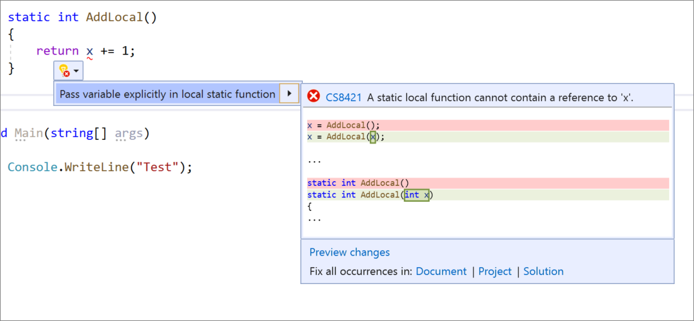

# Static local function refactorings and Quick Actions

 [!INCLUDE [Visual Studio](~/includes/applies-to-version/vs-windows-only.md)]

This article outlines two productivity features related  to static local functions. One is a refactoring that makes a local function static, and the other is a Quick Action that generates code to pass variables into a static local function.

## Make local function static

This refactoring applies to:

- C#

**What:** Makes a local function static and passes in variables defined outside the function to the function’s declaration and calls.

**When:** You want your local function to be static and for all variables to be defined in the scope of the function.

**Why:** Static local functions improves readability: knowing that specific code is isolated makes it easier to understand, reread, and reuse. Static local functions also provide scoping to prevent polluting a class with a static function that's only called in a single method.

### How-to

1. Place your caret on the local function name.

2. Press **Ctrl**+**.** (period) to trigger the **Quick Actions and Refactorings** menu.

   

3. Select **Make local function ‘static’.**

## Pass variable explicitly in a static local function

This Quick Action applies to:

- C#

**What:** Passes a variable explicitly into a local static function.

**When:** You want a local function to be static but still use variables initialized outside of it.

**Why:** Using static local functions provides clarification to readers because they know that it can only be declared and called in a specific context of the program. It provides the flexibility to define variables outside this context, but still be able to pass them in as arguments to the static local function.

### How-to

1. Place your caret on the variable where it's used in the static local function.

2. Press **Ctrl**+**.** (period) to trigger the **Quick Actions and Refactorings** menu.

   

3. Select **Pass variable explicitly in local static function**.

## See also

- [Refactoring](../refactoring-in-visual-studio.md)