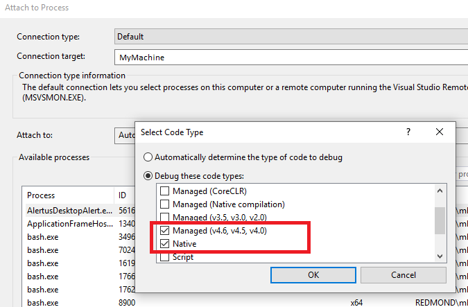

# Collect an ETL trace with PerfView and create minidumps with all call stacks

 [!INCLUDE [Visual Studio](~/includes/applies-to-version/vs-windows-only.md)]

When you report a problem with Visual Studio, the Microsoft product team might ask for an ETL trace or minidumps to collect additional information for troubleshooting. Use the following steps to collect an ETL trace or to create minidumps for all call stacks.

## Collect an ETL trace with PerfView

PerfView is a tool that creates ETL (event trace log) files based on [Event Tracing for Windows](/windows/desktop/ETW/event-tracing-portal) that can be useful in troubleshooting some kinds of issues with Visual Studio. Occasionally when you report a problem, the product team might ask you to run PerfView to collect additional information.

### Install PerfView

Download PerfView from [GitHub](https://github.com/Microsoft/perfview/blob/master/documentation/Downloading.md).

### Run PerfView

1. Right-click on **PerfView.exe** in Windows Explorer and choose **Run as administrator** as admin.
1. On the Collect menu, choose **Collect**.
1. Check **Zip**, **Merge**, and **ThreadTime**.
1. Increase **Circular MB** to 1000.
1. Change **Current Dir** to save ETL traces to a specified folder and Data File if you are going to collect more than once.
1. To start recording data, choose the **Start Collection** button.
1. To stop recording data, choose the **Stop Collection** button. The PrefView.etl.zip file will be saved in the specified directory.

PerfView can store only the most recent data that fits into its buffer. Therefore, try to stop the collection as soon as possible after Visual Studio starts to freeze or slow down. Don't collect for more than 30 seconds after you hit a problem.

## Create minidumps for a Visual Studio process with all call stacks

In some cases, Microsoft might ask for a minidump of a running Visual Studio process with information for all call stacks. To collect this information, perform these steps:

### Create the minidump file

1. Start a new instance of Visual Studio.
1. From the main menu, choose **Debug** > **Attach To Process**.
1. Check the relevant **Managed** and **Native** check boxes and press **Attach**.

   

1. Select the other Visual Studio instance to attach to from the list of running processes.
1. From the main menu, choose **Debug** > **Break All**.
1. From the main menu, choose **Debug** > **Save Dump As**.

### Get the call stacks from the minidump

1. Open the dump file in Visual Studio.
1. Go to **Tools** > **Options** > **Debugging** > **Symbols** and make sure that **Microsoft Symbol Servers** is checked in the **Symbol file (.pdb) locations**.
1. Open the **Command** window (**View** > **Other Windows** > **Command Window**).
1. Type ‘~*k’. The window displays all threads' call stacks.
1. Copy all text from Command Window and save to a text file.
1. Attach the txt file to the bug.
