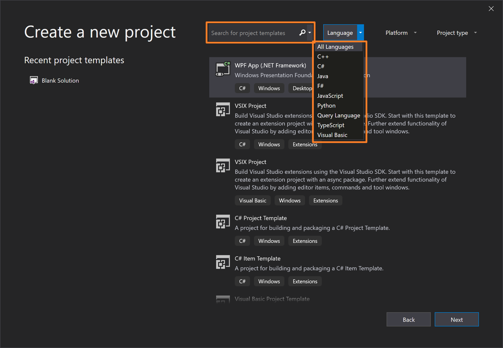

# Add tags to project templates

Starting in [Visual Studio 2019](https://visualstudio.microsoft.com/downloads/) version 16.1 Preview 2, you can add language, platform, and project type tags to your project templates. Tags are used in two places in the new project dialog box:

- Tags appear under the template description

   

- Tags enable the template to be searched and filtered

   

You can add tags by updating the *.vstemplate* XML file using template tags built into Visual Studio or by creating custom template tags. Template tags only appear in the Visual Studio 2019 new project dialog. They don't affect the template rendering in previous versions of Visual Studio.

## Add or edit tags

You may want to add or edit tags in your project template's *.vstemplate* XML when you:

* [Create a new project template](/visualstudio/ide/how-to-create-project-templates) by using the Export Template wizard

* [Update your existing project template](/visualstudio/ide/how-to-update-existing-templates)

* [Create a new VSIX project template](/visualstudio/extensibility/getting-started-with-the-vsix-project-template)

## Syntax

```xml
<LanguageTag> Language Name </LanguageTag>
<PlatformTag> Platform Name </PlatformTag>
<ProjectTypeTag> Project Type </ProjectTypeTag>
```

## Attributes

The following attributes are optional and for advanced user scenarios.

|Attribute|Description|
|---------------|-----------------|
|`Package`|A GUID that specifies the Visual Studio package ID.|
|`ID`|Specifies the Visual Studio resource ID.|

Syntax:

```xml
<LanguageTag Package="{PackageID}" ID="ResourceID" />
<PlatformTag Package="{PackageID}" ID="ResourceID" />
<ProjectTypeTag Package="{PackageID}" ID="ResourceID" />
```

## Elements

### Child elements

None.

### Parent elements

|Element|Description|
|-------------|-----------------|
|[TemplateData](../extensibility/templatedata-element-visual-studio-templates.md)|(Required) Categorizes the template and defines how it displays in either the **New Project** or the **Add New Item** dialog box.|

## Text value

A text value is required unless the `Package` and `ID` attributes are used.

The text provides the name of the template.

## Built-in tags

Visual Studio offers a list of built-in tags that, when added, render a localized resource. Following is a list of built-in tags and their corresponding values in parentheses.

| Language | Platform | Project Type |
| -- | -- | -- |
| C++ (`cpp`) | Android (`android`) | Cloud (`cloud`) |
| C# (`csharp`) | Azure (`azure`) | Console (`console`) |
| F# (`fsharp`) | iOS (`ios`) | Desktop (`desktop`) |
| Java (`java`) | Linux (`linux`) | Extensions (`extension`) |
| JavaScript (`javascript`) | macOS (`macos`) | Games (`games`) |
| Python (`python`) | tvOS (`tvos`) | IoT (`iot`) |
| Query Languate (`querylanguage`) | Windows (`windows`) | Library (`library`) |
| TypeScript (`typescript`) | Xbox (`xbox`) | Machine Learning (`machinelearning`) |
| Visual Basic (`visualbasic`) | | Mobile (`mobile`) |
| | | Office (`office`) |
| | | Other (`other`) |
| | | Service (`service`) |
| | | Test (`test`) |
| | | UWP (`uwp`) |
| | | Web (`web`) |

## Example

The following example shows the metadata for a project template for a Visual C# application.

```xml
<VSTemplate Type="Project" Version="3.0.0"
    xmlns="http://schemas.microsoft.com/developer/vstemplate/2005">
    <TemplateData>
        <Name>My template</Name>
        <Description>A basic template</Description>
        <Icon>TemplateIcon.ico</Icon>
        <ProjectType>CSharp</ProjectType>
        <LanguageTag>C#</LanguageTag>
        <PlatformTag>windows</PlatformTag>
        <PlatformTag>linux</PlatformTag>
        <PlatformTag>My Platform</PlatformTag>
        <ProjectTypeTag>console</ProjectTypeTag>
        <ProjectTypeTag>desktop</ProjectTypeTag>
    </TemplateData>
    <TemplateContent>
        <Project File="MyTemplate.csproj">
            <ProjectItem>Form1.cs<ProjectItem>
            <ProjectItem>Form1.Designer.cs</ProjectItem>
            <ProjectItem>Program.cs</ProjectItem>
            <ProjectItem>Properties\AssemblyInfo.cs</ProjectItem>
            <ProjectItem>Properties\Resources.resx</ProjectItem>
            <ProjectItem>Properties\Resources.Designer.cs</ProjectItem>
            <ProjectItem>Properties\Settings.settings</ProjectItem>
            <ProjectItem>Properties\Settings.Designer.cs</ProjectItem>
        </Project>
    </TemplateContent>
</VSTemplate>
```

## See also

- [Visual Studio template schema reference](/visualstudio/extensibility/visual-studio-template-schema-reference)
- [Creating project and item templates](/visualstudio/ide/creating-project-and-item-templates)
- [Customize project and item templates](/visualstudio/ide/customizing-project-and-item-templates)
- [Getting Started with the VSIX Project Template](/visualstudio/extensibility/getting-started-with-the-vsix-project-template)