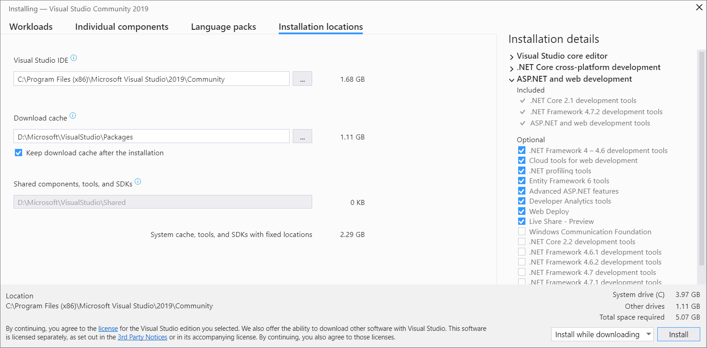

# Select the installation locations in Visual Studio

 [!INCLUDE [Visual Studio](~/includes/applies-to-version/vs-windows-only.md)]

::: moniker range=">=vs-2022"

You can reduce the installation footprint of Visual Studio on your system drive by changing the location of some of its files. Specifically, you can use a different location for the **download cache** and **shared components, tools, and SDKs**.

::: moniker-end

::: moniker range="vs-2019"

You can reduce the installation footprint of Visual Studio on your system drive by changing the location for some of its files. Specifically, you can use a different location for the download cache, shared components, SDKs, and tools files.

::: moniker-end

   > [!NOTE]
   > There are some tools and SDKs that have different rules on where they can be installed. Such tools and SDKs are installed on your system drive even if you choose another location.

Ready to get started? Here's how.

::: moniker range="vs-2019"

1. When you install Visual Studio, choose the **Installation locations** tab.

   

1. In the **Visual Studio IDE** section, accept the default. Visual Studio installs the core product and includes files that are specific to this version of Visual Studio.

   > [!TIP]
   > If your system drive is a solid-state drive (SSD), we recommend that you accept the default location on your system drive. The reason? When you develop with Visual Studio, you read from and write to a lot of files, which increases the disk I/O activity. It's best to choose your fastest drive to handle the load.

1. In the **Download cache** section, decide if you want to keep the download cache, and then decide where you want to store its files.

    * Check or uncheck **Keep download cache after the installation**.

       If you decide not to keep the download cache, the location is used only temporarily. This action won't affect or delete files from previous installations.

    * Specify the drive where you want to store installation files and manifests from the download cache.

        For example, if you select the "Desktop development with C++" workload, the temporarily required size is 1.58 GB on your system drive, which is then freed as soon as the installation completes.

       > [!IMPORTANT]
       > This location is set with your first installation and cannot be changed later from the installer UI. Instead, you must [use command-line parameters](use-command-line-parameters-to-install-visual-studio.md) to move the download cache.

1. In the **Shared components, tools, and SDKs** section, note that it uses the same drive that you chose in the "Download cache" section. The \Microsoft\VisualStudio\Shared directory is where Visual Studio stores the files that are shared by side-by-side Visual Studio installations. SDKs and tools are also stored in this directory.

::: moniker-end

::: moniker range=">=vs-2022"

1. When you install Visual Studio, choose the **Installation locations** tab.

   :::image type="content" source="media/vs-2022/vs-installer-installation-locations-tab.png" border="false" alt-text="Screenshot showing the Installation locations tab of the Visual Studio Installer.":::

1. In the **Visual Studio IDE** section, accept the default path. Visual Studio installs the core product, and includes files that are specific to this version of Visual Studio.

   > [!TIP]
   > If your system drive is a solid-state drive (SSD), we recommend that you keep the core product on your system drive. The reason? When you develop with Visual Studio, you read from and write to a lot of files, which increases the disk I/O activity. It's best to choose your fastest drive to handle the load.

   > [!IMPORTANT]
   > You can select a different location only when you first install Visual Studio. If you've already installed it and want to change the location, you must uninstall Visual Studio and then reinstall it.

1. In the **Download cache** section, decide whether you want to keep the download cache, and if so, where you want to store its files.

    * Check or uncheck **Keep download cache after the installation**.

      If you decide not to keep the download cache, the download cache location is only temporarily used. This action won't affect or delete files from previous installations.

      For example, if you select the "Desktop development with C++" workload, the temporarily required size for the download cache location is 2.11 GB. As soon as the installation completes, downloaded cache files are removed, leaving only package metadata.

    * Specify the folder path, including the drive, where you want to store the installation files and manifests from the download cache.

   > [!IMPORTANT]
   > You can select a different location only when you first install Visual Studio. If you've already installed it and want to change the location, you must uninstall Visual Studio and then reinstall it.

1. In the **Shared components, tools, and SDKs** section, select the folder where you want to store the files that are shared by side-by-side Visual Studio installations. SDKs and tools are also stored in this directory.

   > [!IMPORTANT]
   > If you've installed Visual Studio on your computer before, you won't be able to change the Shared components, tools, and SDKs path and it will appear greyed out.

::: moniker-end

[!INCLUDE[install_get_support_md](includes/install_get_support_md.md)]

## See also

* [Install Visual Studio](install-visual-studio.md)
* [Update Visual Studio](update-visual-studio.md)
* [Modify Visual Studio](update-visual-studio.md)
* [Uninstall Visual Studio](uninstall-visual-studio.md)
