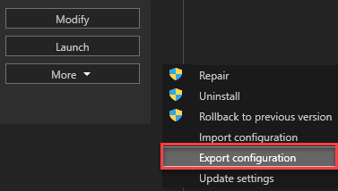
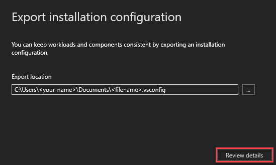

# Import or export installation configurations

 [!INCLUDE [Visual Studio](~/includes/applies-to-version/vs-windows-only.md)]

You can use installation configuration files to configure Visual Studio. To do so, export the workloads and components information to a [.vsconfig file](#vsconfig-file-format) by using the Visual Studio Installer. You can then import the configuration into new or existing installations, use them to create or modify a layout or an offline installation, and share them with others.

## Export a configuration

You can export an installation configuration file from either a previously installed instance of Visual Studio. 

### Use the Visual Studio Installer UI

1. Open the Visual Studio Installer.

1. On the product card, choose the **More** button, and then select **Export configuration**.

   

1. Browse to or type the location where you want to save your .vsconfig file, and then choose **Review details**.

   

1. Make sure you've got the workloads and components that you want, and then choose **Export**.

   ::: moniker range="vs-2022"

      :::image type="content" source="../install/media/vs-2022/export-configuration-confirmation-1.png" alt-text="Screenshot of the Export Window.":::

   ::: moniker-end

### Export a configuration file programmatically

You can export a configuration programmatically by using the `export` verb as described in the [Install Visual Studio from the command line](use-command-line-parameters-to-install-visual-studio.md) documentation.

## Import a configuration

Similar to exporting a configuration, you can also import an installation configuration file into either a previously installed instance of Visual Studio, or use it to initialize a new installation of Visual Studio.  

### Use the Visual Studio Installer UI

When you're ready to import an installation configuration file, follow these steps.

1. Open the Visual Studio Installer.

1.  On either the **Installed** tab or the **Available** tab, select **More** > **Import configuration** on the product card.

1. Locate the .vsconfig file that you want to import, and then choose **Review details**.

1. Make sure you've got the workloads and components that you want, and then choose **Close**.

### Programmatically use a configuration file to add components to an existing installation
 
Use `--config` to either initialize or modify an existing installation to add or remove components. The example below uses the installer already on the client machine to modify an existing installation.

```shell
"C:\Program Files (x86)\Microsoft Visual Studio\Installer\setup.exe" modify --installPath "C:\VS" --config "C:\myconfig.vsconfig"
```

> [!NOTE]
> To add or remove components to an existing installation by using a config file (_*.vsconfig_), you'll need to **modify** your installed product and not update. **Update** just updates the components to the latest version; it doesn't add or remove new ones. To learn more, see [Install Visual Studio from the command line](use-command-line-parameters-to-install-visual-studio.md).

## Use a configuration file to initialize the contents of a layout

Using the correct bootstrapper that corresponds to the version and edition of Visual Studio that you want, open an administrator command prompt and run the following command to use `-config` to configure the contents of a layout:

```shell
vs_enterprise.exe --layout c:\localVSlayout --config c:\myconfig.vsconfig --lang en-US 
```

## Automatically install missing components

Save a .vsconfig file to your solution root directory and then open a solution. Visual Studio automatically detects the missing components and prompts you to install them.


You can also generate a .vsconfig file right from Solution Explorer.

1. Right-click on your solution file.

1. Choose **Add** > **Installation Configuration File**.

1. Confirm the location where you want to save the .vsconfig file, and then choose **Review details**.

1. Make sure you've got the workloads and components that you want, and then choose **Export**.

> [!NOTE]
> For more information, see the [Configure Visual Studio across your organization with .vsconfig](https://devblogs.microsoft.com/setup/configure-visual-studio-across-your-organization-with-vsconfig/) blog post.

[!INCLUDE[install_get_support_md](includes/install_get_support_md.md)]

## vsconfig file format

The .vsconfig file is a json file format that contains a components section that contains [workloads and components](workload-and-component-ids.md).

```shell
{
  "version": "1.0", 
  "components": [ 
    "Microsoft.VisualStudio.Component.CoreEditor", 
    "Microsoft.VisualStudio.Workload.CoreEditor", 
    "Microsoft.VisualStudio.Component.NuGet" 
    ] 
}
```

## Related content

* [Create a network installation of Visual Studio](create-a-network-installation-of-visual-studio.md)
* [Update a networked-based installation of Visual Studio](update-a-network-installation-of-visual-studio.md)
* [Control updates to Visual Studio deployments](controlling-updates-to-visual-studio-deployments.md)
* [Configure policies for enterprise deployments](configure-policies-for-enterprise-deployments.md)
