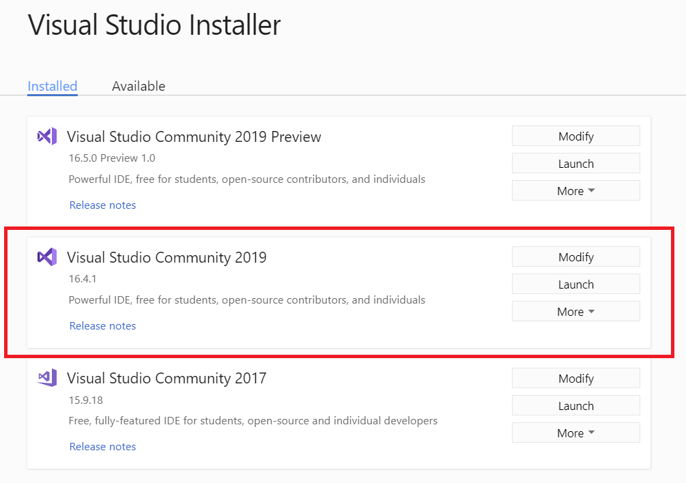
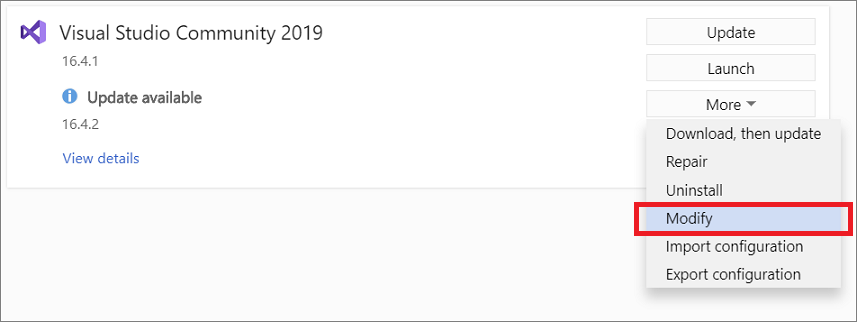
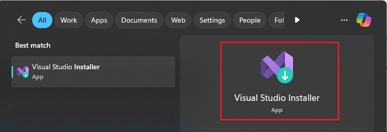
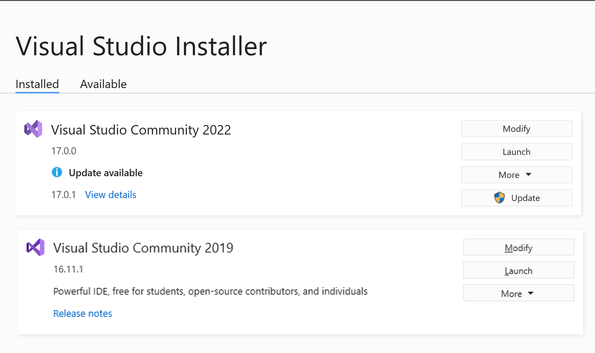
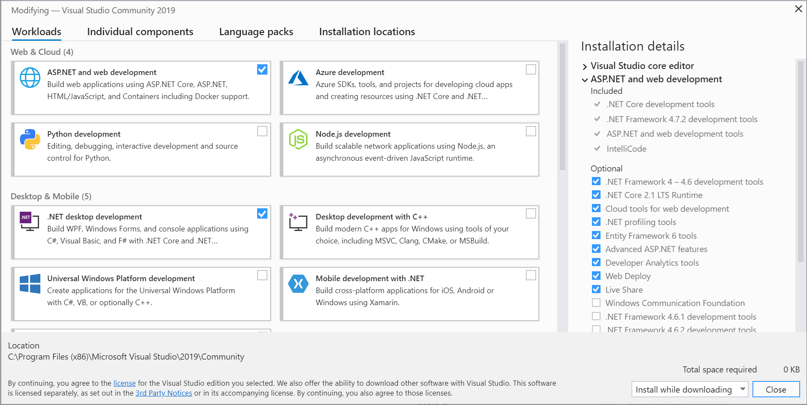
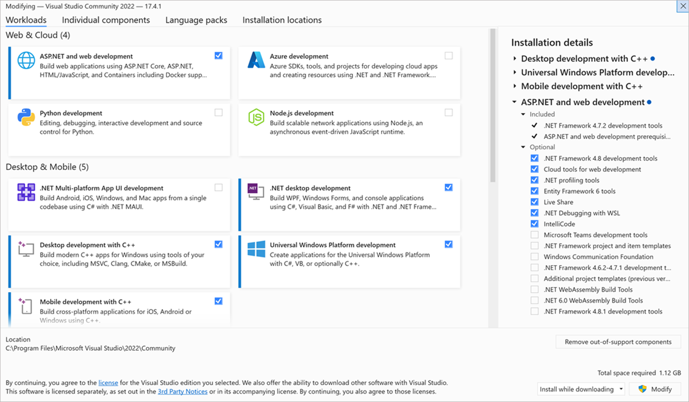
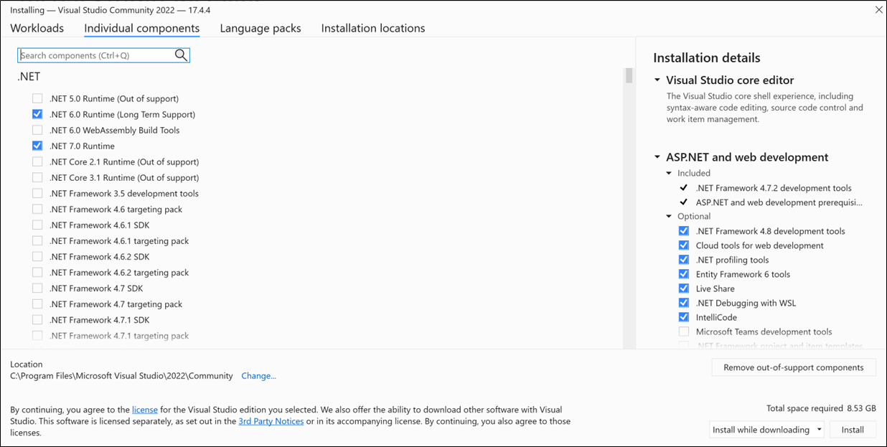

# Modify Visual Studio workloads, components, and language packs

 [!INCLUDE [Visual Studio](~/includes/applies-to-version/vs-windows-only.md)]

It's easy to modify Visual Studio so that it includes only what you want, when you want it. To do so, open the Visual Studio Installer, and then add or remove workloads, components, and language packs.

## Prerequisites

- To install, modify, or update Visual Studio, you must run the Visual Studio Installer as an administrator. If you try to modify Visual Studio as a typical user, you'll get a User Account Control notice prompting you for admin credentials. For more information, see [User permissions and Visual Studio](../ide/user-permissions-and-visual-studio.md).

- The following procedures assume you have an internet connection. For more about how to modify a previously created [offline installation](create-an-offline-installation-of-visual-studio.md) of Visual Studio, see:
  - [Update a network-based installation of Visual Studio](update-a-network-installation-of-visual-studio.md)
  - [Control updates to network-based Visual Studio deployments](controlling-updates-to-visual-studio-deployments.md)

## Launch the installer to modify your installation

To modify your Visual Studio installation, you first need to launch the Visual Studio Installer, and then select a Visual Studio installation to modify.

::: moniker range="vs-2019"

1. Find the **Visual Studio Installer** on your computer.

     In the Windows Start menu, you can search for "installer".

     

     > [!NOTE]
     > You can also find the Visual Studio Installer in the following location:
     >
     > `C:\Program Files (x86)\Microsoft Visual Studio\Installer\vs_installer.exe`

    You might have to update the installer before continuing. If so, follow the prompts.

1. In the installer, look for the edition of Visual Studio that you installed, and then choose **Modify**.

     

     > [!IMPORTANT]
     > If you have an update pending, the Modify button is in a different place. This way, you can modify Visual Studio without updating it, should you want to. Choose **More**, and then choose **Modify**.
     >
     > 

::: moniker-end

::: moniker range=">=vs-2022"

1. There are many ways to open the Visual Studio Installer:

   - In the Windows Start menu, you can search for "installer", and then select **Visual Studio Installer** from the results.

     

   - Run the Visual Studio Installer executable, which is located at this path: `C:\Program Files (x86)\Microsoft Visual Studio\Installer\vs_installer.exe`

   - If you have Visual Studio open, select **Tools** > **Get Tools and Features...**, which opens the Visual Studio Installer.

     

   You might be prompted to update the Visual Studio Installer before continuing. If so, follow the prompts.

1. In the Visual Studio Installer, look for the installation of Visual Studio that you want to modify, and then choose the **Modify** button.

     

::: moniker-end

## Change workloads or individual components

::: moniker range="vs-2019"

 Workloads contain the features you need for the programming language or platform that you're using. Use workloads to modify Visual Studio so that it supports the work you want to do, when you want to do it.

 > [!TIP]
>For more information about which tool and component bundles you need for development, see [Visual Studio workloads](https://visualstudio.microsoft.com/vs/#workloads).

1. In the Visual Studio Installer, choose the **Workloads** tab, and then select or deselect the workloads that you want.

    

1. Choose whether you want to accept the default **Install while downloading** option or the **Download all, then install** option.

    

    The "Download all, then install" option is handy if you want to download first and then install later.

1. Choose **Modify**.

1. After the new workloads are installed, choose **Launch** from the Visual Studio Installer to open Visual Studio.

::: moniker-end

::: moniker range=">=vs-2022"

Workloads contain the components you need for the programming language or platform that you're using. Use workloads to modify Visual Studio so that it supports the work you want to do, when you want to do it.

> [!TIP]
> For more about which tools and component bundles you need for development, see [Visual Studio workloads](https://visualstudio.microsoft.com/vs/#workloads).

1. In the Visual Studio Installer, choose the **Workloads** tab, and then select or deselect the workloads that you want.

    

1. To add more components than a workload installs, choose the **Individual components** tab, and then select or deselect the individual components that you want.

    

1. Choose whether you want to **Install while downloading** or **Download all, then install**. The default option, **Install while downloading**, saves overall time by starting the install earlier.

    

1. Choose **Modify**.

1. After the modified workloads or components are installed, choose **Launch** from the Visual Studio Installer to open Visual Studio 2022.

::: moniker-end

> [!TIP]
> For information about the SQL Server Data Tools (SSDT) component, see [Download and install SSDT for Visual Studio](/sql/ssdt/download-sql-server-data-tools-ssdt?view=sql-server-ver15&preserve-view=true).

## Modify language packs

The Visual Studio Installer selects a default language pack for Visual Studio that matches the language of the operating system. However, you can change the default language whenever you want.

To do so:

1. Choose the **Language packs** tab in the Visual Studio Installer.
1. Select the language you prefer.
1. Follow the prompts.

[!INCLUDE[install_get_support_md](includes/install_get_support_md.md)]

## See also

* [List of Visual Studio workload & component IDs](workload-and-component-ids.md)
* [Update Visual Studio](update-visual-studio.md)
* [Update a network-based installation of Visual Studio](update-a-network-installation-of-visual-studio.md)
* [Uninstall Visual Studio](uninstall-visual-studio.md)
