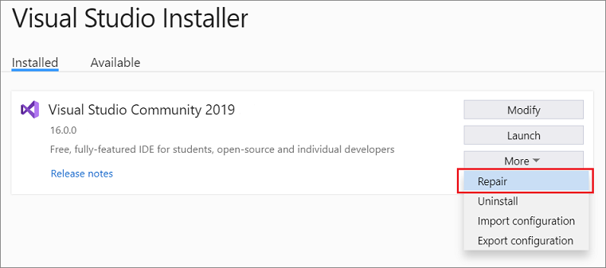
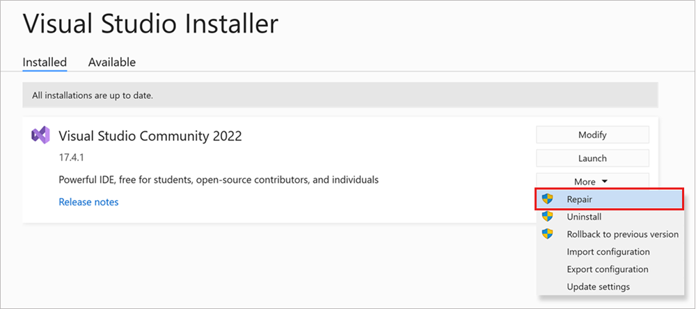

# Repair Visual Studio

Sometimes your Visual Studio installation becomes damaged or corrupted. A repair is useful for fixing a wide variety of install-time issues, including update issues.

## When to use repair

Use repair if you're having issues with:

* Installation payload, which can happen when writing a file to disk is unsuccessful and the file gets corrupted. Repair can reacquire needed files.
* Client-side download, assuming that you fixed any internet connection or proxy issues.
* Updating Visual Studio. Repair fixes many common update issues.

> [!TIP] 
> An unstable internet connection or an issue in a Windows service, like Windows Installer, can cause install issues. In those scenarios, repair might also be affected. To check for underlying issues, review the error report generated by the Visual Studio Installer.

> [!NOTE] 
> Repairing Visual Studio resets user settings and reinstalls your existing assemblies. If you're experiencing a product issue and repair doesn't fix it, create a [Visual Studio Feedback Ticket](https://aka.ms/feedback/suggest?space=8). For more information, see [How to report a problem with Visual Studio or Visual Studio Installer](../ide/how-to-report-a-problem-with-visual-studio.md).

## How to repair

::: moniker range="vs-2019"

1. Find the **Visual Studio Installer** on your computer.

     From the Start menu in Windows, you can search for *installer*.

     

     > [!NOTE]
     > You can also find the Visual Studio Installer in the following location:
     >
     > `C:\Program Files (x86)\Microsoft Visual Studio\Installer\setup.exe`

    You might have to update the installer before continuing. If so, follow the prompts.

1. In the installer, look for the edition of Visual Studio that you installed. Next, choose **More**, and then choose **Repair**.

     

   > [!NOTE]
   > Repairing Visual Studio will reset its environment. Local customizations like per-user extensions installed without elevation, user settings, and profiles will be removed. Your synchronized settings such as themes, colors, and key bindings will be restored.

    The **Repair** option appears only for installed instances of Visual Studio. If you don't see the **Repair** option, check whether you selected **More** in a version that's listed in the Visual Studio Installer as "Available" rather than "Installed".

::: moniker-end

::: moniker range=">=vs-2022"

1. Find the **Visual Studio Installer** on your computer.

    From the Start menu in Windows, search for "installer", and then select **Visual Studio Installer** from the results.

     

    You can also find the Visual Studio Installer in the following location:
    `C:\Program Files (x86)\Microsoft Visual Studio\Installer\setup.exe`

    You might be prompted to update the Visual Studio Installer before continuing. If so, follow the prompts.

1. In the Visual Studio Installer, look for the installation of Visual Studio that you want to repair. Then choose **Repair** from the **More** dropdown menu.

     

   > [!NOTE]
   > Repairing Visual Studio will reset its environment. Local customizations, like per-user extensions installed without elevation, user settings, and profiles will be removed. Your synchronized settings such as themes, colors, and key bindings will be restored.

    The **Repair** option applies to installed instances of Visual Studio. If you don't see the **Repair** option in the **More** dropdown menu, chances are you're in the **Available** tab instead of the **Installed** tab of the Visual Studio Installer.

::: moniker-end

[!INCLUDE[install_get_support_md](includes/install_get_support_md.md)]

## Related content

* [Install Visual Studio](install-visual-studio.md)
* [Update Visual Studio](update-visual-studio.md)
* [Uninstall Visual Studio](uninstall-visual-studio.md)
* [Troubleshooting Visual Studio installation and upgrade issues](troubleshooting-installation-issues.md)
