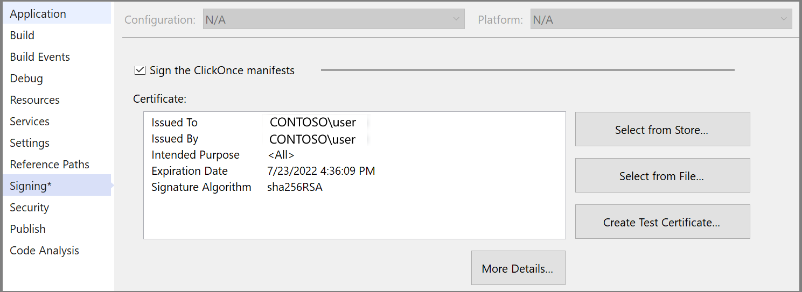

# MSB3327

The full error text is similar to the following example:

```output
MSB3327: Unable to find code signing certificate in the current user’s Windows certificate store. To correct this, either disable signing of the ClickOnce manifest or install the certificate into the certificate store.
```

You could get the error if you enabled **Sign the ClickOnce manifests** and the .pfx file specified for ClickOnce manifest signing could not be found in your certificate store when MSBuild was trying to publish the manifest.

To resolve this error, try re-importing the .pfx file again in the certificate store. To re-import the .pfx file, right-click the .pfx file in Windows Explorer and choose **Install PFX**.



:::moniker range="vs-2017"
See [How to: Sign application and deployment manifests](../../ide/how-to-sign-application-and-deployment-manifests.md).
:::moniker-end

:::moniker range=">=vs-2019"
See [How to: Sign application and deployment manifests](../../ide/how-to-sign-application-and-deployment-manifests.md) or for newer .NET projects in Visual Studio 2019 or later, see [Deploy a .NET Windows Desktop application using ClickOnce](../../deployment/quickstart-deploy-using-clickonce-folder.md).
:::moniker-end

When running in a non-interactive environment, such as a script in a pipeline, use the command-line tool [certutil](/windows-server/administration/windows-commands/certutil).

```cmd
certutil –f –p [certificate_password] –importpfx <path to pfx file>
```
