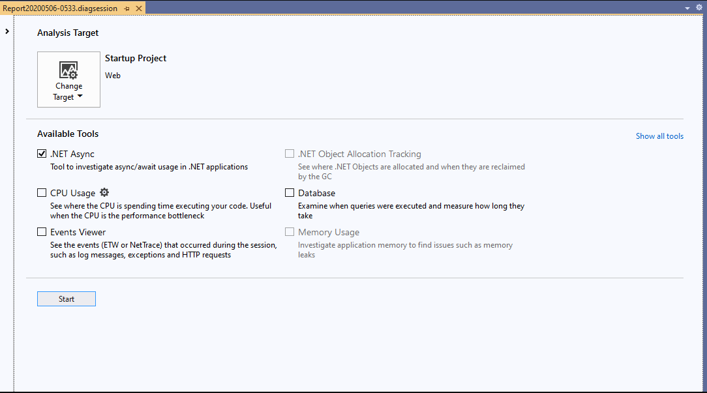
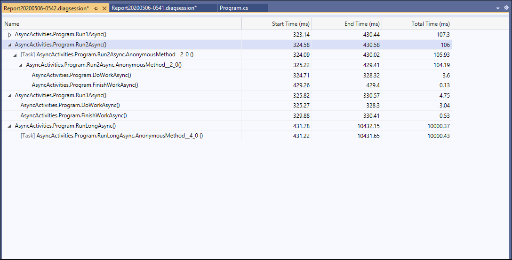
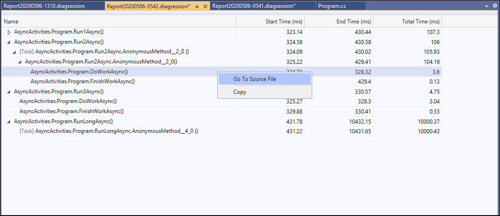

# Analyze performance of .NET asynchronous code

 [!INCLUDE [Visual Studio](~/includes/applies-to-version/vs-windows-only.md)]

Use the .NET Async tool to analyze the performance of asynchronous code in your app.

> [!NOTE]
> The .NET Async tool requires Visual Studio 2019 version 16.7 or later and a .NET project that uses **async** and **await**.

## Setup

1. Select **Alt+F2** to open the performance profiler in Visual Studio.

1. Select the **.NET Async** check box.

   

1. Click the **Start** button to run the tool.

1. After the tool starts running, go through the scenario you want to profile in your app. Then select **Stop collection** or close your app to see your data.

1. After collection stops, you see a table of the activities that happened during your profiling session.

   

Asynchronous events are organized into activities chronologically. Each displays its start time, end time, and duration.

Each row that corresponds to a [task](/dotnet/api/system.threading.tasks) is labeled in the **Name** column. For any task name that can't be resolved, a **Task in** label appears. It's followed by the name of the method the task occurs within. If an asynchronous activity doesn't complete within the collection session, an **Incomplete** label appears in the **End Time** column.

To further investigate a specific task or activity, right-click the row. Then select **Go To Source File** to see where in your code that activity happened.

## Related content

- [Optimizing Profiler settings](../profiling/optimize-profiler-settings.md)
- [Identify hot paths with Flame Graph](../profiling/flame-graph.md)
- [Analyze CPU usage](../profiling/cpu-usage.md)