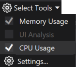
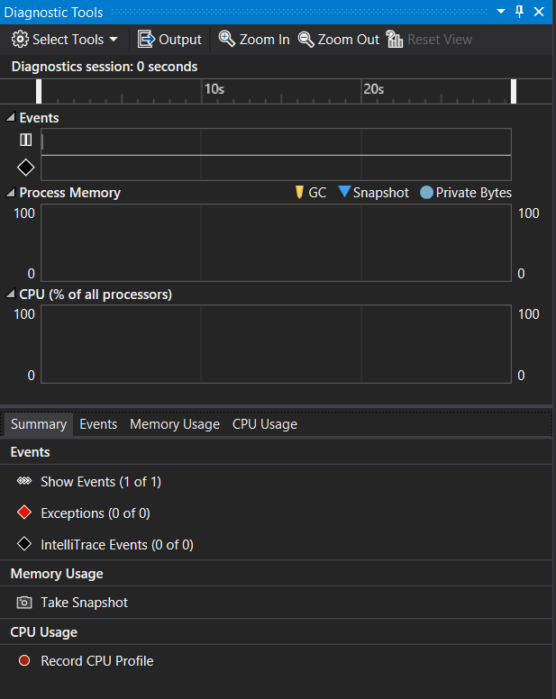
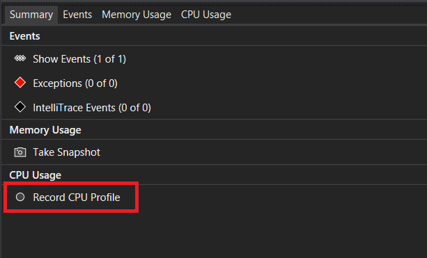
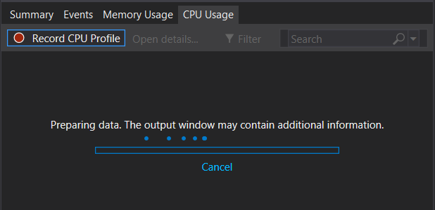
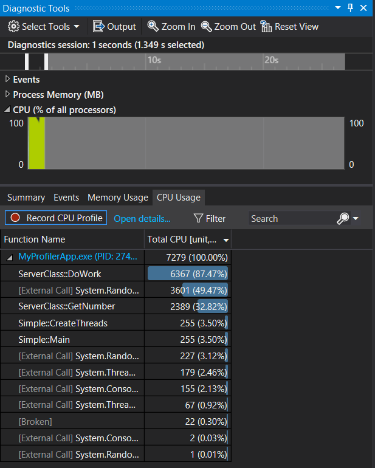
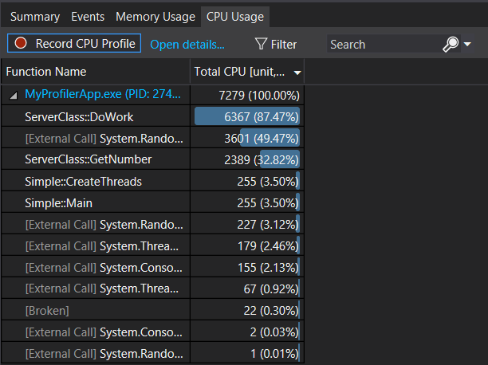
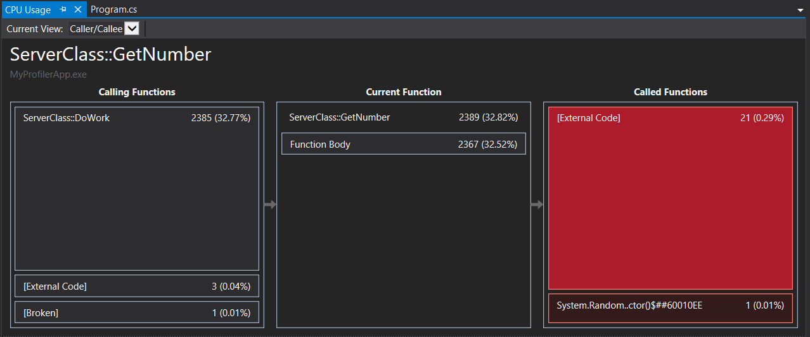
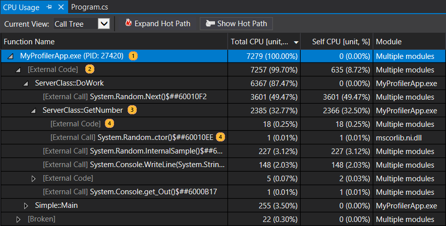
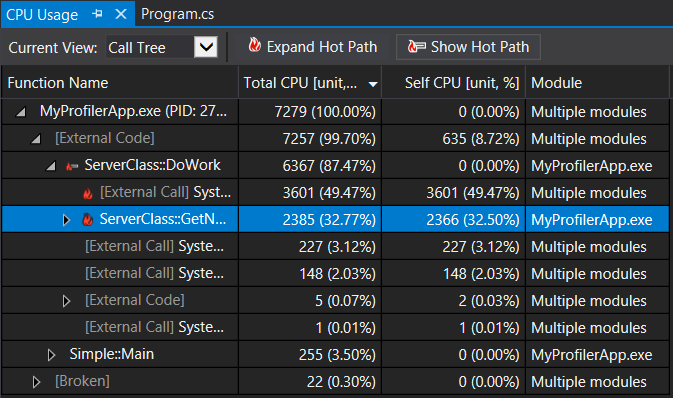
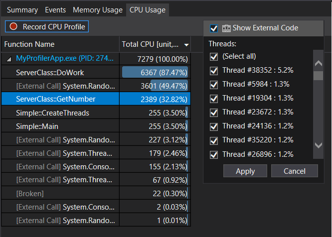

# Measure application performance by analyzing CPU usage (C#, Visual Basic, C++, F#)

 [!INCLUDE [Visual Studio](~/includes/applies-to-version/vs-windows-only.md)]

Find performance issues while you're debugging with the debugger-integrated **CPU Usage** diagnostic tool.  You can also analyze CPU usage without a debugger attached or by targeting a running app. For more information, see [Run profiling tools with or without the debugger](../profiling/running-profiling-tools-with-or-without-the-debugger.md).

When the debugger pauses, the **CPU Usage** tool in the Diagnostic Tools window collects information about the functions that are executing in your application. The tool lists the functions that were performing work, and provides a timeline graph you can use to focus on specific segments of the sampling session.

> [!Important]
> The debugger-integrated Diagnostics Tools are supported for .NET development in Visual Studio, including ASP.NET, ASP.NET Core, and for native/C++ development. The corresponding Visual Studio [workload](../install/modify-visual-studio.md) is required. Windows 8 and later is required to run profiling tools with the debugger (**Diagnostic Tools** window).

In this tutorial, you will:

> [!div class="checklist"]
> * Collect CPU usage data
> * Analyze CPU usage data

If **CPU Usage** does not give you the data that you need, other profiling tools in the [Performance Profiler](../profiling/profiling-feature-tour.md#post_mortem) provide different kinds of information that might be helpful to you. In many cases, the performance bottleneck of your application may be caused by something other than your CPU, such as memory, rendering UI, or network request time.

## Step 1: Collect CPU usage data

1. Open the project you want to debug in Visual Studio and set a breakpoint in your app at the point where you want to examine CPU usage.

2. Set a second breakpoint at the end of the function or region of code that you want to analyze.

    By setting two breakpoints, you can limit data collection to the parts of code that you want to analyze.

3. The **Diagnostic Tools** window appears automatically unless you have turned it off. To bring up the window again, click **Debug** > **Windows** > **Show Diagnostic Tools**.

4. You can choose whether to see **CPU Usage**, [Memory Usage](../profiling/Memory-Usage.md), or both, with the **Select Tools** setting on the toolbar. If you are running Visual Studio Enterprise,  you can also enable or disable IntelliTrace in **Tools** > **Options** > **IntelliTrace**.

     

     We will mainly be looking at CPU utilization, so make sure that **CPU Usage** is enabled (it is enabled by default).

5. Click **Debug** > **Start Debugging** (or **Start** on the toolbar, or **F5**).

     When the app finishes loading, the Summary view of the Diagnostics Tools appears. If you need to open the window, click **Debug** > **Windows** > **Show Diagnostic Tools**.

     

     For more information on the events, see [Searching and filtering the Events tab of the Diagnostic Tools window](https://devblogs.microsoft.com/devops/searching-and-filtering-the-events-tab-of-the-diagnostic-tools-window/).

6. Run the scenario that will cause your first breakpoint to be hit.

7. While the debugger is paused, enable the collection of the CPU Usage data and then open the **CPU Usage** tab.

     

     When you choose **Record CPU Profile**, Visual Studio will begin recording your functions and how much time they take to execute. You can only view this collected data when your application is halted at a breakpoint.

8. Hit F5 to run the app to your second breakpoint.

     Now, you now have performance data for your application specifically for the region of code that runs between the two breakpoints.

     The profiler begins preparing thread data. Wait for it to finish.

     

     The CPU Usage tool displays the report in the **CPU Usage** tab.

     

9. If you want to select a more specific region of code to analyze, select a region in the CPU timeline (it must be a region that shows profiling data).

     

     At this point, you can begin to analyze the data.

     > [!TIP]
     >  When trying to identify performance issues, take multiple measurements. Performance naturally varies from run-to-run, and code paths typically execute slower the first time they run due to one-time initialization work such as loading DLLs, JIT compiling methods, and initializing caches. By taking multiple measurements, you get a better idea of the range and median of the metric being shown, whichs allow you to compare the first time versus the steady state performance of an area of code.

## Step 2: Analyze CPU usage data

We recommend that you begin analyzing your data by examining the list of functions under CPU Usage, identifying the functions that are doing the most work, and then taking a closer look at each one.

1. In the function list, examine the functions that are doing the most work.

    

    > [!TIP]
    > Functions are listed in order starting with those doing the most work (they're not in call order). This helps you quickly identify the longest running functions.

2. In the function list, double-click one of your app functions that is doing a lot of work.

    When you double-click a function, the **Caller/Callee** view opens in the left pane.

    

    In this view, the selected function shows up in the heading and in the **Current Function** box (GetNumber, in this example). The function that called the current function is shown on the left under **Calling Functions**, and any functions called by the current function are shown in **Called Functions** box on the right. (You can select either box to change the current function.)

    This view shows you the total time (ms) and the percentage of the overall app running time that the function has taken to complete.
    **Function Body** also shows you the total amount of time (and the percentage of time) spent in the function body excluding time spent in calling and called functions. (In this example, 2367 out of 2389 ms were spent in the function body, and the remaining 22 ms were spent in external code called by this function).

    > [!TIP]
    > High values in **Function Body** may indicate a performance bottleneck within the function itself.

3. To see a higher-level view showing the order in which the functions are called, select **Call Tree** from the drop-down list at the top of the pane.

    Each numbered area in the figure relates to a step in the procedure.

    

    |Image|Description|
    |-|-|
    ||The top-level node in CPU Usage call trees is a pseudo-node|
    ||In most apps, when the [Show External Code](#view-external-code) option is disabled, the second-level node is an **[External Code]** node that contains the system and framework code that starts and stops the app, draws the UI, controls thread scheduling, and provides other low-level services to the app.|
    ||The children of the second-level node are the user-code methods and asynchronous routines that are called or created by the second-level system and framework code.|
    ||Child nodes of a method contain data only for the calls of the parent method. When **Show External Code** is disabled, app methods can also contain an **[External Code]** node.|

    Here is more information on the column values:

    - **Total CPU** indicates how much work was done by the function and any functions called by it. High total CPU values point to the functions that are most expensive overall.

    - **Self CPU** indicates how much work was done by the code in the function body, excluding the work done by functions that were called by it. High **Self CPU** values may indicate a performance bottleneck within the function itself.

    - **Modules** The name of the module containing the function, or the number of modules containing the functions in an [External Code] node.

    To see the function calls that use the highest percentage of the CPU in the call tree view, click **Expand Hot Path**.

    

    > [!NOTE]
    > If you see code in the call tree marked as "broken" code or "unwalkable stack", this indicates that Event Tracing for Windows (ETW) events were likely dropped. Try collecting the same trace a second time to resolve the issue.

## View external code

External code are functions in system and framework components that are executed by the code you write. External code include functions that start and stop the app, draw the UI, control threading, and provide other low-level services to the app. In most cases, you won't be interested in external code, and so the CPU Usage tool gathers the external functions of a user method into one **[External Code]** node.

If you want to view the call paths of external code, choose **Show External Code** from the **Filter view** list and then choose **Apply**.

Be aware that many external code call chains are deeply nested, so that the width of the Function Name column can exceed the display width of all but the largest of computer monitors. When this happens, function names are shown as **[...]**.

Use the search box to find a node that you are looking for, then use the horizontal scroll bar to bring the data into view.

> [!TIP]
> If you profile external code that calls Windows functions, you should make sure that you have the most current .*pdb* files. Without these files, your report views will list Windows function names that are cryptic and difficult to understand. For more information about how to make sure that you have the files you need, see [Specify symbol (.pdb) and source files in the debugger](../debugger/specify-symbol-dot-pdb-and-source-files-in-the-visual-studio-debugger.md).

## Next steps

In this tutorial, you've learned how to collect and analyze CPU usage data. If you already completed the [First look at profiling tools](../profiling/profiling-feature-tour.md), you may want to get a quick look at how to analyze memory usage in your apps.

> [!div class="nextstepaction"]
> [Profile memory usage in Visual Studio](../profiling/memory-usage.md)
