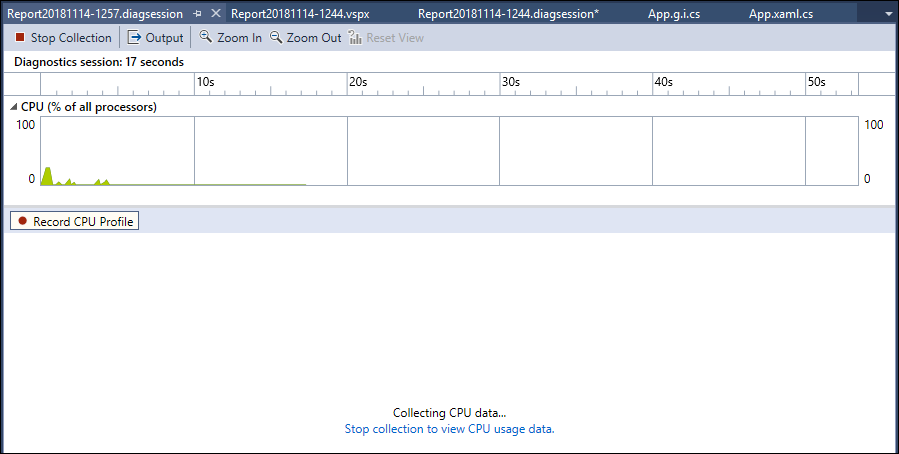
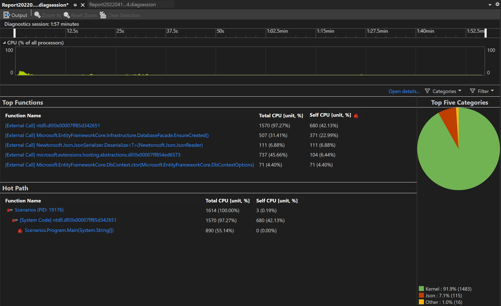
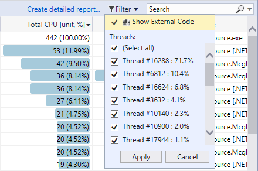
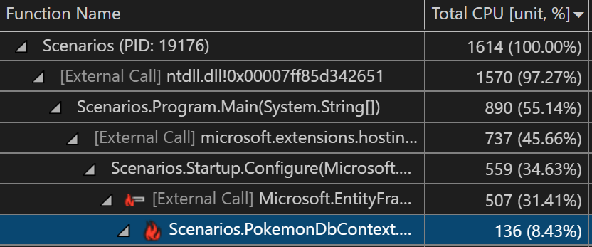
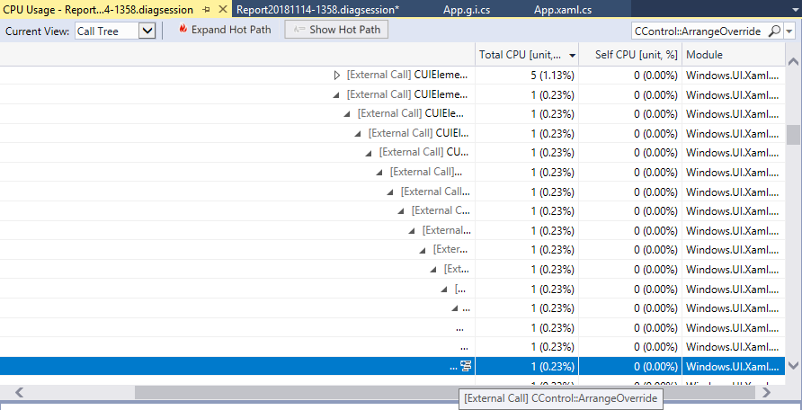
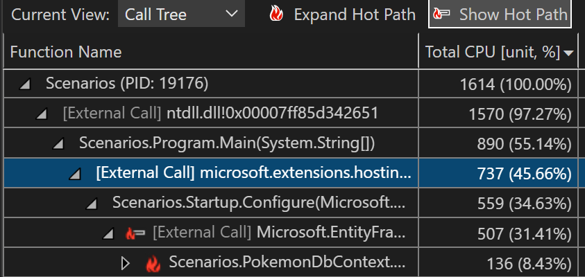

# Analyze CPU usage without debugging in the Performance Profiler (C#, Visual Basic, C++, F#)

 [!INCLUDE [Visual Studio](~/includes/applies-to-version/vs-windows-only.md)]

A good way to start investigating performance issues in your app is to understand its CPU usage. The **CPU Usage** performance tool shows the CPU time and percentage spent executing code in C++, C#/Visual Basic, and JavaScript apps. If you need to diagnose a slow-down or a process hang in your team’s codebase, the CPU Usage tool can help you diagnose the issue with your team’s production code. The tool provides automatic insights and various views of your data so that you can analyze and diagnose performance issues.

The tool is also helpful for DevOps scenarios, such as when a customer reports that some requests or orders are not getting through to the retail website during peak season. Often, the issues are in production, and it is challenging to debug at that moment, but this tool can help you capture enough information and evidence of the issue. After collecting a trace file, the analysis can quickly help you understand potential causes and give suggestions within the context of your code so that you can take the next steps to fix the issue.

The **CPU Usage** tool is helpful for both local trace sessions and production. It can also be initiated by using the keyboard shortcut, **Alt+F2**, and then **CPU Usage** or by opening an already collected trace using a tool like dotnet-trace or dotnet-monitor.

The CPU Usage tool can run on an open Visual Studio project, on an installed Microsoft Store app, or attached to a running app or process. You can run the CPU Usage tool with or without debugging. For more information, see [Run profiling tools with or without the debugger](../profiling/running-profiling-tools-with-or-without-the-debugger.md).

The following instructions show how to use the CPU Usage tool without the debugger, using the Visual Studio Performance Profiler. The examples use a Release build on a local machine. Release builds provide the best view of actual app performance. To analyze CPU usage with Debug builds (debugger attached), see [Beginner's guide to performance profiling](../profiling/beginners-guide-to-performance-profiling.md).

Usually, the local machine best replicates installed app execution. To collect data from a remote device, run the app directly on the device, not over a Remote Desktop Connection.

>[!NOTE]
>Windows 7 or later is required to use the [Performance Profiler](../profiling/profiling-feature-tour.md).

## Collect CPU usage data

1. In the Visual Studio project, set the solution configuration to **Release** and select **Local Windows Debugger** (or **Local Machine**) as the deployment target.

    ::: moniker range=">=vs-2022"
    
    ::: moniker-end
    ::: moniker range="<=vs-2019"
    
    ::: moniker-end

1. Select **Debug** > **Performance Profiler**.

1. Under **Available tools**, select **CPU Usage**, and then select **Start**.

    ::: moniker range=">=vs-2022"
    
    ::: moniker-end
    ::: moniker range="<=vs-2019"
    
    ::: moniker-end

1. After the app starts, the diagnostic session begins and displays CPU usage data. When you're finished collecting data, select **Stop Collection**.

    ::: moniker range=">=vs-2022"
    
    ::: moniker-end
    ::: moniker range="<=vs-2019"
    
    ::: moniker-end

    The CPU Usage tool analyzes the data and displays the report.

    ::: moniker range=">=vs-2022"
    
    ::: moniker-end
    ::: moniker range="<=vs-2019"
   
    ::: moniker-end

## Analyze the CPU Usage report

The diagnostic report is sorted by **Total CPU**, from highest to lowest. Change the sort order or sort column by selecting the column headers. Use the **Filter** dropdown to select or deselect threads to display, and use the **Search** box to search for a specific thread or node.

::: moniker range=">=vs-2019"
Starting in Visual Studio 2019, you can click the **Expand Hot Path** and **Show Hot Path** buttons to see the function calls that use the highest percentage of the CPU in the call tree view.
::: moniker-end

###  CPU Usage data columns

|Name|Description|
|-|-|
|**Total CPU [unit, %]**|   The milliseconds and CPU percentage used by calls to the function, and functions called by the function, in the selected time range. This is different from the **CPU Utilization** timeline graph, which compares the total CPU activity in a time range to the total available CPU.|
|**Self CPU [unit, %]**|   The milliseconds and CPU percentage used by calls to the function in the selected time range, excluding functions called by the function.|
|**Module**|The name of the module containing the function.

###  The CPU Usage call tree

To view the call tree, select the parent node in the report. The **CPU Usage** page opens to the **Caller/Callee** view. In the **Current View** dropdown, select **Call Tree**.

####  Call tree structure

::: moniker range=">=vs-2022"

::: moniker-end
::: moniker range="vs-2019"

::: moniker-end
::: moniker range="vs-2017"

::: moniker-end

|Image|Description|
|-|-|
||The top-level node in CPU Usage call trees is a pseudo-node.|
||In most apps, when the **Show External Code** option is disabled, the second-level node is an **[External Code]** node. The node contains the system and framework code that starts and stops the app, draws the UI, controls thread scheduling, and provides other low-level services to the app.|
||The children of the second-level node are the user-code methods and asynchronous routines that are called or created by the second-level system and framework code.|
||Child nodes of a method have data only for the calls of the parent method. When **Show External Code** is disabled, app methods can also contain an **[External Code]** node.|

####  External code

System and framework functions that are executed by your code are called *external code*. External code functions start and stop the app, draw the UI, control threading, and provide other low-level services to the app. In most cases, you aren't interested in external code, so the CPU Usage call tree gathers the external functions of a user method into one **[External Code]** node.

::: moniker range=">=vs-2022"
To view the call paths of external code, switch the current view to the **Call Tree** view or right-click and select **View in Call Tree**.

::: moniker-end
::: moniker range="<=vs-2019"
To view the call paths of external code, on the main diagnostic report page (right pane), select **Show External Code** from the **Filter** dropdown, and then select **Apply**. The **Call Tree** view of the **CPU Usage** page then expands the external code calls. (The **Filter** dropdown is available on the main diagnostic page, not the detailed views.)

::: moniker-end

::: moniker range=">=vs-2022"
Many external code call chains are deeply nested, so the width of the chain can exceed the display width of the **Function Name** column. The function names then appear as shown in the following image.

::: moniker-end
::: moniker range="<=vs-2019"
Many external code call chains are deeply nested, so the width of the chain can exceed the display width of the **Function Name** column. The function names then appear as **...**.

::: moniker-end

To find a function name you're looking for, use the search box. Hover over the selected line or use the horizontal scroll bar to view the data.

::: moniker range=">=vs-2022"

::: moniker-end
::: moniker range="vs-2019"

::: moniker-end
::: moniker range="vs-2017"

::: moniker-end

###  Asynchronous functions in the CPU usage call tree

When the compiler encounters an asynchronous method, it creates a hidden class to control the method's execution. Conceptually, the class is a state machine. The class has compiler-generated functions that asynchronously call the original methods, and the callbacks, scheduler, and iterators needed to run them. When a parent method calls the original method, the compiler removes the method from the execution context of the parent, and runs the hidden class methods in the context of the system and framework code that controls app execution. The asynchronous methods are often, but not always, executed on one or more different threads. This code appears in the **CPU Usage** call tree as children of the **[External Code]** node immediately below the top node of the tree.

::: moniker range="<=vs-2019"
In the following example, the first two nodes under **[External Code]** are the compiler-generated methods of the state machine class. The third node is the call to the original method.

::: moniker-end

Expand the generated methods to show what's going on:

::: moniker range=">=vs-2022"

::: moniker-end
::: moniker range="<=vs-2019"

::: moniker-end

- `MainPage::GetMaxNumberAsyncButton_Click` just manages a list of the task values, computes the maximum of the results, and displays the output.

- `MainPage+<GetMaxNumberAsyncButton_Click>d__3::MoveNext` shows you the activity required to schedule and launch the 48 tasks that wrap the call to `GetNumberAsync`.

- `MainPage::<GetNumberAsync>b__b` shows the activity of the tasks that call `GetNumber`.
