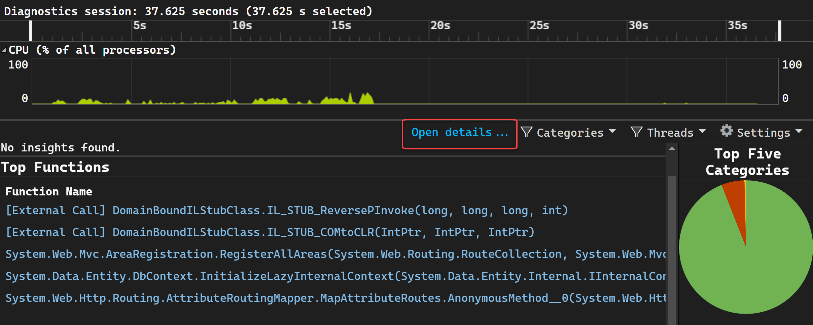

# Identify hot paths with a visualized call tree

Flame graphs are a visualization of categorized data, created to visualize stack traces of profiled software so that the most frequent code paths can be identified quickly and accurately.

The **Flame Graph** helps you identify hot paths in your code by visualizing a call tree. The graph gives a visual overview of where time is being spent in your application and you can click on specific nodes to dig into them further.

This view is in the CPU tool details tool window, above the source line highlighting view. After you've stopped your profiling session, you can view the Flame Graph by clicking **Open details**.

## ....

## ...

## See also
- [Diagnose high latency with CPU Insights](../profiling/cpu-insights.md)
- [Analyze CPU usage without debugging](../profiling/cpu-usage.md)