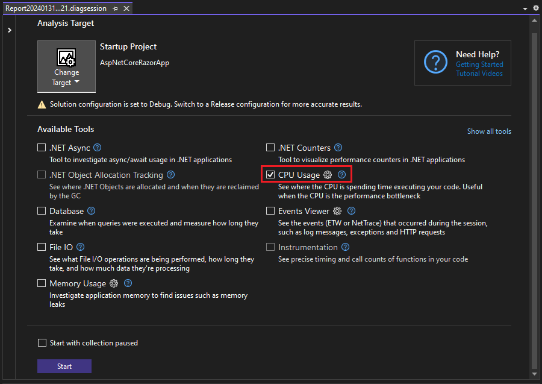
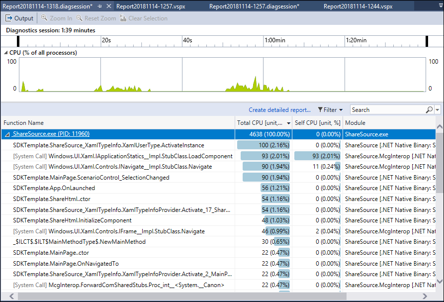
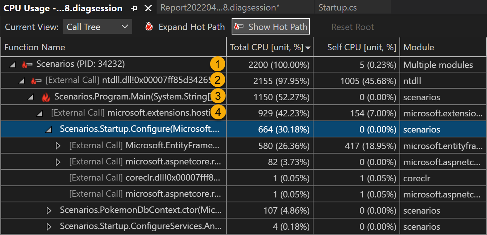
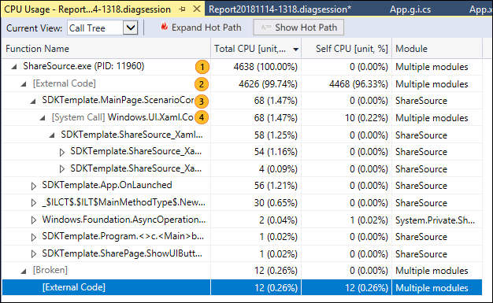

# Identify hot paths with a visualized call tree

Flame graphs are a visualization of categorized data, created to visualize stack traces of profiled software so that the most frequent code paths can be identified quickly and accurately.

The **Flame Graph** helps you identify hot paths in your code by visualizing a call tree. This new view is in the CPU tool details tool window, above the source line highlighting view. The graph gives a visual overview of where time is being spent in your application and you can click on specific nodes to dig into them further.

## 

1. In the Visual Studio project, set the solution configuration to **Release** and select **Local Windows Debugger** (or **Local Machine**) as the deployment target.

    ::: moniker range=">=vs-2022"
    
    ::: moniker-end
    ::: moniker range="<=vs-2019"
    
    ::: moniker-end

1. Select **Debug** > **Performance Profiler**.

1. Under **Available tools**, select **CPU Usage**, and then select **Start**.

    ::: moniker range=">=vs-2022"
    
    ::: moniker-end
    ::: moniker range="<=vs-2019"
    
    ::: moniker-end

1. After the app starts, the diagnostic session begins and displays CPU usage data. When you're finished collecting data, select **Stop Collection**.

    ::: moniker range=">=vs-2022"
    
    ::: moniker-end
    ::: moniker range="<=vs-2019"
    
    ::: moniker-end

    The CPU Usage tool analyzes the data and displays the report.

    ::: moniker range=">=vs-2022"
    
    ::: moniker-end
    ::: moniker range="<=vs-2019"
   
    ::: moniker-end

## Analyze the CPU Usage report

The diagnostic report is sorted by **Total CPU**, from highest to lowest. Change the sort order or sort column by selecting the column headers. Use the **Filter** dropdown to select or deselect threads to display, and use the **Search** box to search for a specific thread or node.

Starting in Visual Studio 2019, you can click the **Expand Hot Path** and **Show Hot Path** buttons to see the function calls that use the highest percentage of the CPU in the call tree view.

###  CPU Usage data columns

|Name|Description|
|-|-|
|**Total CPU [unit, %]**|   The milliseconds and CPU percentage used by calls to the function, and functions called by the function, in the selected time range. This is different from the **CPU Utilization** timeline graph, which compares the total CPU activity in a time range to the total available CPU.|
|**Self CPU [unit, %]**|   The milliseconds and CPU percentage used by calls to the function in the selected time range, excluding functions called by the function.|
|**Module**|The name of the module containing the function.

###  The CPU Usage call tree

To view the call tree, select the parent node in the report. The **CPU Usage** page opens to the **Caller/Callee** view. In the **Current View** dropdown, select **Call Tree**.

####  Call tree structure

::: moniker range=">=vs-2022"

::: moniker-end
::: moniker range="vs-2019"

::: moniker-end

|Image|Description|
|-|-|
||The top-level node in CPU Usage call trees is a pseudo-node.|
||In most apps, when the **Show External Code** option is disabled, the second-level node is an **[External Code]** node. The node contains the system and framework code that starts and stops the app, draws the UI, controls thread scheduling, and provides other low-level services to the app.|
||The children of the second-level node are the user-code methods and asynchronous routines that are called or created by the second-level system and framework code.|
||Child nodes of a method have data only for the calls of the parent method. When **Show External Code** is disabled, app methods can also contain an **[External Code]** node.|

####  External code

System and framework functions that are executed by your code are called *external code*. External code functions start and stop the app, draw the UI, control threading, and provide other low-level services to the app. In most cases, you aren't interested in external code, so the CPU Usage call tree gathers the external functions of a user method into one **[External Code]** node.

::: moniker range=">=vs-2022"
To view the call paths of external code, switch the current view to the **Call Tree** view or right-click and select **View in Call Tree**.

::: moniker-end
::: moniker range="<=vs-2019"
To view the call paths of external code, on the main diagnostic report page (right pane), select **Show External Code** from the **Filter** dropdown, and then select **Apply**. The **Call Tree** view of the **CPU Usage** page then expands the external code calls. (The **Filter** dropdown is available on the main diagnostic page, not the detailed views.)