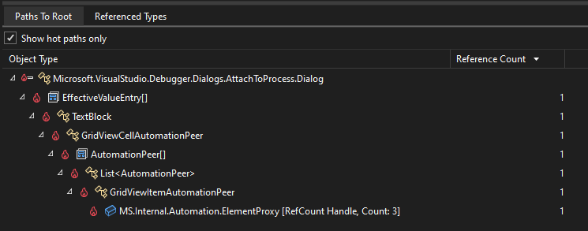
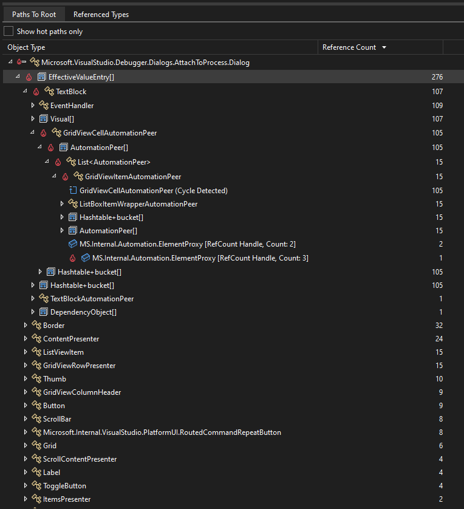

# Hot paths to root in the Memory Usage tool

 [!INCLUDE [Visual Studio](~/includes/applies-to-version/vs-windows-only.md)]

When calculating the inclusive size of an object (the total amount of memory retained on the heap by keeping the object alive), it's often helpful to reduce the strongly connected heap graph into a tree. Unlike a graph, a node in a tree has arbitrarily many children but only a single parent. Rather than consider every possible path to root for an object, choosing the most likely path to root using various heuristics is typically sufficient to find the reference chain that if removed, will make the object eligible for garbage collection. Some of these heuristics include prioritizing the shortest path to root, certain root types, and user code paths. For various reasons, this strategy doesn't always find the most interesting or longest-living retention chain, but often provides a useful starting point in a memory usage investigation.

In the Memory Usage tool reference graph, that path to root is the "hot path to root."

## Example
In this example, there's a WPF control (`AttachToProcess.Dialog`) being leaked through a binding that is ultimately rooted by an `AutomationPeer`. In the filtered view, this retention path is obvious; only the direct path to the root is visible.

With the option disabled, it becomes clear that there are hundreds of bindings, and most expansion paths lead to dead ends that cycle. Without the visual indicator, it's tedious to sort through thousands of potential retention paths to find a candidate reason for the leak.

## See also

For more information about the Visual Studio Memory Usage tool, see
- [Analyze memory usage with the debugger](../profiling/memory-usage.md)
- [Analyze memory usage without the debugger](../profiling/memory-usage-without-debugging2.md)