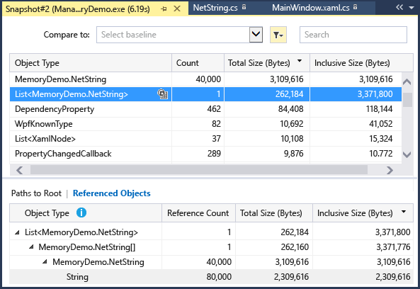
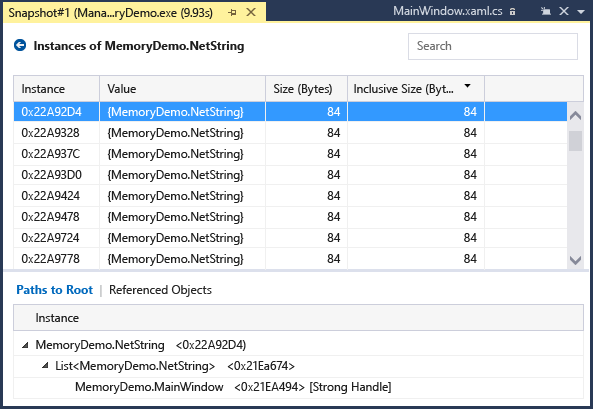
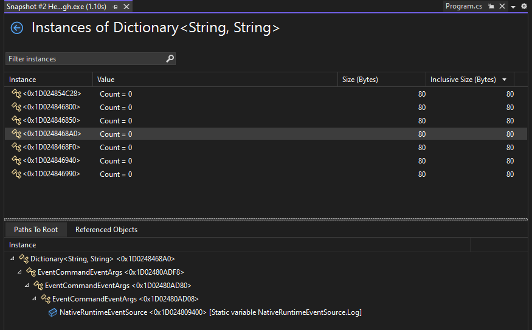

 Choose the current link of an **Objects (Diff)** or **Allocations (Diff)** cell in the Memory Usage summary table.

 ::: moniker range="<=vs-2019"

 

 ::: moniker-end

 ::: moniker range=">=vs-2022"

 

 ::: moniker-end

 The top pane shows the count and size of the types in the snapshot, including the size of all objects that are referenced by the type (**Inclusive Size**).

 The **Paths to Root** tree in the bottom pane displays the objects that reference the type selected in the upper pane. The .NET garbage collector cleans up the memory for an object only when the last type that references it has been released.

 ::: moniker range="<=vs-2019"

 The **Referenced Objects** tree displays the references that are held by the type selected in the upper pane.

 

 ::: moniker-end

 The **Referenced Types** tree displays the references that are held by the type selected in the upper pane.

 ::: moniker range=">=vs-2022"

 

 ::: moniker-end

 To display the instances of a selected type in the upper pane, click on "View Instances" next to the object type.

 ::: moniker range="<=vs-2019"

 

 ::: moniker-end

 ::: moniker range=">=vs-2022"

 

 ::: moniker-end

 The **Instances** view displays the instances of the selected object in the snapshot in the upper pane. The **Paths to Root** and **Referenced Objects** pane displays the objects that reference the selected instance and the types that the selected instance references. When the debugger is stopped at the point where the snapshot was taken, you can hover over the **Value** cell to display the values of the object in a tool tip.