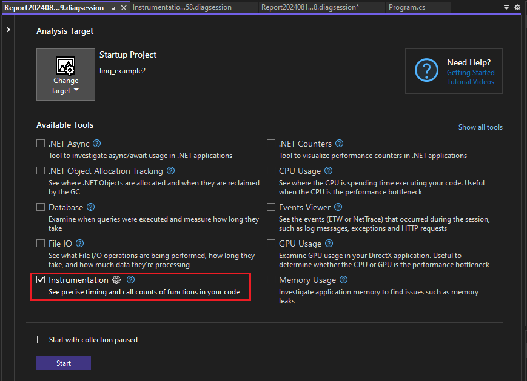
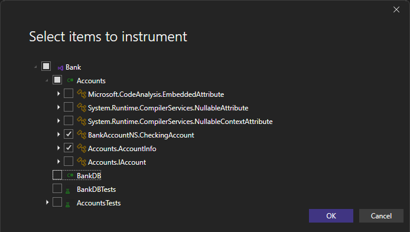

# Instrument your .NET applications in Visual Studio (C#, Visual Basic, F#)

 [!INCLUDE [Visual Studio](~/includes/applies-to-version/vs-windows-only.md)]

With the release of Visual Studio 2022 version 17.5 Preview 1, you can use the new dynamic Instrumentation tool. This tool shows the exact number of times your functions are called and is faster than the previous version of the Instrumentation tool. This tool supports .NET Core instrumentation without needing PDBs.

You can access the Instrumentation tool by launching the Performance Profiler for a .NET Project in Visual Studio (**Debug > Performance Profiler** or **Alt + F2**). Once you are on the summary page, select the **.NET Instrumentation** checkbox.

## Instrument your application

1. Select **Alt+F2** to open the performance profiler in Visual Studio.

1. Select the **.NET Instrumentation** check box.

   

   > [!NOTE]
   > If the tool isn't available for selection, clear every other tool's check box because some tools need to run alone. To learn more about running tools together, see [Screenshot showing how to use profiling tools from the command line.](../profiling/using-the-profiling-tools-from-the-command-line.md).
   >
   > If the tool still isn't available, check that your project meets the preceding requirements. Make sure your project is in Release mode to capture the most accurate data.

1. Select the **Start** button to run the tool.

1. Select the items in your program to instrument.

   

1. Select **OK**.

1. After the tool starts running, go through the scenario you want to profile in your app. Then select **Stop collection** or close the app to see your data.

## Analyze the Instrumentation report

Your profiling data appears in Visual Studio.

The Instrumentation data view shows you a list of functions ordered by longest running, with the longest running function at the top under **Top Functions**. The **Hot Path** section shows you the call stack for the functions that are using the most CPU. These lists can help guide you to functions where performance bottlenecks are happening.

Double-click on a function that you are interested in, and you will see a more detailed view.

The information available for the Instrumentation tool is the same as CPU Usage, except it's based on instrumented data instead of sampled data. For detailed information on the views, see [CPU Usage](../profiling/cpu-usage.md).

## See Also

[Instrumentation](../profiling/instrumentation.md)
[First look at profiling tools](../profiling/profiling-feature-tour.md)
