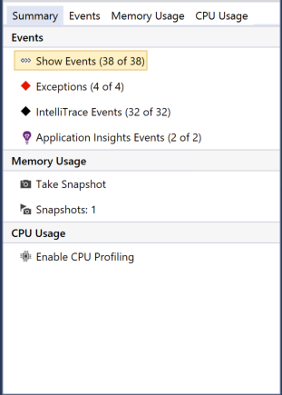
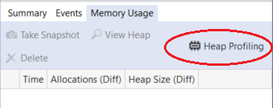
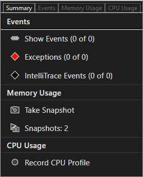
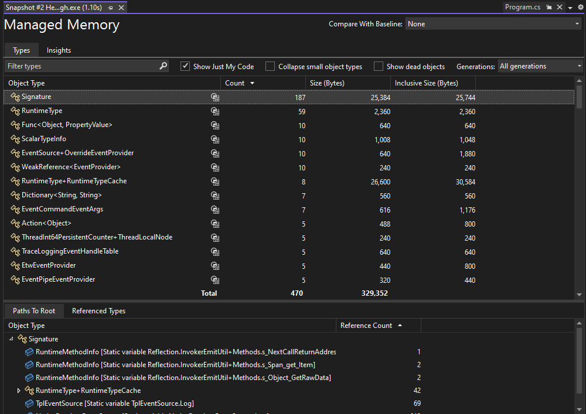
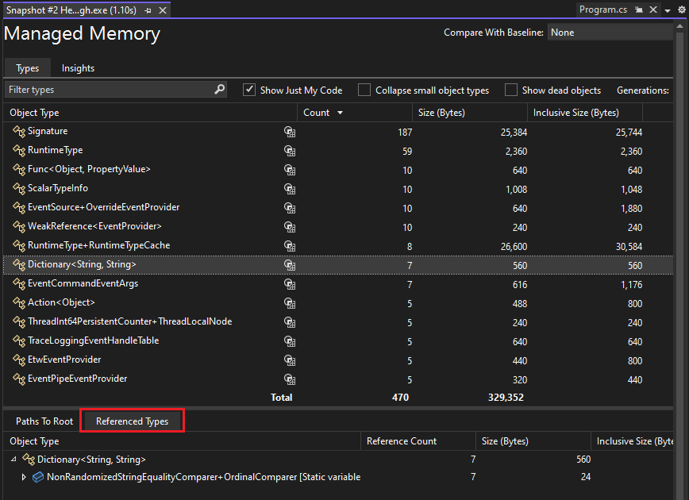
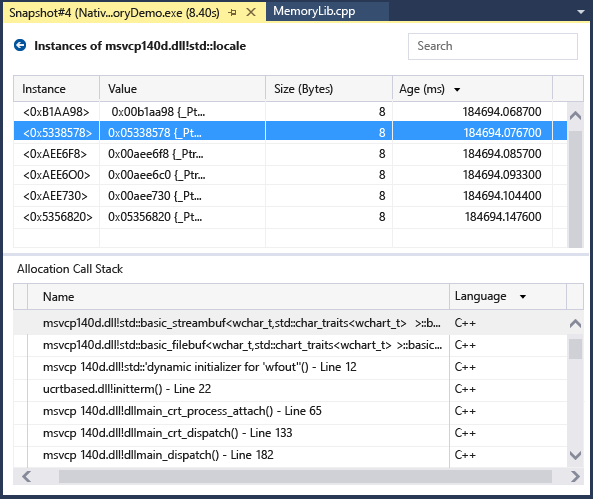
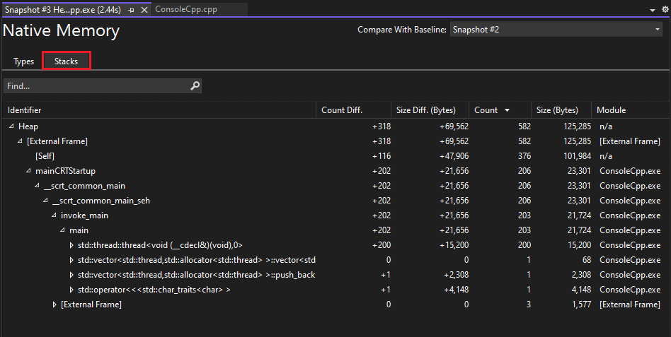
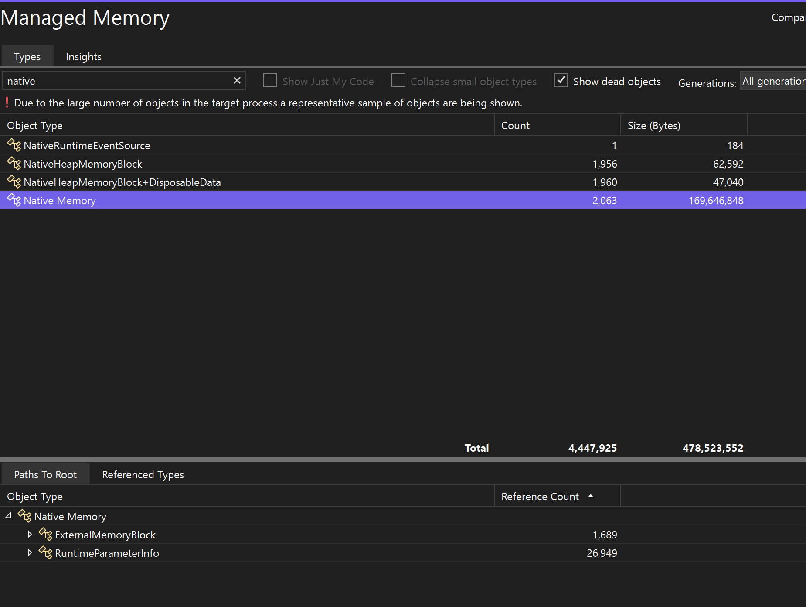
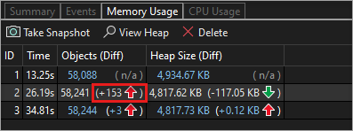
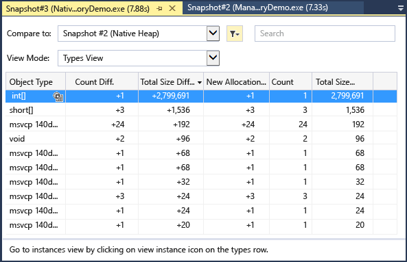

# Measure memory usage in Visual Studio (C#, Visual Basic, C++, F#)

 [!INCLUDE [Visual Studio](~/includes/applies-to-version/vs-windows-only.md)]

Find memory leaks and inefficient memory while you're debugging with the debugger-integrated **Memory Usage** diagnostic tool. The Memory Usage tool lets you take one or more *snapshots* of the managed and native memory heap to help understand the memory usage impact of object types. You can also analyze memory usage without a debugger attached or by targeting a running app. For more information, see [Run profiling tools with or without the debugger](../profiling/running-profiling-tools-with-or-without-the-debugger.md). For information on choosing the best memory analysis tool for your needs, see [Choose a memory analysis tool](../profiling/analyze-memory-usage.md).

Although you can collect memory snapshots at any time in the **Memory Usage** tool, you can use the Visual Studio debugger to control how your application executes while investigating performance issues. Setting breakpoints, stepping, Break All, and other debugger actions can help you focus your performance investigations on the code paths that are most relevant. Performing those actions while your app is running can eliminate the noise from the code that doesn't interest you and can significantly reduce the amount of time it takes you to diagnose an issue.

> [!Important]
> The debugger-integrated Diagnostics Tools are supported for .NET development in Visual Studio, including ASP.NET, ASP.NET Core, native/C++ development, and mixed mode (.NET and native) apps. Windows 8 and later is required to run profiling tools with the debugger (**Diagnostic Tools** window).

In this tutorial, you will:

> [!div class="checklist"]
> * Take snapshots of memory
> * Analyze memory usage data

If **Memory Usage** does not give you the data that you need, other profiling tools in the [Performance Profiler](../profiling/profiling-feature-tour.md#post_mortem) provide different kinds of information that might be helpful to you. In many cases, the performance bottleneck of your application may be caused by something other than your memory, such as CPU, rendering UI, or network request time.

> [!NOTE]
> **Custom Allocator Support** The native memory profiler works by collecting allocation [ETW](/windows-hardware/drivers/devtest/event-tracing-for-windows--etw-) event data emitted during run time.  Allocators in the CRT and Windows SDK have been annotated at the source level so that their allocation data can be captured. If you are writing your own allocators, then any functions that return a pointer to newly allocated heap memory can be decorated with [__declspec](/cpp/cpp/declspec)(allocator), as seen in this example for myMalloc:
>
> `__declspec(allocator) void* myMalloc(size_t size)`

## Collect memory usage data

1. Open the project you want to debug in Visual Studio and set a breakpoint in your app at the point where you want to begin examining memory usage.

    If you have an area where you suspect a memory issue, set the first breakpoint before the memory issue occurs.

    > [!TIP]
    > Because it can be challenging to capture the memory profile of an operation that interests you when your app frequently allocates and de-allocates memory, set breakpoints at the start and end of the operation (or step through the operation) to find the exact point that memory changed.

2. Set a second breakpoint at the end of the function or region of code that you want to analyze (or after a suspected memory issue occurs).

3. The **Diagnostic Tools** window appears automatically unless you have turned it off. To bring up the window again, click **Debug** > **Windows** > **Show Diagnostic Tools**.

4. Choose **Memory Usage** with the **Select Tools** setting on the toolbar.

     ::: moniker range="<=vs-2019"

     

     ::: moniker-end

     ::: moniker range=">=vs-2022"

     

     ::: moniker-end

5. Click **Debug / Start Debugging** (or **Start** on the toolbar, or **F5**).

     When the app finishes loading, the Summary view of the Diagnostics Tools appears.

     ::: moniker range="<=vs-2019"
     
     

     > [!NOTE]
     > Because collecting memory data can affect the debugging performance of your native or mixed-mode apps, memory snapshots are disabled by default. To enable snapshots in native or mixed-mode apps, start a debugging session (Shortcut key: **F5**). When the **Diagnostic Tools** window appears, choose the **Memory Usage** tab, and then choose **Heap Profiling**.
     >
     >  
     >
     >  Stop (Shortcut key: **Shift**+**F5**) and restart debugging.

     ::: moniker-end

     ::: moniker range=">=vs-2022"

     

     > [!NOTE]
     > Because collecting memory data can affect the debugging performance of your native or mixed-mode apps, memory snapshots are disabled by default. To enable snapshots in native or mixed-mode apps, start a debugging session (Shortcut key: **F5**). When the **Diagnostic Tools** window appears, choose the **Memory Usage** tab, and then choose **Heap Profiling**.
     >
     >  
     >
     >  Stop (Shortcut key: **Shift**+**F5**) and restart debugging.

     ::: moniker-end

6. To take a snapshot at the start of your debugging session, choose **Take snapshot** on the **Memory Usage** summary toolbar. (It may help to set a breakpoint here as well.)

     ::: moniker range="<=vs-2019"
     
     

     ::: moniker-end

     ::: moniker range=">=vs-2022"

     

     ::: moniker-end

     > [!TIP]
     > To create a baseline for memory comparisons, consider taking a snapshot at the start of your debugging session.

6. Run the scenario that will cause your first breakpoint to be hit.

7. While the debugger is paused at the first breakpoint, choose **Take snapshot** on the **Memory Usage** summary toolbar.

8. Press **F5** to run the app to your second breakpoint.

9. Now, take another snapshot.

   At this point, you can begin to analyze the data.

   If you have trouble collecting or displaying data, see [Troubleshoot profiling errors and fix issues](../profiling/troubleshoot-profiler-errors.md).

## Analyze memory usage data
The rows of the Memory Usage summary table list the snapshots that you have taken during the debugging session and provides links to more detailed views.

::: moniker range="<=vs-2019"
     

::: moniker-end

::: moniker range=">=vs-2022"

::: moniker-end

 The name of the column depends on the debugging mode you choose in the project properties: .NET, native, or mixed (both .NET and native).

- The **Objects (Diff)** and **Allocations (Diff)** columns display the number of objects in .NET and native memory when the snapshot was taken.

- The **Heap Size (Diff)** column displays the number of bytes in the .NET and native heaps

When you have taken multiple snapshots, the cells of the summary table include the change in the value between the row snapshot and the previous snapshot.

To analyze memory usage, click one of the links that opens up a detailed report of memory usage:

- To view details of the difference between the current snapshot and the previous snapshot, choose the change link to the left of the arrow (). A red arrow indicates an increase in memory usage, and a green arrow indicates a decrease.

> [!TIP]
> To help identify memory issues more quickly, the diff reports are sorted by object types that increased the most in overall number (click the change link in **Objects (Diff)** column) or that increased the most in overall heap size (click the change link in **Heap Size (Diff)** column).

- To view details of only the selected snapshot, click the non-change link.

   The report appears in a separate window.

### Managed types reports
 Choose the current link of an **Objects (Diff)** or **Allocations (Diff)** cell in the Memory Usage summary table.

 ::: moniker range="<=vs-2019"

 

 ::: moniker-end

 ::: moniker range=">=vs-2022"

 

 ::: moniker-end

 The top pane shows the count and size of the types in the snapshot, including the size of all objects that are referenced by the type (**Inclusive Size**).

 The **Paths to Root** tree in the bottom pane displays the objects that reference the type selected in the upper pane. The .NET garbage collector cleans up the memory for an object only when the last type that references it has been released.

 ::: moniker range="<=vs-2019"

 The **Referenced Objects** tree displays the references that are held by the type selected in the upper pane.

 

 ::: moniker-end

 The **Referenced Types** tree displays the references that are held by the type selected in the upper pane.

 ::: moniker range=">=vs-2022"

 

 ::: moniker-end

 To display the instances of a selected type in the upper pane, click on "View Instances" next to the object type.

 ::: moniker range="<=vs-2019"

 

 ::: moniker-end

 ::: moniker range=">=vs-2022"

 

 ::: moniker-end

 The **Instances** view displays the instances of the selected object in the snapshot in the upper pane. The **Paths to Root** and **Referenced Objects** pane displays the objects that reference the selected instance and the types that the selected instance references. When the debugger is stopped at the point where the snapshot was taken, you can hover over the **Value** cell to display the values of the object in a tool tip.

### Native type reports
 Choose the current link of an **Allocations (Diff)** or **Heap Size (Diff)** cell in the Memory Usage summary table of the **Diagnostic Tools** window.

 ::: moniker range="<=vs-2019"

 

 ::: moniker-end

 ::: moniker range=">=vs-2022"

 

 ::: moniker-end

 The **Types View** displays the number and size of the types in the snapshot.

::: moniker range="<=vs-2019"

- Choose the instances icon () of a selected type to display information about the objects of the selected type in the snapshot.

     The **Instances** view displays each instance of the selected type. Selecting an instance displays the call stack that resulted in the creation of the instance in the **Allocation Call Stack** pane.

     

::: moniker-end

::: moniker range=">=vs-2022"

- Choose **View Instances** next to a selected type to display information about the objects of the selected type in the snapshot.

     The **Instances** view displays each instance of the selected type. Selecting an instance displays the call stack that resulted in the creation of the instance in the **Allocation Call Stack** pane.

     

::: moniker-end

::: moniker range="<=vs-2019"

- Choose **Stacks View** in the **View Mode** list to see the allocation stack for the selected type.

     

::: moniker-end

::: moniker range=">=vs-2022"

- Choose **Stacks** to see the allocation stack for the selected type.

     

::: moniker-end

::: moniker range=">=vs-2022"
### Memory Usage Insights

The Memory Analysis tool also gives multiple powerful built-in auto insights. Select the **Insights** tab in the Managed types reports and it shows the applicable auto insights like **Duplicate strings** and  **Sparse arrays**.

The **Duplicate Strings** section shows the list of strings that get allocated multiple times on the heap. In addition, this section shows the total wasted memory, that is, the (number of instances - 1) times the size of the string.

The **Sparse Arrays** section shows arrays that are mostly filled with zero elements, which can be inefficient in terms of performance and memory usage. The memory analysis tool will automatically detect these arrays and show you how much memory is being wasted due to these zero values.

Certain types are known to have fields that can be read to determine the size of the native memory they're holding onto. The **Insights** tab shows fake native memory nodes in the object graph, which are retained by their parent objects such that the UI will recognize them and display their size and reference graph.

::: moniker-end

### Change (Diff) reports

- Choose the change link in a cell of the summary table of the **Memory Usage** tab on the **Diagnostic Tools** window.

   ::: moniker range="<=vs-2019"

   

   ::: moniker-end

   ::: moniker range=">=vs-2022"

   

   ::: moniker-end

- Choose a snapshot in the **Compare To** list of a managed or native report.

   ::: moniker range="<=vs-2019"

   

   ::: moniker-end

   ::: moniker range=">=vs-2022"

   

   ::: moniker-end

The change report adds columns (marked with **(Diff)**) to the base report that show the difference between the base snapshot value and the comparison snapshot. Here's how a Native Type View diff report might look:

::: moniker range="<=vs-2019"

::: moniker-end

::: moniker range=">=vs-2022"

::: moniker-end

## Blogs and videos

[Analyze CPU and Memory While Debugging](https://devblogs.microsoft.com/visualstudio/analyze-cpu-memory-while-debugging/)

[Visual C++ Blog: Memory Profiling in Visual C++ 2015](https://devblogs.microsoft.com/cppblog/memory-profiling-in-visual-c-2015/)

## Next steps

In this tutorial, you've learned how to collect and analyze memory usage data. If you already completed the [tour of the profiler](../profiling/profiling-feature-tour.md), you may want to read about a general approach to optimizing code using the profiling tools.

> [!div class="nextstepaction"]
> [Reduce compute costs by using profiling tools](../profiling/optimize-code-using-profiling-tools.md)

In this tutorial, you've learned how to collect and analyze memory usage data while debugging. You may want to find out more about analyzing memory usage in release builds using the Performance Profiler.

> [!div class="nextstepaction"]
> [Analyze memory usage in the Performance Profiler](../profiling/memory-usage-without-debugging2.md)
