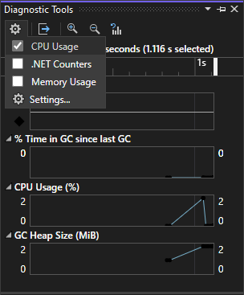
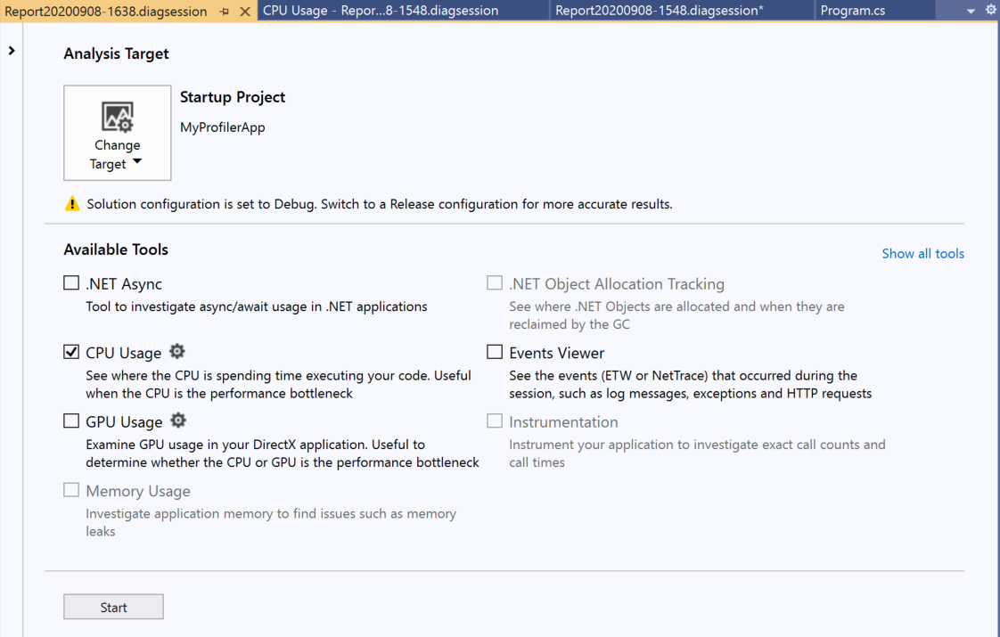
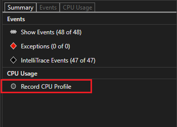
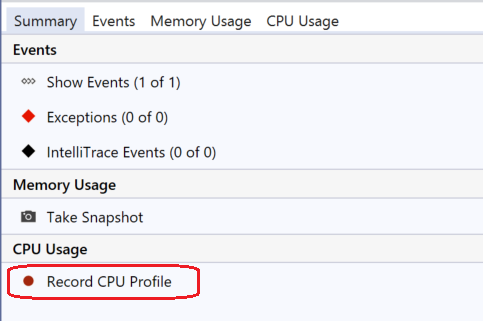
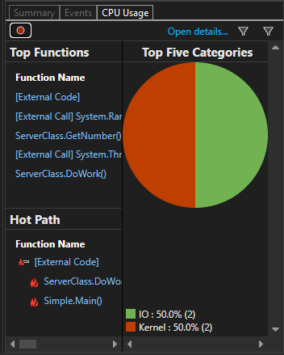
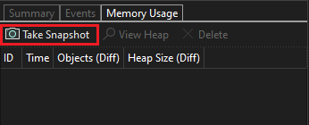
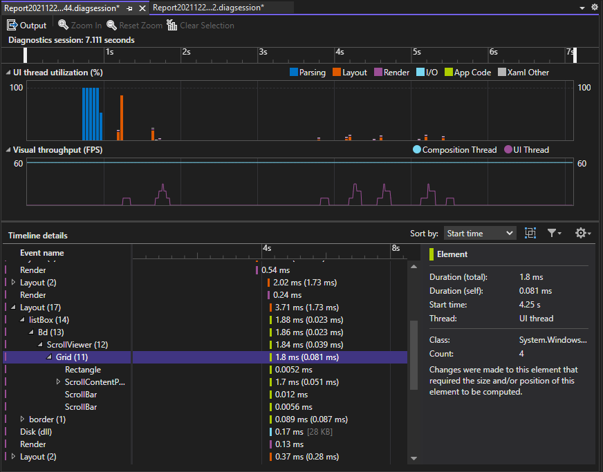
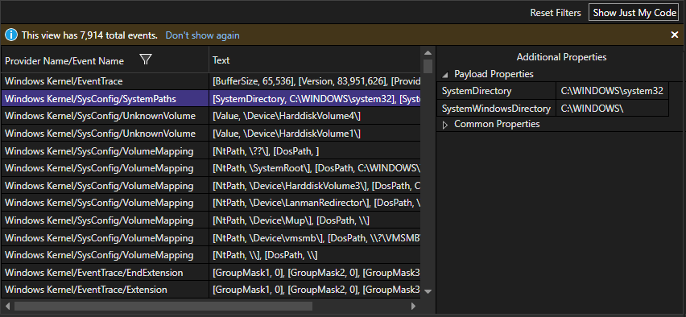
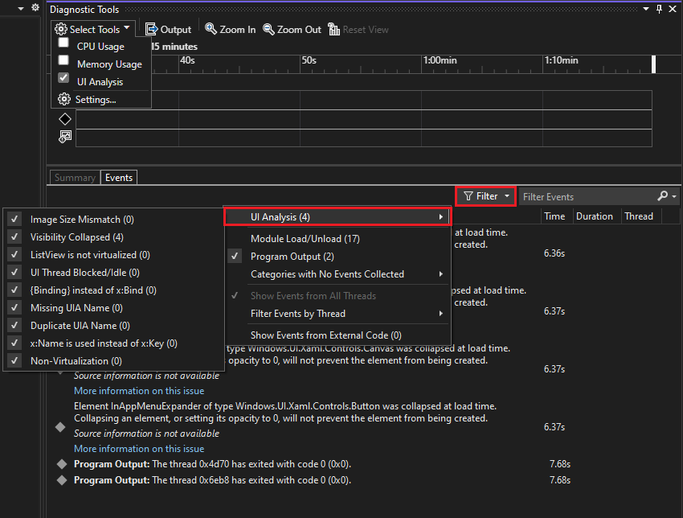

# First look at profiling tools (C#, Visual Basic, C++, F#)

 [!INCLUDE [Visual Studio](~/includes/applies-to-version/vs-windows-only.md)]

Visual Studio provides a variety of profiling tools to help you diagnose different kinds of app performance issues depending on your app type. In this article, we give a quick look at the most common profiling tools.

To see profiling tool support for different app types, see [Which tool should I use?](#which-tool-should-i-use)

## Measure performance while debugging

The profiling tools that you can access during a debugging session are available in the Diagnostic Tools window. The Diagnostic Tools window appears automatically unless you have turned it off. To bring up the window, click **Debug / Windows / Show Diagnostic Tools** (or press **Ctrl** + **Alt** + **F2**). With the window open, you can select tools for which you want to collect data.

::: moniker range=">=vs-2022"

::: moniker-end
::: moniker range="<=vs-2019"

::: moniker-end

While you are debugging, you can use the **Diagnostic Tools** window to analyze CPU and memory usage, and you can view events that show performance-related information.

::: moniker range=">=vs-2022"

::: moniker-end
::: moniker range="<=vs-2019"

::: moniker-end

The **Diagnostic Tools** window is a common way to profile apps, but for Release builds you can also do a post-mortem analysis of your app instead. For more information on different approaches, see [Run profiling tools with or without the debugger](../profiling/running-profiling-tools-with-or-without-the-debugger.md). To see profiling tool support for different app types, see [Which tool should I use?](#which-tool-should-i-use)

Tools available in the Diagnostic Tools window or during a debugging session include:
- [CPU usage](../profiling/beginners-guide-to-performance-profiling.md)
- [Memory usage](../profiling/memory-usage.md)
- [PerfTips](../profiling/perftips.md)

> [!NOTE]
> Windows 8 and later is required to run profiling tools with the debugger (**Diagnostic Tools** window). You can use the [post-mortem](#post_mortem) tools with Windows 7 and later. 

##  Measure performance in release builds

Tools in the Performance Profiler are intended to provide analysis for **Release** builds. In the Performance Profiler, you can collect diagnostic info while the app is running, and then examine the collected information after the app is stopped (a post-mortem analysis).

Open the Performance Profiler by choosing **Debug** > **Performance Profiler** (or **Alt + F2**).

::: moniker range=">=vs-2022"

::: moniker-end
::: moniker range="<=vs-2019"

::: moniker-end

For more information on using the CPU Usage or Memory usage tool in the Performance Profiler vs. the debugger-integrated tools, see [Run profiling tools with or without the debugger](../profiling/running-profiling-tools-with-or-without-the-debugger.md). 

Tools available in the Performance Profiler include:

- [CPU usage](../profiling/cpu-usage.md)
- [.NET object allocation](../profiling/dotnet-alloc-tool.md)
- [Memory usage](../profiling/memory-usage-without-debugging2.md)
- [.NET async tool](../profiling/analyze-async.md)
- [Database tool](../profiling/analyze-database.md)
- [GPU usage](../profiling/gpu-usage.md)

To see profiling tool support for different app types, see [Which tool should I use?](#which-tool-should-i-use)

In some scenarios, the window allows you to select [multiple profiling tools](../profiling/use-multiple-profiler-tools-simultaneously.md). Tools such as CPU Usage may provide complementary data that you can use to help in your analysis. You can also use the [command-line profiler](../profiling/profile-apps-from-command-line.md) to enable scenarios involving multiple profiling tools.

## Examine performance using PerfTips

Often, the easiest way to view performance information is to use [PerfTips](../profiling/perftips.md). Using PerfTips, you can view performance information while interacting with your code. You can check information such as the duration of the event (measured from when the debugger was last paused, or when the app started). For example, if you step through code (F10, F11), PerfTips show you the app runtime duration from the previous step operation to the current step.

::: moniker range=">=vs-2022"

::: moniker-end
::: moniker range="<=vs-2019"

::: moniker-end

You can use PerfTips to examine how long it takes for a code block to execute, or how long it takes for a single function to complete.

PerfTips show the same events that also show up in the **Events** view of the Diagnostic Tools. In the **Events** view, you can view different events that occur while you are debugging, such as the setting of a breakpoint or a code stepping operation.

::: moniker range=">=vs-2022"

::: moniker-end
::: moniker range="<=vs-2019"

::: moniker-end

 > [!NOTE]
 > If you have Visual Studio Enterprise, you can also see [IntelliTrace events](../debugger/intellitrace.md) in this tab.

## Analyze CPU usage

The CPU Usage tool is a good place to start analyzing your app's performance. It will tell you more about CPU resources that your app is consuming. You can use the [debugger-integrated CPU Usage tool](../profiling/beginners-guide-to-performance-profiling.md) or the [post-mortem CPU Usage tool](../profiling/cpu-usage.md).

When using the debugger-integrated CPU Usage tool, open the Diagnostics Tool window (if it's closed, choose **Debug / Windows / Show Diagnostic Tools**). While debugging, open the  **Summary** view, and select **Record CPU Profile**.

::: moniker range=">=vs-2022"

::: moniker-end
::: moniker range="<=vs-2019"

::: moniker-end

One way to use the tool is to set two breakpoints in your code, one at the beginning and one at the end of the function or the region of code you want to analyze. Examine the profiling data when you are paused at the second breakpoint.

::: moniker range=">=vs-2022"
The **CPU Usage** view shows you a list of functions ordered by longest running, with the longest running function at the top under **Top Functions**. The **Hot Path** section shows you the call stack for the functions that are using the most CPU. These lists can help guide you to functions where performance bottlenecks are happening.

::: moniker-end
::: moniker range="<=vs-2019"

The **CPU Usage** view shows you a list of functions ordered by longest running, with the longest running function at the top. This can help guide you to functions where performance bottlenecks are happening.

::: moniker-end

::: moniker range=">=vs-2022"
Double-click on a function that you are interested in, and you will see a more detailed "Call tree" view, with the selected function highlighted. The table shows columns with data such as the time spent in the function, including called functions (**Total CPU**), and a second column that shows the time spent in a function, excluding called functions (**Self CPU**). This data can help you evaluate whether the function itself is a performance bottleneck.

::: moniker-end
::: moniker range="<=vs-2019"
Double-click on a function that you are interested in, and you will see a more detailed three-pane "butterfly" view, with the selected function in the middle of the window, the calling function on the left, and called functions on the right. The **Function Body** section shows the total amount of time (and the percentage of time) spent in the function body excluding time spent in calling and called functions. This data can help you evaluate whether the function itself is a performance bottleneck.

::: moniker-end

## Analyze memory usage

The **Diagnostic Tools** window also allows you to evaluate memory usage in your app using the **Memory Usage** tool. For example, you can look at the number and size of objects on the heap. You can use the [debugger-integrated Memory Usage tool](../profiling/memory-usage.md) or the [post-mortem Memory Usage tool](../profiling/memory-usage-without-debugging2.md) in the Performance Profiler.

.NET developers may choose between either the [.NET Object Allocation tool](../profiling/dotnet-alloc-tool.md) or the [Memory usage](../profiling/memory-usage.md) tool.

- The **.NET Object Allocation** tool helps you identify allocation patterns and anomalies in your .NET code, and helps identify common issues with garbage collection. This tool runs only as a post-mortem tool. You can run this tool on local or remote machines.
- The **Memory usage** tool is helpful in identifying memory leaks, which are not typically common in .NET apps. If you need to use debugger features while checking memory, such as stepping through code, the [debugger-integrated Memory usage](../profiling/beginners-guide-to-performance-profiling.md) tool is recommended.

To analyze memory usage with the **Memory Usage** tool, you need to take at least one memory snapshot. Often, the best way to analyze memory is to take two snapshots; the first right before a suspected memory issue, and the second snapshot right after a suspected memory issue occurs. Then you can view a diff of the two snapshots and see exactly what changed. The following illustration shows taking a snapshot with the debugger-integrated tool.

::: moniker range=">=vs-2022"

::: moniker-end
::: moniker range="<=vs-2019"

::: moniker-end

When you select one of the arrow links, you are given a differential view of the heap (a red up arrow  shows an increasing object count (left) or an increasing heap size (right)). If you click the right link, you get a differential heap view ordered by objects that increased the most in heap size. This can help you pinpoint memory problems. For example, in the illustration below, the bytes used by `ClassHandlersStore` objects increased by 3,492 bytes in the second snapshot.

::: moniker range=">=vs-2022"

::: moniker-end
::: moniker range="<=vs-2019"

::: moniker-end

If you click the link on the left instead in the **Memory Usage** view, the heap view is organized by object count; the objects of a particular type that increased the most in number are shown at the top (sorted by **Count Diff** column).

## Analyze resource consumption (XAML)

In XAML apps, such as Windows desktop WPF apps and UWP apps, you can analyze resource consumption using the Application Timeline tool. For example, you can analyze the time spent by your application preparing UI frames (layout and render), servicing network and disk requests, and in scenarios like application startup, page load, and Window resize. To use the tool, choose **Application Timeline** in the Performance Profiler, and then choose **Start**. In your app, go through the scenario with a suspected resource consumption issue, and then choose **Stop collection** to generate the report.

Low framerates in the **Visual throughput** graph may correspond to visual problems that you see when running your app. Similarly, high numbers in the **UI thread utilization** graph may also correspond to UI responsiveness issues. In the report, you can select a time period with a suspected performance issue, and then examine the detailed UI thread activities in the Timeline details view (lower pane).

::: moniker range=">=vs-2022"

::: moniker-end
::: moniker range="<=vs-2019"

::: moniker-end

In the Timeline details view, you can find information such as the type of activity (or the UI element involved) along with the duration of the activity. For example, in the illustration, a **Layout** event for a Grid control takes 57.53 ms.

For more information, see [Application Timeline](../profiling/application-timeline.md).

::: moniker range=">=vs-2022"
## Analyze asynchronous code (.NET)

The [.NET Async tool](../profiling/analyze-async.md) allows you to analyze the performance of asynchronous code in your application. This tool is available in the Performance Profiler. Open the Performance Profiler by choosing **Debug** > **Performance Profiler** (or **Alt + F2**).

The tool shows each async operation in a list view. You can see information such as the start time, end time, and total time for an async operation.

::: moniker-end

::: moniker range="vs-2019"
## Analyze asynchronous code (.NET)

The [.NET Async tool](../profiling/analyze-async.md) allows you to analyze the performance of asynchronous code in your application. This tool is available in the Performance Profiler. Open the Performance Profiler by choosing **Debug** > **Performance Profiler** (or **Alt + F2**).

The tool shows each async operation in a list view. You can see information such as the start time, end time, and total time for an async operation.

::: moniker-end

::: moniker range=">=vs-2019"

## Examine application events

The generic [events viewer](../profiling/events-viewer.md) allows you to view the activity of your application through a list of events, such as module load, thread start, and system configurations, to help better diagnose how your application is performing right within the Visual Studio profiler. This tool is available in the Performance Profiler. Open the Performance Profiler by choosing **Debug** > **Performance Profiler** (or **Alt + F2**).

The tool shows each event in a list view. Columns provide information about each event, such as the event name, timestamp, and process ID.

## Analyze database performance (.NET Core)

For .NET Core apps that use ADO.NET or Entity Framework Core, the [Database tool](../profiling/analyze-database.md) allows you to record the database queries that your application makes during a diagnostic session. You can then analyze information about individual queries in order to find places where your app's performance can be improved. This tool is available in the Performance Profiler. Open the Performance Profiler by choosing **Debug** > **Performance Profiler** (or **Alt + F2**).

The tool shows each query in a list view. You can see information such as the query start time and duration.

## Visualize .NET counters (.NET Core)

Starting in Visual Studio 2019 version 16.7, you can use the [.NET Counters tool](../profiling/dotnet-counters-tool.md) in Visual Studio to visualize performance counters. You can visualize counters created using [dotnet counters](/dotnet/core/diagnostics/dotnet-counters). dotnet counters supports many counters such as CPU usage and garbage collector heap size.

The tool shows live values for each counter in a list view.

:::image type="content" source="../profiling/media/dotnet-counters-tool-collecting.png" alt-text=".NET Counter tool collecting.":::

::: moniker-end

## Examine UI performance and accessibility events (UWP)

In your UWP apps, you can enable **UI Analysis** in the **Diagnostic Tools** window. The tool searches for common performance or accessibility issues and displays them in the **Events** view while you are debugging. The event descriptions provide information that can help resolve issues.

::: moniker range=">=vs-2022"

::: moniker-end
::: moniker range="<=vs-2019"

::: moniker-end

## Analyze GPU Usage (Direct3D)

In Direct3D apps (Direct3D components must be in C++), you can examine activity on the GPU and analyze performance issues. For more information, see [GPU Usage](./gpu-usage.md). To use the tool, choose **GPU Usage** in the Performance Profiler, and then choose **Start**. In your app, go through the scenario that you're interested in profiling, and then choose **Stop collection** to generate a report.

When you select a time period in the graphs and choose **view details**, a detailed view appears in the lower pane. In the detailed view, you can examine how much activity is happening on each CPU and GPU. Select events in the lowest pane to get popups in the timeline. For example, select the **Present** event to view **Present** call popups. (The light gray vertical VSync lines can be used as a reference to understand whether certain **Present** calls missed VSync. There must be one **Present** call between every two VSyncs in order for the app to steadily hit 60 FPS.)

::: moniker range=">=vs-2022"

::: moniker-end
::: moniker range="<=vs-2019"

::: moniker-end

You can also use the graphs to determine whether there are CPU bound or GPU bound performance bottlenecks.

::: moniker range="vs-2017"
## Analyze performance (JavaScript UWP)

For UWP apps, you can use the JavaScript Memory tool and the HTML UI Responsiveness tool.

The JavaScript Memory tool is similar to the Memory Usage tool available for other app types. You can use this tool to understand memory usage and find memory leaks in your app. For more details about the tool, see [JavaScript Memory](../profiling/javascript-memory.md).

To diagnose UI responsiveness, slow loading time, and slow visual updates in UWP apps, use the HTML UI Responsiveness tool. Usage is similar to the Application Timeline tool for other app types. For more information, see [HTML UI responsiveness](../profiling/html-ui-responsiveness.md).

::: moniker-end

::: moniker range="vs-2017"
## Analyze network usage (UWP)

In UWP apps, you can analyze network operations performed using the `Windows.Web.Http` API. This tool may help you to resolve issues like access and authentication problems, incorrect cache-use, and poor display and download performance. To use the tool, choose **Network** in the Performance Profiler, and then choose **Start**. In your app, go through the scenario that uses `Windows.Web.Http`, and then choose **Stop collection** to generate the report.

Select an operation in the summary view to view more details.

For more information, see [Network Usage](../profiling/network-usage.md).
::: moniker-end

## Analyze performance (legacy tools)

::: moniker range="vs-2017"
If you need features such as instrumentation that are not currently present in CPU Usage or Memory Usage tools, and you are running desktop or ASP.NET apps, you can use the Performance Explorer for profiling. (Not supported in UWP apps). For more info, see [Performance Explorer](../profiling/performance-explorer.md).
::: moniker-end

::: moniker range=">=vs-2019"
In Visual Studio 2019,  the legacy Performance Explorer and related profiling tools such as the Performance Wizard were folded into the Performance Profiler, which you can open using **Debug** > **Performance Profiler**. In the Performance Profiler, the available diagnostics tools depend on the target chosen and the current, open startup project. The CPU Usage tool provides the sampling capability previously supported in the Performance Wizard. The Instrumentation tool provides the instrumented profiling capability (for precise call counts and durations) that was in the Performance Wizard. Additional memory tools also appear in the Performance Profiler.
::: moniker-end

## Which tool should I use?

Here is a table that lists the different tools Visual Studio offers and the different project types you can use them with:

::: moniker range=">=vs-2019"
|Performance Tool|Windows desktop|UWP|ASP.NET/ASP.NET Core|
|----------------------|---------------------|-------------|-------------|
|[PerfTips](../profiling/perftips.md)|yes|yes|yes|
|[CPU Usage](../profiling/beginners-guide-to-performance-profiling.md)|yes|yes|yes|
|[Memory Usage](../profiling/memory-usage.md)|yes|yes|yes|
|[.NET Object Allocation](../profiling/dotnet-alloc-tool.md)|yes (.NET only)|yes|yes|
|[GPU Usage](./gpu-usage.md)|yes|yes|no|
|[Application Timeline](../profiling/application-timeline.md)|yes (XAML)|yes|no|
|[Events viewer](../profiling/events-viewer.md)|yes|yes|yes|
|[.NET Async](../profiling/analyze-async.md)|yes (.NET only)|yes|yes|
|[.NET Counters](../profiling/dotnet-counters-tool.md)|yes (.NET Core only)|no|yes (ASP.NET Core only)|
|[Database](../profiling/analyze-database.md)|yes (.NET Core only)|no|yes (ASP.NET Core only)|
|[Performance Explorer](#analyze-performance-legacy-tools)|no|no|no|
|[IntelliTrace](../debugger/intellitrace.md)|.NET with Visual Studio Enterprise only|.NET with Visual Studio Enterprise only|.NET with Visual Studio Enterprise only|
::: moniker-end

::: moniker range="vs-2017"
|Performance Tool|Windows desktop|UWP|ASP.NET/ASP.NET Core|
|----------------------|---------------------|-------------|-------------|
|[CPU Usage](../profiling/beginners-guide-to-performance-profiling.md)|yes|yes|yes|
|[Memory Usage](../profiling/memory-usage.md)|yes|yes|yes|
|[GPU Usage](./gpu-usage.md)|yes|yes|no|
|[Application Timeline](../profiling/application-timeline.md)|yes (XAML)|yes|no|
|[PerfTips](../profiling/perftips.md)|yes|yes for XAML, no for HTML|yes|
|[Performance Explorer](../profiling/performance-explorer.md)|yes|no|yes|
|[IntelliTrace](../debugger/intellitrace.md)|.NET with Visual Studio Enterprise only|.NET with Visual Studio Enterprise only|.NET with Visual Studio Enterprise only|
|[Network Usage](../profiling/network-usage.md)|no|yes|no|
|[HTML UI responsiveness](../profiling/html-ui-responsiveness.md)|no|yes for HTML, no for XAML|no|
|[JavaScript Memory](../profiling/javascript-memory.md)|no|yes for HTML, no for XAML|no|
::: moniker-end

## See also
- [Debugging in Visual Studio](../debugger/debugger-feature-tour.md)