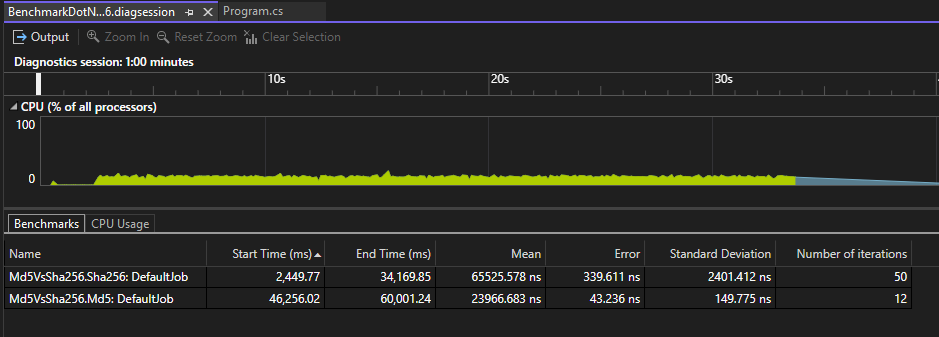

# Analyze BenchmarkDotNet data in Visual Studio

You can use the profiling tools to collect and view [BenchmarkDotNet](https://benchmarkdotnet.org/articles/overview.html) data in Visual Studio.

When you add a BenchmarkDotNet diagnoser to your benchmark classes as an attribute, a *.diagsession* is generated after the benchmark runs. You can then open the *.diagsession* in Visual Studio and view profiling data for the benchmarks. 

The following diagnosers are supported:

- CPUUsageDiagnoser
- DatabaseDiagnoser
- DotNetCountersDiagnoser
- EventsDiagnoser
- FileIODiagnoser

Each diagnoser generates performance data related to that diagnoser. For example, the CPUUsageDiagnoser generates a *.diagsession* file with CPU data in it, and the DatabaseDiagnoser generates a *.diagsession* file with data on database operations. Limitations correspond to the associated profiling tool. For example, the profiler's Database tool works on [ADO.NET](/dotnet/framework/data/adonet/ado-net-overview) or [Entity Framework Core](/ef/core/).

## Prerequisites

- Visual Studio 2022 version 17.9 or later

- Your benchmark project must include the following two NuGet packages:

  - [BenchmarkDotNET](https://www.nuget.org/packages/BenchmarkDotNet/)
  - [Microsoft.VisualStudio.DiagnosticsHub.BenchmarkDotNetDiagnosers](https://www.nuget.org/packages/Microsoft.VisualStudio.DiagnosticsHub.BenchmarkDotNetDiagnosers)

## Collect Benchmark.NET data

1. Create a console project.

   The benchmark functions must be added to a .NET console application. These can be wrapper functions that reference other project types. 

1. Set your build to a Release build instead of a Debug build.

1. Attribute your code for diagnosers and benchmarks, and include code to run the benchmarks (`BenchmarkRunner.Run`).

   Add the diagnoser name as an attribute to the class that contains the benchmarks for which you want to generate data.

   For example, you can use the following code for the CPUUsageDiagnoser.

    ```csharp
    using System;
    using System.Security.Cryptography;
    using BenchmarkDotNet.Attributes;
    using BenchmarkDotNet.Running;
    using Microsoft.VSDiagnostics;
    
    namespace MyBenchmarks
    {
        [CPUUsageDiagnoser]
        public class Md5VsSha256
        {
            private const int N = 10000;
            private readonly byte[] data;
    
            private readonly SHA256 sha256 = SHA256.Create();
            private readonly MD5 md5 = MD5.Create();
    
            public Md5VsSha256()
            {
                data = new byte[N];
                new Random(42).NextBytes(data);
            }
    
            [Benchmark]
            public byte[] Sha256() => sha256.ComputeHash(data);
    
            [Benchmark]
            public byte[] Md5() => md5.ComputeHash(data);
        }
    
        public class Program
        {
            public static void Main(string[] args)
            {
                var summary = BenchmarkRunner.Run(typeof(Program).Assembly);
            }
        }
    }
    ```
   
1. Run the application to generate the *.diagsession* file.

   Check the console output to get the location of the file. For example:  

   ```cmd
   // * Diagnostic Output - VSDiagnosticsDiagnoser * 
   Collection result moved to 'BenchmarkDotNet_Md5VsSha256_20231218_123326.diagsession'.
   Session : {7f38bcc2-c692-4266-aa24-b12bc5325ea4}
     Stopped
   Exported diagsession file: *.diagsession
   ```
   
## View Benchmark .NET data

1. In Visual Studio, select **File > Open > File** and navigate to the location of the *.diagsession* file, and then select and open the file.

1. Select the **Benchmark** tab to view BenchmarkDotNet data.

   

For more information about the results, see [BenchmarkDotNet](https://benchmarkdotnet.org/articles/overview.html) documentation.

## Related content

- [First look at profiling](../profiling/choose-performance-tool.md)
- [Which tool should I use?](../profiling/choose-performance-tool.md)