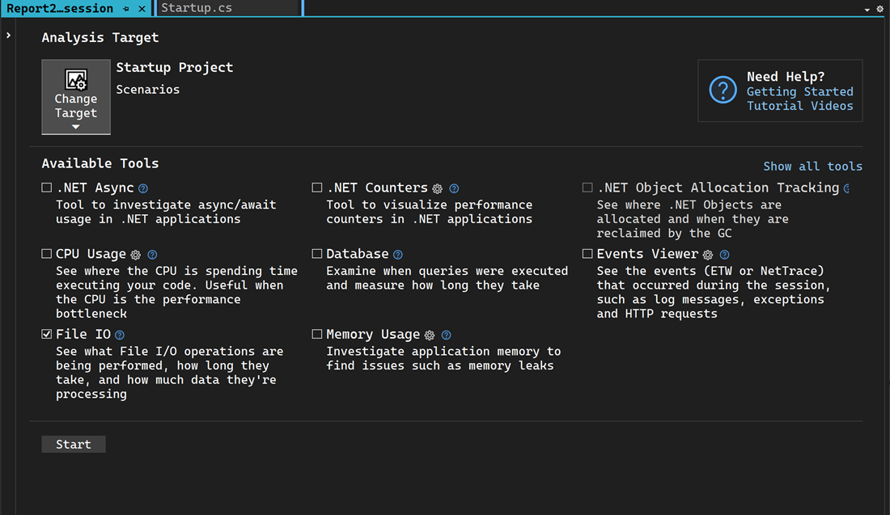
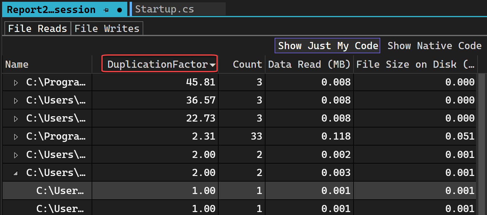

# View file read and write information to help improve performance

The **File IO** tool provides file read and write information with files read during the profiling session. The files are autogenerated in a report after collection and arranged by their target process with aggregate information displayed. 

## Setup

1. Select **Alt+F2** to open the performance profiler in Visual Studio.

1. Select the **File IO** check box.

   

   > [!NOTE]
   > If the tool isn't available for selection, clear every other tool's check box because some tools need to run alone. To learn more about running tools together, see [Screenshot showing how to use profiling tools from the command line.](../profiling/using-the-profiling-tools-from-the-command-line.md).
   >
   > If the tool still isn't available, check that your project meets the preceding requirements. Make sure your project is in Release mode to capture the most accurate data.

1. Select the **Start** button to run the tool.

1. Select **Yes** when prompted.

1. After the tool starts running, go through the scenario you want to profile in your app. Then select **Stop collection** or close the app to see your data.

## Analyze the File IO report

Select **File Reads** to view all the File Reads on one page and select **File Writes** for writes. If you right-click on one of the rows, you can go to the source in your code. If an aggregate row was read multiple times, expand it to see the individual read operations for that file with its frequency, if they were read multiple times.

The **Duplication Factor** for an individual file read is the number of bytes read from the file divided by the size of the file. For an aggregate read, it's the total number of bytes read from the file divided by the average size of the file across all read operations. The same logic applies for file writes. Duplication Factor shows if you're reading or writing more than what you need to from the file. If you have a duplication factor of 3x, that means the number of bytes you're reading from the file is 3 times the size of the file itself, which may be an indication that you're reading and processing more than you realized. This can indicate a place where caching the result of the file read and processing could improve your app's performance.

Double-clicking any file will cause it to be loaded in the **Backtraces** view. This view loads for any file in either reads or writes, allowing you to see where the read or write is happening in your code.

 > [!NOTE]
 > Only Data Read, Data Written, and Count are currently supported.
 > 
 > [!NOTE] 
 > Caching the file read is not the correct fix as the OS already does that. Instead, cache what the file reads are translated into.

## See also

- [Beginners guide to CPU sampling](../profiling/beginners-guide-to-cpu-sampling.md)
- [Analyze database](../profiling/analyze-database.md)
- [Identify hot paths with Flame Graph](../profiling/flame-graph.md)