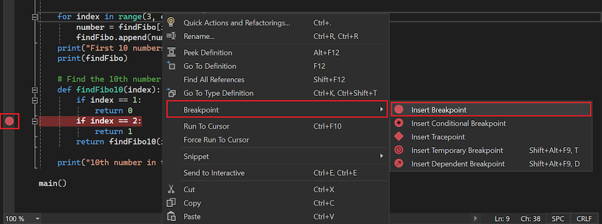
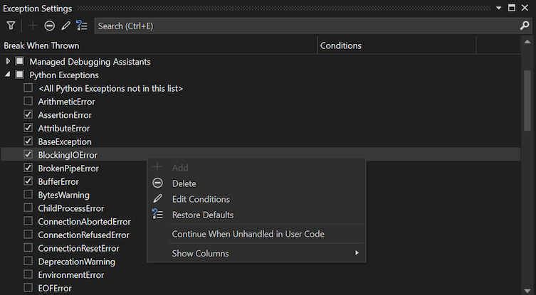
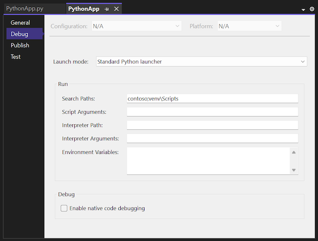
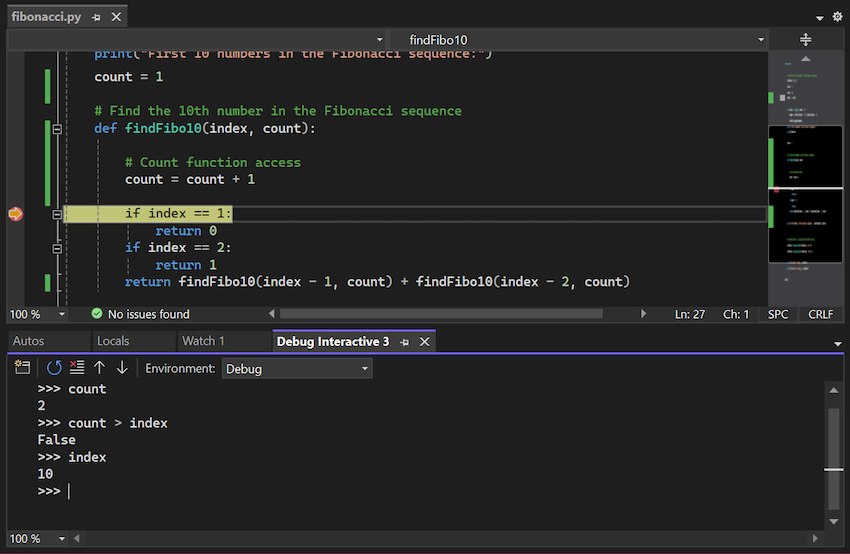
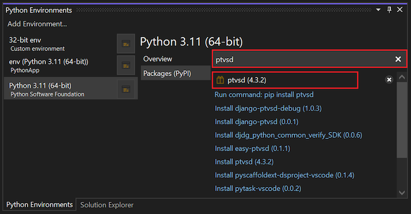
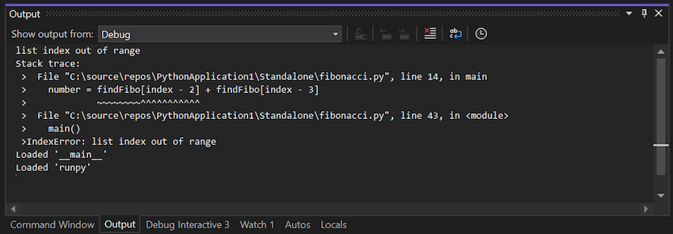

# Debug your Python code

[!INCLUDE [Visual Studio](~/includes/applies-to-version/vs-windows-only.md)]

Visual Studio provides a comprehensive debugging experience for Python, including attaching to running processes, evaluating expressions in the **Watch** and **Immediate** windows, inspecting local variables, breakpoints, step in/out/over statements, **Set Next Statement**, and more.

Also see the following scenario-specific debugging articles:

- [Linux remote debugging](debugging-python-code-on-remote-linux-machines.md)
- [Mixed-mode Python/C++ debugging](debugging-mixed-mode-c-cpp-python-in-visual-studio.md)
- [Symbols for mixed-mode debugging](debugging-symbols-for-mixed-mode-c-cpp-python.md)

<a name="debugging-without-a-project"></a>

> [!Tip]
> Python in Visual Studio supports debugging without a project. With a stand-alone Python file open, right-click in the editor, select **Start with Debugging**, and Visual Studio launches the script with the global default environment (see [Python environments](managing-python-environments-in-visual-studio.md)) and no arguments. But from then on, you have full debugging support.
>
> To control the environment and arguments, create a project for the code, which is easily done with the [From existing Python code](managing-python-projects-in-visual-studio.md#create-a-project-from-existing-files) project template.

<a name="debugging-with-a-project"></a>

## Basic debugging

The basic debugging workflow involves settings breakpoints, stepping through code, inspecting values, and handling exceptions as described in the following sections.

A debugging session starts with the **Debug** > **Start Debugging** command, the **Start** button on the toolbar, or the **F5** key. These actions launch your project's startup file (shown in bold in **Solution Explorer**) with the project's active environment and any command-line arguments or search paths that have been specified in **Project Properties** (see [Project debugging options](#project-debugging-options)). Visual Studio 2017 version 15.6 and later alerts you if you don't have a startup file set; earlier versions may open an output window with the Python interpreter running, or the output window briefly appears and disappears. In any case, right-click the appropriate file and select **Set as Startup File**.

> [!Note]
> The debugger always starts with the active Python environment for the project. To change the environment, make a different one active as described on [Select a Python environment for a project](selecting-a-python-environment-for-a-project.md).

### Breakpoints

Breakpoints stop execution of code at a marked point so you can inspect the program state. Set breakpoints by clicking in the left margin of the code editor or by right-clicking a line of code and selecting **Breakpoint** > **Insert Breakpoint**. A red dot appears on each line with a breakpoint.



Clicking the red dot or right-clicking the line of code and selecting **Breakpoint** > **Delete Breakpoint** removes the breakpoint. You can also disable it without removing it using the **Breakpoint** > **Disable Breakpoint** command.

> [!Note]
> Some breakpoints in Python can be surprising for developers who have worked with other programming languages. In Python, the entire file is executable code, so Python runs the file when it's loaded to process any top-level class or function definitions. If a breakpoint has been set, you may find the debugger breaking part-way through a class declaration. This behavior is correct, even though it's sometimes surprising.

You can customize the conditions under which a breakpoint is triggered, such as breaking only when a variable is set to a certain value or value range. To set conditions, right-click the breakpoint's red dot, select **Condition**, then create expressions using Python code. For full details on this feature in Visual Studio, see [Breakpoint conditions](../debugger/using-breakpoints.md#breakpoint-conditions).

When setting conditions, you can also set **Action** and create a message to log to the output window, optionally continuing execution automatically. Logging a message creates what is called a _tracepoint_ without adding logging code to your application directly:


### Step through code

Once stopped at a breakpoint, you have various ways to step through code or run blocks of code before breaking again. These commands are available in a number of places, including the top debug toolbar, the **Debug** menu, on the right-click context menu in the code editor, and through keyboard shortcuts (though not all commands are in all places):

| Feature                 | Keystroke                  | Description                                                                                                                                                                                                                    |
| ----------------------- | -------------------------- | ------------------------------------------------------------------------------------------------------------------------------------------------------------------------------------------------------------------------------ |
| **Continue**            | **F5**                     | Runs code until the next breakpoint is reached.                                                                                                                                                                                |
| **Step Into**           | **F11**                    | Runs the next statement and stops. If the next statement is a call to a function, the debugger stops at the first line of the function being called.                                                                           |
| **Step Over**           | **F10**                    | Runs the next statement, including making a call to a function (running all its code) and applying any return value. Stepping over allows you to easily skip functions that you do not need to debug.                          |
| **Step Out**            | **Shift**+**F11**          | Runs code until the end of the current function, then steps to the calling statement. This command is useful when you don't need to debug the remainder of the current function.                                               |
| **Run to Cursor**       | **Ctrl**+**F10**           | Runs code up to the location of the caret in the editor. This command allows you to easily skip over a segment of code that you don't need to debug.                                                                           |
| **Set Next Statement**  | **Ctrl**+**Shift**+**F10** | Changes the current run point in the code to the location of the caret. This command allows you to omit a segment of code from being run at all, such as when you know the code is faulty or produces an unwanted side-effect. |
| **Show Next Statement** | **Alt**+**Num** **\***     | Returns you to the next statement to run. This command is helpful if you've been looking around in your code and don't remember where the debugger is stopped.                                                                 |

### Inspect and modify values

When stopped in the debugger, you can inspect and modify the values of variables. You can also use the **Watch** window to monitor individual variables and custom expressions. (See [Inspect variables](../debugger/debugger-feature-tour.md#inspect-variables-with-the-autos-and-locals-windows) for general details.)

To view a value using **DataTips**, simply hover the mouse over any variable in the editor. You can select the value to change it:


The **Autos** window (**Debug** > **Windows** > **Autos**) contains variables and expressions that are close to the current statement. You can double-click in the value column or select and press **F2** to edit the value:


The **Locals** window (**Debug** > **Windows** > **Locals**) displays all variables that are in the current scope, which can again be edited:


For more on using **Autos** and **Locals**, see [Inspect variables in the Autos and Locals windows](../debugger/autos-and-locals-windows.md).

The **Watch** windows (**Debug** > **Windows** > **Watch** > **Watch 1-4**) allow you to enter arbitrary Python expressions and view the results. Expressions are reevaluated for each step:


For more on using **Watch**, see [Set a watch on variables using the Watch and QuickWatch windows](../debugger/watch-and-quickwatch-windows.md).

When inspecting a string value(`str`, `unicode`, `bytes`, and `bytearray` are all considered strings for this purpose), a magnifying glass icon appears on the right side of the value. Selecting the icon displays the unquoted string value in a popup dialog, with wrapping and scrolling, which is useful for long strings. In addition, selecting the drop-down arrow on the icon allows you to select plain text, HTML, XML, and JSON visualizations:


HTML, XML, and JSON visualizations appear in separate popup windows with syntax highlighting and tree views.

### Exceptions

If an error occurs in your program during debugging, but you don't have an exception handler for it, the debugger breaks at the point of the exception:


At this point you can inspect the program state, including the call stack. However, if you attempt to step through the code, the exception continues being thrown until it's either handled or your program exits.

The **Debug** > **Windows** > **Exception Settings** menu command brings up a window in which you can expand **Python Exceptions**:



The checkbox for each exception controls whether the debugger _always_ breaks when it's raised. Check this box when you want to break more often for a particular exception.

By default, most exceptions break when an exception handler cannot be found in the source code. To change this behavior, right-click any exception and modify the **Continue When Unhandled in User Code** option. Clear this box when you want to break less often for an exception.

To configure an exception that doesn't appear in this list, select the **Add** button to add it. The name must match the full name of the exception.

## Project debugging options

By default, the debugger starts your program with the standard Python launcher, no command-line arguments, and no other special paths or conditions. Startup options are changed through the project's debug properties accessed by right-clicking your project in **Solution Explorer**, selecting **Properties**, and selecting the **Debug** tab.



### Launch mode options

| Option                         | Description                                                                                                                                                                                                                                                                                                                                                                                                                                                             |
| ------------------------------ | ----------------------------------------------------------------------------------------------------------------------------------------------------------------------------------------------------------------------------------------------------------------------------------------------------------------------------------------------------------------------------------------------------------------------------------------------------------------------- |
| **Standard Python launcher**   | Uses debugging code written in portable Python that is compatible with CPython, IronPython, and variants such as Stackless Python. It provides the best experience for debugging pure Python code. When you attach to a running _python.exe_ process, this launcher is used. This launcher also provides [mixed-mode debugging](debugging-mixed-mode-c-cpp-python-in-visual-studio.md) for CPython, allowing you to step seamlessly between C/C++ code and Python code. |
| **Web launcher**               | Starts your default browser on launch and enables debugging of templates. See the [Web template debugging](python-web-application-project-templates.md#debugging) section for more information.                                                                                                                                                                                                                                                                         |
| **Django Web launcher**        | Identical to the Web launcher and shown only for backwards compatibility.                                                                                                                                                                                                                                                                                                                                                                                               |
| **IronPython (.NET) launcher** | Uses the .NET debugger, which only works with IronPython but allows for stepping between any .NET language project, including C# and VB. This launcher is used if you attach to a running .NET process that is hosting IronPython.                                                                                                                                                                                                                                      |

### Run options (search paths, startup arguments, and environment variables)

| Option                    | Description                                                                                                                                                                                                                                                                                                                |
| ------------------------- | -------------------------------------------------------------------------------------------------------------------------------------------------------------------------------------------------------------------------------------------------------------------------------------------------------------------------- |
| **Search Paths**          | These values match what's shown in the project's **Search Paths** node in **Solution Explorer**. You can modify this value here, but it's easier to use **Solution Explorer** that lets you browse folders and automatically converts paths to relative form.                                                              |
| **Script Arguments**      | These arguments are added to the command used to launch your script, appearing after your script's filename. The first item here is available to your script as `sys.argv[1]`, the second as `sys.argv[2]`, and so on.                                                                                                     |
| **Interpreter Arguments** | These arguments are added to the launcher command line before the name of your script. Common arguments here are `-W ...` to control warnings, `-O` to slightly optimize your program, and `-u` to use unbuffered IO. IronPython users are likely to use this field to pass `-X` options, such as `-X:Frames` or `-X:MTA`. |
| **Interpreter Path**      | Overrides the path associated with the current environment. The value may be useful for launching your script with a non-standard interpreter.                                                                                                                                                                             |
| **Environment Variables** | In this multi-line text box, add entries of the form \<NAME>=\<VALUE>. Because this setting is applied last, on top of any existing global environment variables, and after `PYTHONPATH` is set according to the **Search Paths** setting, it can be used to manually override any of those other variables.               |

## Immediate and Interactive windows

There are two interactive windows you can use during a debugging session: the standard Visual Studio **Immediate** window, and the **Python Debug Interactive** window.

The **Immediate** window (**Debug** > **Windows** > **Immediate**) is used for quick evaluation of Python expressions and inspection or assignment of variables within the running program. See the general [Immediate window](../ide/reference/immediate-window.md) article for details.

The **Python Debug Interactive** window (**Debug** > **Windows** > **Python Debug Interactive**) is richer as it makes the full [Interactive REPL](python-interactive-repl-in-visual-studio.md) experience available while debugging, including writing and running code. It automatically connects to any process started in the debugger using the Standard Python launcher (including processes attached through **Debug** > **Attach to Process**). It's not, however, available when using mixed-mode C/C++ debugging.



The **Debug Interactive** window supports special meta-commands in addition to the [standard REPL commands](python-interactive-repl-in-visual-studio.md#meta-commands):

| Command                       | Arguments                                                 | Description                                               |
| ----------------------------- | --------------------------------------------------------- | --------------------------------------------------------- |
| `$continue`, `$cont`, `$c`    | Starts running the program from the current statement.    |
| `$down`, `$d`                 | Move the current frame one level down in the stack trace. |
| `$frame`                      |                                                           | Displays the current frame ID.                            |
| `$frame`                      | frame ID                                                  | Switches the current frame to the specified frame ID.     |
| `$load`                       | Loads commands from file and executes until complete      |
| `$proc`                       |                                                           | Displays the current process ID.                          |
| `$proc`                       | process ID                                                | Switches the current process to the specified process ID. |
| `$procs`                      |                                                           | Lists the processes currently being debugged.             |
| `$stepin`, `$step`, `$s`      | Steps into the next function call, if possible.           |
| `$stepout`, `$return`, `$r`   | Steps out of the current function.                        |
| `$stepover`, `$until`, `$unt` | Steps over the next function call.                        |
| `$thread`                     |                                                           | Displays the current thread ID.                           |
| `$thread`                     | thread ID                                                 | Switches the current thread to the specified thread ID.   |
| `$threads`                    |                                                           | Lists the threads currently being debugged.               |
| `$up`, `$u`                   |                                                           | Move up the current frame one level in the stack trace.   |
| `$where`, `$w`, `$bt`         | Lists the frames for the current thread.                  |

The standard debugger windows such as **Processes**, **Threads**, and **Call Stack** aren't synchronized with the **Debug Interactive** window. Changing the active process, thread, or frame in the **Debug Interactive** window doesn't affect the other debugger windows. Similarly, changing the active process, thread, or frame in the other debugger windows doesn't affect the **Debug Interactive** window.

<a name="use-the-experimental-debugger"></a>

## Use the legacy debugger

Visual Studio 2017 versions 15.8 and later use a debugger based on ptvsd version 4.1+. Visual Studio 2019 versions 16.5 and later use a debugger based on debugpy. These versions of the debugger are compatible with Python 2.7 and Python 3.5+. If you're using Python 2.6, 3.1 to 3.4, or IronPython, Visual Studio shows the error, **Debugger does not support this Python environment**:


In these cases, you must use the older debugger (which is the default in Visual Studio 2017 versions 15.7 and earlier). Select the **Tools** > **Options** menu command, navigate to **Python** > **Debugging**, and select the **Use legacy debugger** option.

If you've installed an older version of ptvsd in the current environment (such as an earlier 4.0.x version, or a 3.x version required for remote debugging), Visual Studio may show an error or warning.

The error, **Debugger package could not be loaded**, appears when you've installed ptvsd 3.x:


In this case, select **Use the legacy debugger** to set the **Use legacy debugger** option, and restart the debugger.

The warning, **Debugger package is outdated**, appears when you've installed an earlier 4.x version of ptvsd:


> [!Important]
> Although you may choose to ignore the warning for some versions of ptvsd, Visual Studio may not work correctly.

To manage your ptvsd installation:

1. Navigate to the **Packages** tab in the **Python Environments** window.

1. Enter "ptvsd" in the search box and examine the installed version of ptvsd:

   

1. If the version is lower than 4.1.1a9 (the version bundled with Visual Studio), select the **X** to the right of the package to uninstall the older version. Visual Studio then uses its bundled version. (You can also uninstall from PowerShell using `pip uninstall ptvsd`.)

1. Alternately, you can update the ptvsd package to its newest version by following the instructions in the [Troubleshooting](#troubleshooting) section.

## Troubleshooting

### For Visual Studio 2019 (Version 16.4 and earlier) upgrade ptvsd

If you have issues with the debugger, first upgrade your version of the debugger as follows:

1. Navigate to the **Packages** tab in the **Python Environments** window.

1. Enter `ptvsd --upgrade` in the search box, then select **Run command: pip install ptvsd --upgrade**. (You can also use the same command from PowerShell.)

   

   If issues persist, please file an issue on the [PTVS GitHub repository](https://github.com/Microsoft/ptvs/issues).

   > [!NOTE]
   > For Visual Studio 2019 version 16.5 and later, debugpy is part of the Visual Studio Python workload and is updated along with Visual Studio.

### Enable debugger logging

In the course of investigating a debugger issue, Microsoft may ask you to enable and collect debugger logs that help in diagnosis.

The following steps enable debugging in the current Visual Studio session:

1. Open a command window in Visual Studio using the **View** > **Other Windows** > **Command Window** menu command.

1. Enter the following command:

   ```ps
   DebugAdapterHost.Logging /On /OutputWindow
   ```

1. Start debugging and go through whatever steps are necessary to reproduce your issue. During this time, debug logs appear in the **Output** window under **Debug Adapter Host Log**. You can then copy the logs from that window and paste into a GitHub issue, email, etc.

   

1. If Visual Studio stops responding or you aren't otherwise able to access the **Output** window, restart Visual Studio, open a command window, and enter the following command:

   ```ps
   DebugAdapterHost.Logging /On
   ```

1. Start debugging and reproduce your issue again. The debugger logs can then be found in `%temp%\DebugAdapterHostLog.txt`.

## Related content

For complete details on the Visual Studio debugger, see [Debugging in Visual Studio](../debugger/debugger-feature-tour.md).
