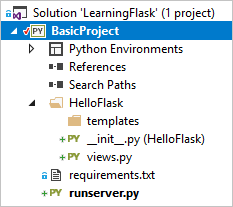
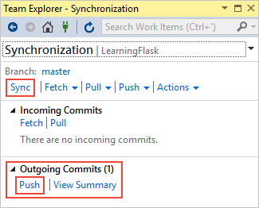

# Step 2: Create a Flask app with views and page templates

[!INCLUDE [Visual Studio](~/includes/applies-to-version/vs-windows-only.md)]

**Previous step: [Create a Visual Studio project and solution](learn-flask-visual-studio-step-01-project-solution.md)**

In step 1 of this tutorial, you created a Flask app with one page and all the code in a single file. To allow future development, it's best to refactor the code and create a structure for page templates. In particular, you want to separate code for the app's views from other aspects like startup code.

In this step you now learn how to:

> [!div class="checklist"]
>
> - Refactor the app's code to separate views from startup code (step 2-1)
> - Render a view using a page template (step 2-2)

## Step 2-1: Refactor the project to support further development

In the code created by the "Blank Flask Web Project" template, you have a single _app.py_ file that contains startup code alongside a single view. To allow further development of an app with multiple views and templates, it's best to separate these concerns.

1. In your project folder, create an app folder called `HelloFlask` (right-click the project in **Solution Explorer** and select **Add** > **New Folder**.)

2. In the _HelloFlask_ folder, create a file named _\_\_init\_\_.py_ with the following contents that creates the `Flask` instance and loads the app's views (created in the next step):

   ```python
   from flask import Flask
   app = Flask(__name__)

   import HelloFlask.views
   ```

3. In the _HelloFlask_ folder, create a file named _views.py_ with the following contents. The name _views.py_ is important because you used `import HelloFlask.views` within _\_\_init\_\_.py_; you'll see an error at runtime if the names don't match.

   ```python
   from flask import Flask
   from HelloFlask import app

   @app.route('/')
   @app.route('/home')
   def home():
       return "Hello Flask!"
   ```

   In addition to renaming the function and route to `home`, this code contains the page rendering code from _app.py_ and imports the `app` object that's declared in _\_\_init\_\_.py_.

4. Create a subfolder in _HelloFlask_ named _templates_, which remains empty for now.

5. In the project's root folder, rename _app.py_ to _runserver.py_, and make the contents match the following code:

   ```python
   import os
   from HelloFlask import app    # Imports the code from HelloFlask/__init__.py

   if __name__ == '__main__':
       HOST = os.environ.get('SERVER_HOST', 'localhost')

       try:
           PORT = int(os.environ.get('SERVER_PORT', '5555'))
       except ValueError:
           PORT = 5555

       app.run(HOST, PORT)
   ```

6. Your project structure should look like the following image:

   

7. Select **Debug** > **Start Debugging** (**F5**) or use the **Web Server** button on the toolbar (the browser you see might vary) to start the app and open a browser. Try both the / and /home URL routes.

8. You can also set breakpoints at various parts of the code and restart the app to follow the startup sequence. For example, set a breakpoint on the first lines of _runserver.py_ and *HelloFlask\_*init\__.py_, and on the `return "Hello Flask!"` line in _views.py_. Then, restart the app (**Debug** > **Restart**, **Ctrl**+**Shift**+**F5**, or the toolbar button shown below) and step through (**F10**) the code, or run from each breakpoint using **F5**.

   

9. When you're done, stop the app.

### Commit to source control

After making the changes to the code and testing successfully, you can review and commit your changes to source control. In later steps, when this tutorial reminds you to commit to source control again, you can refer to this section.

1. Select the changes button along the bottom of Visual Studio (circled below), to navigate to **Team Explorer**.

   

1. In **Team Explorer**, enter a commit message like "Refactor code" and select **Commit All**. When the commit is complete, you see a message **Commit \<hash> created locally. Sync to share your changes with the server.** If you want to push changes to your remote repository, select **Sync**, then select **Push** under **Outgoing Commits**. You can also accumulate multiple local commits before pushing to remote.

   

### Question: How frequently should one commit to source control?

Answer: Committing changes to source control creates a record in the change log and a point to which you can revert the repository if necessary. Each commit can also be examined for its specific changes. Because commits in Git are inexpensive, it's better to do frequent commits than to accumulate a larger number of changes into a single commit. You don't need to commit every small change to individual files. Typically, you make a commit when adding a feature, changing a structure like you've done in this step, or refactoring some code. Also check with others in your team for the granularity of commits that work best for everyone.

How often you commit and how often you push commits to a remote repository are two different concerns. You might accumulate multiple commits in your local repository before pushing them to the remote repository. The frequency of your commits depends on how your team wants to manage the repository.

## Step 2-2: Use a template to render a page

The `home` function that you have so far in _views.py_ generates nothing more than a plain-text HTTP response for the page. However, most real-world web pages, respond with rich HTML pages that often incorporate live data. The primary reason to define a view using a function is to generate content dynamically.

Because the return value for the view is just a string, you can build up any HTML you like within a string, using dynamic content. However, because it's best to separate markup from data, it's better to place the markup in a template and keep the data in code.

1. For starters, edit _views.py_ to contain the following code that uses inline HTML for the page with some dynamic content:

   ```python
   from datetime import datetime
   from flask import render_template
   from HelloFlask import app

   @app.route('/')
   @app.route('/home')
   def home():
       now = datetime.now()
       formatted_now = now.strftime("%A, %d %B, %Y at %X")

       html_content = "<html><head><title>Hello Flask</title></head><body>"
       html_content += "<strong>Hello Flask!</strong> on " + formatted_now
       html_content += "</body></html>"

       return html_content
   ```

1. Run the app and refresh the page a few times to see that the date/time is updated. When you're done, stop the app.

1. To convert the page rendering to use a template, create a file named _index.html_ in the _templates_ folder with the following content, where `{{ content }}` is a placeholder or replacement token (also called a _template variable_) for which you supply a value in the code:

   ```html
   <html>
     <head>
       <title>Hello Flask</title>
     </head>

     <body>
       {{ content }}
     </body>
   </html>
   ```

1. Modify the `home` function to use `render_template` to load the template and supply a value for "content", which is done using a named argument matching the name of the placeholder. Flask automatically looks for templates in the _templates_ folder, so the path to the template is relative to that folder:

   ```python
   def home():
       now = datetime.now()
       formatted_now = now.strftime("%A, %d %B, %Y at %X")

       return render_template(
           "index.html",
           content = "<strong>Hello, Flask!</strong> on " + formatted_now)
   ```

1. Run the app and see the results. Observe that the inline HTML in the `content` value doesn't render _as_ HTML because the templating engine (Jinja) automatically escapes HTML content. Automatic escaping prevents accidental vulnerabilities to injection attacks. Developers often gather input from one page and use it as a value in another through a template placeholder. Escaping also serves as a reminder that it's best to keep HTML out of the code.

   Accordingly, review _templates\index.html_ to contain distinct placeholders for each piece of data within the markup:

   ```html
   <html>
     <head>
       <title>{{ title }}</title>
     </head>
     <body>
       <strong>{{ message }}</strong>{{ content }}
     </body>
   </html>
   ```

   Then update the `home` function to provide values for all the placeholders:

   ```python
   def home():
       now = datetime.now()
       formatted_now = now.strftime("%A, %d %B, %Y at %X")

       return render_template(
           "index.html",
           title = "Hello Flask",
           message = "Hello, Flask!",
           content = " on " + formatted_now)
   ```

1. Run the app again and see the properly rendered output.

   

1. You can commit your changes to source control and update your remote repository. For more information, see [step 2-1](#commit-to-source-control).

### Question: Do page templates have to be in a separate file?

Answer: Although templates are usually maintained in separate HTML files, you can also use an inline template. Separate files are recommended to maintain a clean separation between markup and code.

### Question: Must templates use the .html file extension?

Answer: The _.html_ extension for page template files is entirely optional, because you can always identify the exact relative path to the file in the first argument to the `render_template` function. However, Visual Studio (and other editors) typically give you features like code completion and syntax coloration with _.html_ files, which outweighs the fact that page templates aren't HTML.

When you're working with a Flask project, Visual Studio automatically detects when the HTML file you're editing is actually a Flask template, and provides certain auto-complete features. For example, when you start typing a Flask page template comment, `{#`, Visual Studio automatically gives you the closing `#}` characters. The **Comment Selection** and **Uncomment Selection** commands (on the **Edit** > **Advanced** menu and on the toolbar) also use template comments instead of HTML comments.

### Question: Can templates be organized into further subfolders?

Answer: Yes, you can use subfolders and then refer to the relative path under _templates_ in calls to `render_template`. Doing so is a great way to effectively create namespaces for your templates.

## Next steps

> [!div class="nextstepaction"]
> [Serve static files, add pages, and use template inheritance](learn-flask-visual-studio-step-03-serve-static-files-add-pages.md)

## Go deeper

- [Flask Quickstart - Rendering Templates](https://flask.palletsprojects.com/quickstart/#rendering-templates) (flask.pocoo.org)
- Tutorial source code on GitHub: [Microsoft/python-sample-vs-learning-flask](https://github.com/Microsoft/python-sample-vs-learning-flask)
