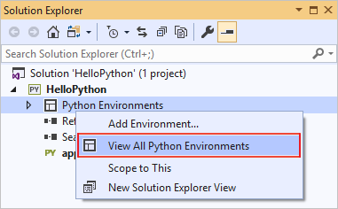
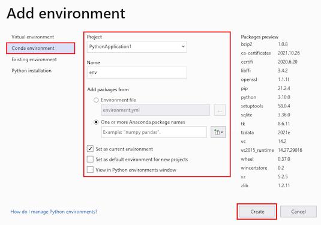
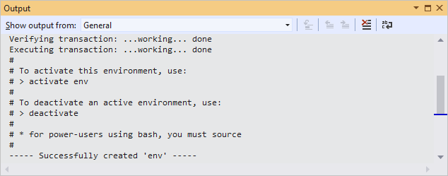
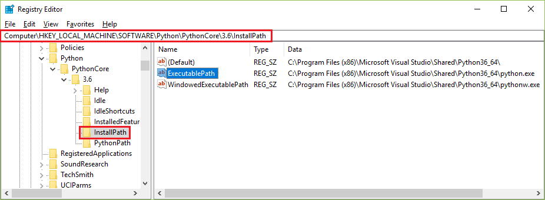

# How to create and manage Python environments in Visual Studio

A **Python environment** is a context in which you run Python code and includes global, virtual, and conda environments. An environment consists of an interpreter, a library (typically the Python Standard Library), and a set of installed packages. These components together determine which language constructs and syntax are valid, what operating-system functionality you can access, and which packages you can use.

In Visual Studio on Windows, you use the **Python Environments** window, as described in this article, to manage environments and select one as the default for new projects. Other aspects of environments are found in the following articles:

- For any given project, you can [select a specific environment](selecting-a-python-environment-for-a-project.md) rather than use the default.

- For details on creating and using virtual environments for Python projects, see [Use virtual environments](selecting-a-python-environment-for-a-project.md#use-virtual-environments).

- If you want to install packages in an environment, refer to the [Packages tab reference](python-environments-window-tab-reference.md#packages-tab).

- To install another Python interpreter, see [Install Python interpreters](installing-python-interpreters.md). In general, if you download and run an installer for a mainline Python distribution, Visual Studio detects that new installation and the environment appears in the **Python Environments** window and can be selected for projects.

If you're new to Python in Visual Studio, the following articles also provide from general background:

- [Work with Python in Visual Studio](overview-of-python-tools-for-visual-studio.md)
- [Install Python support in Visual Studio](installing-python-support-in-visual-studio.md)

::: moniker range="vs-2017"
> [!Note]
> You can't manage environments for Python code that is opened only as a folder using the **File** > **Open** > **Folder** command. Instead, [Create a Python project from existing code](quickstart-01-python-in-visual-studio-project-from-existing-code.md) to enjoy the environment features of Visual Studio.
::: moniker-end

::: moniker range=">=vs-2019"
> [!Note]
> You can manage environments for Python code that is opened as a folder using the **File** > **Open** > **Folder** command. The Python toolbar allows you switch between all detected environments, and also add a new environment. The environment information is stored in the PythonSettings.json file in the Workspace .vs folder.
::: moniker-end

## The Python Environments window

The environments that Visual Studio knows about are displayed in the **Python Environments** window. To open the window, use one of the following methods:

- Select the **View** > **Other Windows** > **Python Environments** menu command.
- Right-click the **Python Environments** node for a project in **Solution Explorer** and select **View All Python Environments**:

    ::: moniker range="vs-2017"
    
    ::: moniker-end
    ::: moniker range=">=vs-2019"
    
    ::: moniker-end

In either case, the **Python Environments** window appears alongside **Solution Explorer**:

::: moniker range="vs-2017"

::: moniker-end
::: moniker range=">=vs-2019"

::: moniker-end

Visual Studio looks for installed global environments using the registry (following [PEP 514](https://www.python.org/dev/peps/pep-0514/)), along with virtual environments and conda environments (see [Types of environments](#types-of-environments)). If you don't see an expected environment in the list, see [Manually identify an existing environment](#manually-identify-an-existing-environment).

When you select an environment in the list, Visual Studio displays various properties and commands for that environment on the **Overview** tab. For example, you can see in the image above that the interpreter's location is *C:\Python36-32*. The four commands at the bottom of the **Overview** tab each open a command prompt with the interpreter running. For more information, see [Python Environments window tab reference - Overview](python-environments-window-tab-reference.md#overview-tab).

Use the drop-down list below the list of environments to switch to different tabs such as **Packages**, and **IntelliSense**. These tabs are also described in the [Python Environments window tab reference](python-environments-window-tab-reference.md).

Selecting an environment doesn't change its relation to any projects. The default environment, shown in boldface in the list, is the one that Visual Studio uses for any new projects. To use a different environment with new projects, use the **Make this the default environment for new projects** command. Within the context of a project you can always select a specific environment. For more information, see [Select an environment for a project](selecting-a-python-environment-for-a-project.md).

To the right of each listed environment is a control that opens an **Interactive** window for that environment. (In Visual Studio 2017 15.5 and earlier, another control appears that refreshes the IntelliSense database for that environment. See [Environments window tab reference](python-environments-window-tab-reference.md) for details about the database.)

::: moniker range="vs-2017"
> [!Tip]
> When you expand the **Python Environments** window wide enough, you get a fuller view of your environments that you may find more convenient to work with.
>
> 
::: moniker-end

::: moniker range=">=vs-2019"
> [!Tip]
> When you expand the **Python Environments** window wide enough, you get a fuller view of your environments that you may find more convenient to work with.
>
> 
::: moniker-end

> [!Note]
> Although Visual Studio respects the system-site-packages option, it doesn't provide a way to change it from within Visual Studio.

### What if no environments appear?

If no environments appear, it means Visual Studio failed to detect any Python installations in standard locations. For example, you may have installed Visual Studio 2017 or later but cleared all the interpreter options in the installer options for the Python workload. Similarly, you may have installed Visual Studio 2015 or earlier but did not install an interpreter manually (see [Install Python interpreters](installing-python-interpreters.md)).

If you know you have a Python interpreter on your computer but Visual Studio (any version) did not detect it, then use the **+ Custom** command to specify its location manually. See the next section, [Manually identify an existing environment](#manually-identify-an-existing-environment).

> [!Tip]
> Visual Studio detects updates to an existing interpreter, such as upgrading Python 2.7.11 to 2.7.14 using the installers from python.org. During the installation process, the older environment disappears from the **Python Environments** list before the update appears in its place.
>
> However, if you manually move an interpreter and its environment using the file system, Visual Studio won't know the new location. For more information, see [Move an interpreter](installing-python-interpreters.md#move-an-interpreter).

### Types of environments

Visual Studio can work with global, virtual, and conda environments.

#### Global environments

Each Python installation (for example, Python 2.7, Python 3.6, Python 3.7, Anaconda 4.4.0, etc., see [Install Python interpreters](installing-python-interpreters.md)) maintains its own *global environment*. Each environment is composed of the specific Python interpreter, its standard library, a set of pre-installed packages, and any additional packages you install while that environment is activated. Installing a package into a global environment makes it available to all projects using that environment. If the environment is located in a protected area of the file system (within *c:\program files*, for example), then installing packages requires administrator privileges.

Global environments are available to all projects on the computer. In Visual Studio, you select one global environment as the default, which is used for all projects unless you specifically choose a different one for a project. For more information, see [Select an environment for a project](selecting-a-python-environment-for-a-project.md).

#### Virtual environments

Although working in a global environment is an easy way to get started, that environment will, over time, become cluttered with many different packages that you've installed for different projects. Such clutter makes it difficult to thoroughly test an application against a specific set of packages with known versions, which is exactly the kind of environment you'd set up on a build server or web server. Conflicts can also occur when two projects require incompatible packages or different versions of the same package.

For this reason, developers often create a *virtual environment* for a project. A virtual environment is a subfolder in a project that contains a copy of a specific interpreter. When you activate the virtual environment, any packages you install are installed only in that environment's subfolder. When you then run a Python program within that environment, you know that it's running against only those specific packages.

Visual Studio provides direct support for creating a virtual environment for a project. For example, if you open a project that contains a *requirements.txt*, or create a project from a template that includes that file, Visual Studio prompts you to automatically create a virtual environment and install those dependencies.

At any time within an open project, you can create a new virtual environment. In **Solution Explorer**, expand the project node, right-click **Python Environments**, and select "Add Virtual Environment." For more information, see [Create a virtual environment](./selecting-a-python-environment-for-a-project.md?view=vs-2019&preserve-view=true#create-a-virtual-environment-1).

Visual Studio also provides a command to generate a *requirements.txt* file from a virtual environment, making it easy to recreate the environment on other computers. For more information, see [Use virtual environments](selecting-a-python-environment-for-a-project.md#use-virtual-environments).

#### Conda environments

A conda environment is one created using the `conda` tool, or with integrated conda management in Visual Studio 2017 version 15.7 and higher. (Requires Anaconda or Miniconda, which are available through the Visual Studio installer, see [Installation](installing-python-support-in-visual-studio.md#visual-studio-2019-and-visual-studio-2017).)

::: moniker range="vs-2017"

1. Select **+ Create conda environment** in the **Python Environments** window, which opens a **Create new conda environment** tab:

    

1. Enter a name for the environment in the **Name** field, select a base Python interpreter in the **Python** field, and select **Create**.

1. The **Output** window shows progress for the new environment, with a few CLI instructions once creation is complete:

    

1. Within Visual Studio, you can activate a conda environment for a project as you would any other environment as described on [Select an environment for a project](selecting-a-python-environment-for-a-project.md).

1. To install packages in the environment, use the [Packages tab](python-environments-window-tab-reference.md#packages-tab).
::: moniker-end

::: moniker range=">=vs-2019"

1. Select **+ Add Environment** in the **Python Environments** window (or from the Python toolbar), which opens the **Add environment** dialog box. In that dialog, select the **Conda environment** tab:

    

1. Configure the following fields:

    | Field | Description |
    | --- | --- |
    | Project | The project in which to create the environment (if you have multiple projects in the same Visual Studio solution). |
    | Name | The name for the conda environment. |
    | Add packages from | Choose **Environment file** if you have an *environment.yml* file describing your dependencies, or choose **One or more Anaconda package names** and list at least one Python package or a Python version in the field below. The package list instructs conda to create a Python environment. To install the latest version of Python, use `python`; to install a specific version, use `python=,major>.<minor>` as in `python=3.7`. You can also use the package button to select Python versions and common packages from a series of menus. |
    | Set as current environment | Activates the new environment in the selected project after the environment is created. |
    | Set as default environment for new projects | Automatically sets and activates the conda environment in any new projects created in Visual Studio. This option is the same as using the **Make this the default environment for new projects** in the **Python Environments** window. |
    | View in Python Environments window | Specifies whether to show the  **Python Environments** window after creating the environment. |

    > [!Important]
    > When creating a conda environment, be sure to specify at least one Python version or Python package using either `environments.yml` or the package list, which ensures that the environment contains a Python runtime. Otherwise, Visual Studio ignores the environment: the environment doesn't appear anywhere the **Python Environments** window, isn't be set as the current environment for a project, and isn't available as a global environment.
    >
    > If you happen to create a conda environment without a Python version, use the `conda info` command to see the locations of conda environment folders, then manually remove the subfolder for the environment from that location.

1. Select **Create**, and observe progress in the **Output** window. The output includes with a few CLI instructions once creation is complete:

    

1. Within Visual Studio, you can activate a conda environment for a project as you would any other environment as described on [Select an environment for a project](selecting-a-python-environment-for-a-project.md).

1. To install additional packages in the environment, use the [Packages tab](python-environments-window-tab-reference.md#packages-tab).
::: moniker-end

> [!Note]
> For best results with conda environments, use conda 4.4.8 or later (conda versions are different from Anaconda versions). You can install suitable versions of Miniconda (Visual Studio 2019) and Anaconda (Visual Studio 2017) through the Visual Studio installer.

To see the conda version, where conda environments are stored, and other information, run `conda info` at an Anaconda command prompt (that is, a command prompt where Anaconda is in the path):

```cli
conda info
```

Your conda environment folders appear as follows:

```output
       envs directories : C:\Users\user\.conda\envs
                          c:\anaconda3\envs
                          C:\Users\user\AppData\Local\conda\conda\envs
```

Because conda environments are not stored with a project, they act similarly to global environments. For example, installing a new package into a conda environment makes that package available to all projects using that environment.

For Visual Studio 2017 version 15.6 and earlier, you can use conda environments by pointing to them manually as described under [Manually identify an existing environment](#manually-identify-an-existing-environment).

Visual Studio 2017 version 15.7 and later detects conda environments automatically and displays them in the **Python Environments** window as described in the next section.

## Manually identify an existing environment

Use the following steps to identify an environment that's installed in a non-standard location (including conda environments in Visual Studio 2017 version 15.6 and earlier):

::: moniker range="vs-2017"

1. Select **+ Custom** in the **Python Environments** window, which opens the **Configure** tab:

    

1. Enter a name for the environment in the **Description** field.

1. Enter or browse (using **...**) to the path of the interpreter in the **Prefix path** field.

1. If Visual Studio detects a Python interpreter at that location (such as the path shown below for a conda environment), it enables the **Auto Detect** command. Selecting **Auto Detect** completes the remaining fields. You can also complete those fields manually.

    

    

1. Once the fields contain the values you want, select **Apply** to save the configuration. You can now use the environment like any other within Visual Studio.

1. If you need to remove a manually identified environment, select the **Remove** command on the **Configure** tab. Auto-detected environments do not provide this option. For more information, see [Configure tab](python-environments-window-tab-reference.md#configure-tab).

::: moniker-end

::: moniker range=">=vs-2019"

1. Select **+ Add Environment** in the **Python Environments** window (or from the Python toolbar), which opens the **Add environment** dialog box. In that dialog, select the **Existing environment** tab:

    

1. Select the **Environment** drop-down, then select **Custom**:

    

1. In the provided fields in the dialog box, enter or browse (using **...**) to the path of the interpreter under **Prefix path**, which fills in  most of the other fields. After reviewing those values and modifying as necessary, select **Add**.

    

1. Details of the environment can be reviewed and modified at any time in the **Python Environments** window. In that window, select the environment, then select the **Configure** tab. After making changes, select the **Apply** command. You can also remove the environment using the **Remove** command (not available for auto-detected environments). For more information, see [Configure tab](python-environments-window-tab-reference.md#configure-tab).
::: moniker-end

## Fix or delete invalid environments

If Visual Studio finds registry entries for an environment, but the path to the interpreter is invalid, then the **Python Environments** window shows the name with a strikeout font:

::: moniker range="vs-2017"

::: moniker-end
::: moniker range=">=vs-2019"

::: moniker-end

To correct an environment you wish to keep, first try using its installer's **Repair** process. The installers for standard Python 3.x, for example, include that option.

To correct an environment that doesn't have a repair option, or to remove an invalid environment, use the following steps to modify the registry directly. Visual Studio automatically updates the **Python Environments** window when you make changes to the registry.

1. Run *regedit.exe*.
1. Navigate to **HKEY_LOCAL_MACHINE\SOFTWARE\Python** or **HKEY_CURRENT_USER\SOFTWARE\Python**. For IronPython, look for **IronPython** instead.
1. Expand the node that matches the distribution, such as **Python Core** for CPython or **ContinuumAnalytics** for Anaconda. For IronPython, expand the version number node.
1. Inspect the values under the **InstallPath** node:

    

    - If the environment still exists on your computer, change the value of **ExecutablePath** to the correct location. Also correct the **(Default)** and **WindowedExecutablePath** values as necessary.
    - If the environment no longer exists on your computer and you want to remove it from the **Python Environments** window, delete the parent node of **InstallPath**, such as **3.6** in the image above.
    - Invalid settings in **HKEY_CURRENT_USER\SOFTWARE\Python** override the settings in **HKEY_LOCAL_MACHINE\SOFTWARE\Python**

## See also

- [Install Python interpreters](installing-python-interpreters.md)
- [Select an interpreter for a project](selecting-a-python-environment-for-a-project.md)
- [Use requirements.txt for dependencies](managing-required-packages-with-requirements-txt.md)
- [Search paths](search-paths.md)
- [Python Environments window reference](python-environments-window-tab-reference.md)