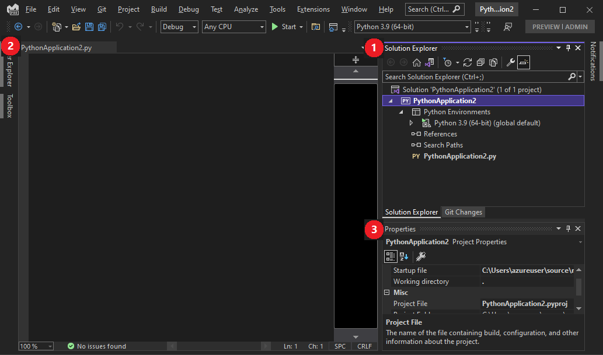
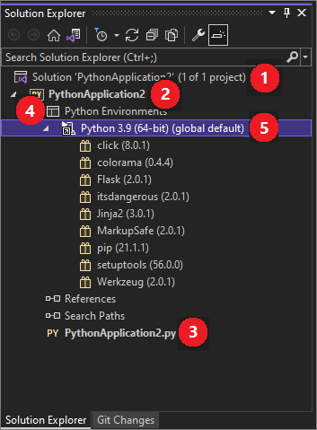

# Tutorial: Work with Python in Visual Studio

Python is a popular programming language that is reliable, flexible, easy to learn, and free to use on all operating systems. Python is supported by both a strong developer community and many, free libraries. The language supports all kinds of development, including web applications, web services, desktop apps, scripting, and scientific computing. Many universities, scientists, casual developers, and professional developers use Python.

Visual Studio provides first-class language support for Python. This tutorial guides you through the following steps:

- [Step 0: Installation](tutorial-working-with-python-in-visual-studio-step-00-installation.md)
- [Step 1: Create a Python project (this article)](#step-1-create-a-new-python-project)
- [Step 2: Write and run code to see Visual Studio IntelliSense at work](tutorial-working-with-python-in-visual-studio-step-02-writing-code.md)
- [Step 3: Create more code in the Interactive REPL window](tutorial-working-with-python-in-visual-studio-step-03-interactive-repl.md)
- [Step 4: Run the completed program in the Visual Studio debugger](tutorial-working-with-python-in-visual-studio-step-04-debugging.md)
- [Step 5: Install packages and manage Python environments](tutorial-working-with-python-in-visual-studio-step-05-installing-packages.md)
- [Step 6: Work with Git](tutorial-working-with-python-in-visual-studio-step-06-working-with-git.md)

[!INCLUDE[tutorial-prereqs](includes/tutorial-prereqs.md)]

## Step 1: Create a new Python project

A *project* is how Visual Studio manages all the files that come together to produce a single application. Application files include source code, resources, and configurations. A project formalizes and maintains the relationships among all the project's files. The project also manages external resources that are shared between multiple projects. A project allows your application to effortlessly expand and grow. Using projects is much easier than manually managing relationships in ad hoc folders, scripts, text files, and your memory.

This tutorial begins with a simple project containing a single, empty code file.

::: moniker range="<=vs-2019"
1. In Visual Studio, select **File** > **New** > **Project** (**Ctrl**+**Shift**+**N**), which brings up the **New Project** dialog. Here you browse templates across different languages, then select one for your project and specify where Visual Studio places files.

1. To view Python templates, select **Installed** > **Python** on the left, or search for "Python". Using search is a great way to find a template when you can't remember its location in the languages tree.

    

    Python support in Visual Studio includes several project templates, including web applications using the Bottle, Flask, and Django frameworks. For the purposes of this walkthrough, however, let's start with an empty project.

1. Select the **Python Application** template, specify a name for the project, and select **OK**.

1. After a few moments, Visual Studio shows the project structure in the **Solution Explorer** window (1). The default code file is open in the editor (2). The **Properties** window (3) also appears to show additional information for any item selected in **Solution Explorer**, including its exact location on disk.

    

1. Take a few moments to familiarize yourself with **Solution Explorer**, which is where you browse files and folders in your project.

    

    (1) Highlighted in bold is your project, using the name you gave in the **New Project** dialog. On disk, this project is represented by a *.pyproj* file in your project folder.

    (2) At the top level is a *solution*, which by default has the same name as your project. A solution, represented by a *.sln* file on disk, is a container for one or more related projects. For example, if you write a C++ extension for your Python application, that C++ project could be in the same solution. The solution might also contain a project for a web service, along with projects for dedicated test programs.

    (3) Under your project you see source files, in this case only a single *.py* file. Selecting a file displays its properties in the **Properties** window. Double-clicking a file opens it in whatever way is appropriate for that file.

    (4) Also under the project is the **Python Environments** node. When expanded, you see the Python interpreters that are available to you. Expand an interpreter node to see the libraries that are installed into that environment (5).

    Right-click any node or item in **Solution Explorer** to access a menu of applicable commands. For example, the **Rename** command allows you to change the name of any node or item, including the project and the solution.

::: moniker-end

::: moniker range=">=vs-2022"
1. In Visual Studio, select **File** > **New** > **Project** or press **Ctrl**+**Shift**+**N**. The **Create a new project** screen appears, where you can search and browse templates across different languages.
   
1. To view Python templates, search for *python*. Search is a great way to find a template when you can't remember its location in the languages tree.
   
   
   
   Python support in Visual Studio includes several project templates, such as web applications in the Bottle, Flask, and Django frameworks. For this tutorial, start with an empty project.
   
1. Select the **PythonConsoleApp** template, and select **Next**.
   
1. On the **Configure your new project** screen, specify a name and file location for the project, and then select **Create**.
   
   The new project opens in Visual Studio.
   
   - The Visual Studio **Solution Explorer** window shows the project structure **(1)**.
   - The default code file opens in the editor **(2)**.
   - The **Properties** window shows more information for the item selected in **Solution Explorer**, including its exact location on disk **(3)**.
   
   
   
1. Familiarize yourself with **Solution Explorer**, where you can browse files and folders in your project.
   
   
   
   - At the top level is the *solution*, which by default has the same name as your project **(1)**.
     
     A solution, which appears as a *.sln* file on disk, is a container for one or more related projects. For example, if you write a C++ extension for your Python application, that C++ project can be in the same solution. The solution could also contain a project for a web service, and projects for dedicated test programs.
   
   - Your project, with the name you gave in the **Create a new project** dialog box, appears in bold **(2)**. On disk, the project is a *.pyproj* file in your project folder.
   
   - Under your project is source files, in this case only a single *.py* file **(3)**. Selecting a file displays its properties in the **Properties** window. Double-clicking a file opens it in whatever way is appropriate for that file.
   
   - Also under the project is the **Python Environments** node **(4)**. Expand the node to show the available Python interpreters.
   
   - Expand an interpreter node to see the libraries installed in that environment **(5)**.
   
   Right-click any node or item in **Solution Explorer** to show a context menu of applicable commands. For example, **Rename** lets you change the name of a node or item, including the project and the solution.
::: moniker-end

## Next step

> [!div class="nextstepaction"]
> [Write and run code](tutorial-working-with-python-in-visual-studio-step-02-writing-code.md)

## Go deeper

- [Python projects in Visual Studio](managing-python-projects-in-visual-studio.md).
- [Learn about the Python language on python.org](https://www.python.org)
- [Python for Beginners](https://www.python.org/about/gettingstarted/) (python.org)
