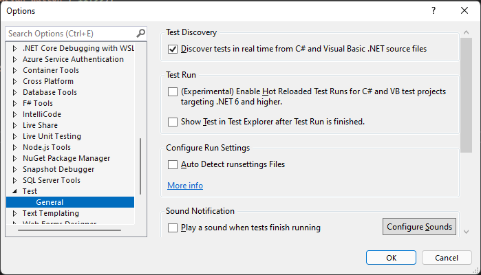
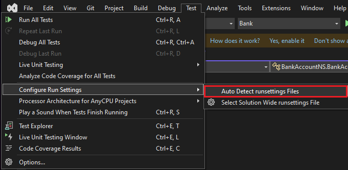
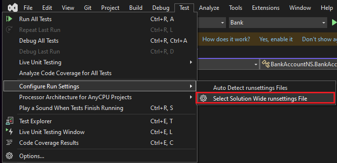
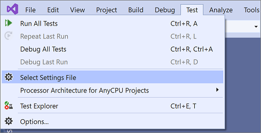

# Configure unit tests by using a *.runsettings* file

 [!INCLUDE [Visual Studio](~/includes/applies-to-version/vs-windows-only.md)]

A *.runsettings* file can be used to configure how unit tests are being run. For example, it can be used to change the .NET version on which the tests are run, the directory for the test results, or the data that's collected during a test run. A common use of a *.runsettings* file is to customize [code coverage analysis](../test/customizing-code-coverage-analysis.md).

Runsettings files can be used to configure tests that are run from the [command line](vstest-console-options.md), from the IDE, or in a build workflow using Azure Test Plans or Azure DevOps Server (formerly known as Team Foundation Server (TFS)).

Runsettings files are optional. If you don't require any special configuration, you don't need a *.runsettings* file.

## Create a run settings file and customize it

1. Add a run settings file to your solution. In **Solution Explorer**, on the shortcut menu of your solution, choose **Add** > **New Item**, and select **XML File**. Save the file with a name such as *test.runsettings*.

   If you don't see all the item templates, choose **Show All Templates**, and then choose the item template.
   
   > [!TIP]
   > The file name doesn't matter, as long as you use the extension *.runsettings*.

2. Add the content from [Example *.runsettings file](#example-runsettings-file), and then customize it to your needs as described in the sections that follow.

3. Specify the *.runsettings file that you want using one of the following methods:

   - [Visual Studio IDE](#specify-a-run-settings-file-in-the-ide)
   - [Command line](#specify-a-run-settings-file-from-the-command-line)
   - [Build workflow](/azure/devops/pipelines/test/getting-started-with-continuous-testing?view=vsts&preserve-view=true) using Azure Test Plans or Azure DevOps Server (formerly known as Team Foundation Server (TFS)).

4. Run the unit tests to use the custom run settings.

If you want to turn the custom settings off and on in the IDE, deselect or select the file on the **Test** menu.

> [!TIP]
> You can create more than one *.runsettings* file in your solution and select one as the active test settings file as needed.

## Specify a run settings file in the IDE

The methods available depend on your version of Visual Studio.

### Visual Studio 2019 version 16.4 and later

There are three ways of specifying a run settings file in Visual Studio 2019 version 16.4 and later.

- [Autodetect the run settings](#autodetect-the-run-settings-file)
- [Manually set the run settings](#manually-select-the-run-settings-file)
- [Set a build property](#set-a-build-property)

#### Autodetect the run settings file

> [!NOTE]
> This will only work for a file named `.runsettings`.

To autodetect the run settings file, place it at the root of your solution.

If auto detection of run settings files is enabled, the settings in this file are applied across all tests run. You can turn on auto detection of runsettings files using two methods:

- Select **Tools** > **Options** > **Test** > **Auto Detect runsettings Files**

   

- Select **Test** > **Configure Run Settings** > **Auto Detect runsettings Files**

   

#### Manually select the run settings file

In the IDE, select **Test** > **Configure Run Settings** > **Select Solution Wide runsettings File**, and then select the *.runsettings* file.

- This file overrides the *.runsettings* file at the root of the solution, if one is present, and is applied across all tests run.
- This file selection only persists locally.



#### Set a build property

Add a build property to a project through either the project file or a Directory.Build.props file. The run settings file for a project is specified by the property **RunSettingsFilePath**.

- Project-level run settings is currently supported in C#, VB, C++, and F# projects.
- A file specified for a project overrides any other run settings file specified in the solution.
- [These MSBuild properties](../msbuild/msbuild-reserved-and-well-known-properties.md) can be used to specify the path to the runsettings file.

Example of specifying a *.runsettings* file for a project:

```xml
<Project Sdk="Microsoft.NET.Sdk">
  <PropertyGroup>
    <RunSettingsFilePath>$(MSBuildProjectDirectory)\example.runsettings</RunSettingsFilePath>
  </PropertyGroup>
  ...
</Project>
```

### Visual Studio 2019 version 16.3 and earlier

To specify a run settings file in the IDE, select **Test** > **Select Settings File**. Browse to and select the *.runsettings* file.



The file appears on the Test menu, and you can select or deselect it. While selected, the run settings file applies whenever you select **Analyze Code Coverage**.

## Specify a run settings file from the command line

To run tests from the command line, use *vstest.console.exe*, and specify the settings file by using the **/Settings** parameter.

1. Open [Developer Command Prompt for Visual Studio](../ide/reference/command-prompt-powershell.md).

2. Enter a command similar to:

   ```cmd
   vstest.console.exe MyTestAssembly.dll /EnableCodeCoverage /Settings:CodeCoverage.runsettings
   ```

   or

   ```cmd
   vstest.console.exe --settings:test.runsettings test.dll
   ```

For more information, see [VSTest.Console.exe command-line options](vstest-console-options.md).

## The *.runsettings file

The *.runsettings file is an XML file that contains different configuration elements within the **RunSettings** element. The sections that follow detail the different elements. For a complete sample, see [Example *.runsettings file](#example-runsettings-file).

```xml
<?xml version="1.0" encoding="utf-8"?>
<RunSettings>
  <!-- configuration elements -->
</RunSettings>
```

Each of the configuration elements is optional because it has a default value.

## RunConfiguration element

```xml
<RunConfiguration>
    <MaxCpuCount>1</MaxCpuCount>
    <ResultsDirectory>.\TestResults</ResultsDirectory>
    <TargetPlatform>x86</TargetPlatform>
    <TargetFrameworkVersion>net6.0</TargetFrameworkVersion>
    <TestAdaptersPaths>%SystemDrive%\Temp\foo;%SystemDrive%\Temp\bar</TestAdaptersPaths>
    <TestCaseFilter>(TestCategory != Integration) &amp; (TestCategory != UnfinishedFeature)</TestCaseFilter>
    <TestSessionTimeout>10000</TestSessionTimeout>
    <TreatNoTestsAsError>true</TreatNoTestsAsError>
</RunConfiguration>
```

The **RunConfiguration** element can include the following elements:

|Node|Default|Values|
|-|-|-|
|**MaxCpuCount**|1|**The option name is case sensitive and is easy to misspell as MaxCPUCount**.<br /><br />This setting controls the level of parallelism on process-level. Use 0 to enable the maximum process-level parallelism.<br /><br />This setting determines the maximum number of test DLLs, or other test containers that can run in parallel. Each DLL runs in its own testhost process, and is isolated on the process level from the tests in other test DLLs. This setting doesn't force tests in each test DLL to run in parallel. Controlling the parallel execution within a DLL (on the thread-level) is up to the test framework such as MSTest, XUnit or NUnit.<br /><br />The default value is `1`, meaning that only one testhost runs at the same time. A special value `0` allows as many testhosts as you have logical processors (for example, 6, for a computer with 6 physical cores without multi-threading, or 12, for a computer with six physical cores with multi-threading).<br /><br />The number of distinct DLLs in the run determines the actual number of testhosts started.|
|**ResultsDirectory**||The directory where test results are placed. The path is relative to the directory that contains .runsettings file.|
|**TargetFrameworkVersion**| net40 or netcoreapp1.0 |**Omit this whole tag to auto-detect.**<br /><br />This setting defines the framework version, or framework family to use to run tests.<br /><br />Accepted values are any framework moniker such as `net48`, `net472`,`net6.0`, `net5.0`, `netcoreapp3.1`, `uap10.0` or any valid full framework name such as`.NETFramework,Version=v4.7.2` or `.NETCoreApp,Version=v6.0.0`. For backwards compatibility `Framework35`, `Framework40`, `Framework45`, `FrameworkCore10`, `FrameworkUap10` are accepted, meaning (`net35`, `net40`, `net45`, `netcoreapp1.0` and `uap10.0` respectively). All the values are case-insensitive.<br /><br />The provided value is used to determine the test runtime provider to be used. Every test runtime provider must respect the framework family to be used, but might not respect the exact framework version:<br /><br />For .NET Framework 4.5.1 - 4.8 a testhost that was built with the specified exact version is used. For values outside of that range, .NET Framework 4.5.1 testhost is used.<br /><br />For .NET, the test project's `<TargetFramework>` (or more precisely `runtimeconfig.json`) determines the actual version.<br /><br />For UWP, the test project application is a testhost by itself, and determines the actual version of UWP that is used.<br /><br />Omit the `TargetFrameworkVersion` element from the *.runsettings* file to automatically determine the framework version from the built binaries.<br /><br />When autodetecting, all target frameworks are unified into a single common framework. When a different version from the same target framework family is found, the newer version is chosen (for example, net452, net472, net48 = net48).<br /><br />For .NET Framework runner (in Visual Studio, or vstest.console.exe in Developer command line) the common target framework is to net40. For .NET runner (dotnet test + DLLs), the common target framework is set to netcoreapp1.0.|
|**TargetPlatform**|x86|**Omit this whole tag to auto-detect.**<br /><br />This setting defines the architecture to use to run tests. Possible values are `x86`, `x64`, `ARM`, `ARM64`, `S390x`.<br /><br />When autodetecting, the architecture for AnyCPU DLLs may differ based on the runner. For .NET Framework runner (in Visual Studio, or vstest.console.exe in Developer command line), the default is x86. For .NET runner (dotnet test), the default is the current process architecture.<br /><br />|
|**TreatTestAdapterErrorsAsWarnings**|false|false, true|
|**TestAdaptersPaths**||One or more paths to the directory where the TestAdapters are located|
|**TestCaseFilter**|| A filter expression in the format \<property>\<operator>\<value>[\|\&amp;\<Expression>]. The boolean operator **\&** should be represented by the HTML entity **\&amp;**. Expressions can be enclosed in parentheses. For detailed syntax on expression structure, see [vstest/docs/filter.md](https://github.com/microsoft/vstest/blob/main/docs/filter.md). |
|**TestSessionTimeout**||Allows users to terminate a test session when it exceeds a given timeout. Setting a timeout ensures that resources are well consumed and test sessions are constrained to a set time. The setting is available in **Visual Studio 2017 version 15.5** and later.|
|**DotnetHostPath**||Specify a custom path to dotnet host that is used to run the testhost. It's useful when you're building your own dotnet, for example when building the dotnet/runtime repository. Specifying this option skips looking for testhost.exe, and forces the use of testhost.dll.|
|**TreatNoTestsAsError**|false| true or false <br>Specify a Boolean value, which defines the exit code when no tests are discovered. If the value is `true` and no tests are discovered, a nonzero exit code is returned. Otherwise, zero is returned.|

## DataCollectors element (diagnostic data adapters)

The **DataCollectors** element specifies settings of diagnostic data adapters. Diagnostic data adapters gather additional information about the environment and the application under test. Each adapter has default settings, and you only have to provide settings if you don't want to use the defaults.

```xml
<DataCollectionRunSettings>
  <DataCollectors>
    <!-- data collectors -->
  </DataCollectors>
</DataCollectionRunSettings>
```

### CodeCoverage data collector

The code coverage data collector creates a log of which parts of the application code have been exercised in the test. For detailed information about customizing the settings for code coverage, see [Customize code coverage analysis](../test/customizing-code-coverage-analysis.md).

```xml
<DataCollector friendlyName="Code Coverage" uri="datacollector://Microsoft/CodeCoverage/2.0" assemblyQualifiedName="Microsoft.VisualStudio.Coverage.DynamicCoverageDataCollector, Microsoft.VisualStudio.TraceCollector, Version=11.0.0.0, Culture=neutral, PublicKeyToken=b03f5f7f11d50a3a">
  <Configuration>
    <CodeCoverage>
      <ModulePaths>
        <Exclude>
          <ModulePath>.*CPPUnitTestFramework.*</ModulePath>
        </Exclude>
      </ModulePaths>

      <UseVerifiableInstrumentation>True</UseVerifiableInstrumentation>
      <AllowLowIntegrityProcesses>True</AllowLowIntegrityProcesses>
      <CollectFromChildProcesses>True</CollectFromChildProcesses>
      <CollectAspDotNet>False</CollectAspDotNet>
    </CodeCoverage>
  </Configuration>
</DataCollector>
```

### VideoRecorder data collector

The video data collector captures a screen recording when tests are run. This recording is useful for troubleshooting UI tests. The video data collector is available in **Visual Studio 2017 version 15.5** and later. For an example of configuring this data collector, see the [Example *.runsettings file](#example-runsettings-file).

To customize any other type of diagnostic data adapters, use a [test settings file](../test/collect-diagnostic-information-using-test-settings.md).

### Blame data collector

This option can help you isolate a problematic test that causes a test host crash. Running the collector creates an output file (*Sequence.xml*) in *TestResults*, which captures the order of execution of the test before the crash.

You can run blame in three different modes: 
- Sequence file mode: to create a file with the list of tests up to the hang
- Crash dump mode: to create a dump when testhost crashes
- Hang dump mode: to create a dump when test doesn't finish before given timeout

The XML configuration should be placed directly into `<RunSettings>` node:

```xml 
<RunSettings>
  <RunConfiguration>
  </RunConfiguration>
  <LoggerRunSettings>
    <Loggers>
      <Logger friendlyName="blame" enabled="True" />
    </Loggers>
  </LoggerRunSettings>
  <DataCollectionRunSettings>
    <DataCollectors>
      <!-- Enables blame -->
      <DataCollector friendlyName="blame" enabled="True">
        <Configuration>
          <!-- Enables crash dump, with dump type "Full" or "Mini".
          Requires ProcDump in PATH for .NET Framework. -->
          <CollectDump DumpType="Full" />
          <!-- Enables hang dump or testhost and its child processes 
          when a test hangs for more than 10 minutes. 
          Dump type "Full", "Mini" or "None" (just kill the processes). -->
          <CollectDumpOnTestSessionHang TestTimeout="10min" HangDumpType="Full" />
        </Configuration>
      </DataCollector>
    </DataCollectors>
  </DataCollectionRunSettings>
</RunSettings>
```

## TestRunParameters

```xml
<TestRunParameters>
    <Parameter name="webAppUrl" value="http://localhost" />
    <Parameter name="docsUrl" value="https://learn.microsoft.com" />
</TestRunParameters>
```

Test run parameters provide a way to define variables and values that are available to the tests at run time. Access the parameters using the MSTest <xref:Microsoft.VisualStudio.TestTools.UnitTesting.TestContext.Properties%2A?displayProperty=nameWithType> property (or the NUnit [TestContext](https://docs.nunit.org/articles/nunit/writing-tests/TestContext.html)):

```csharp
private string _appUrl;
public TestContext TestContext { get; set; }

[TestMethod] // [Test] for NUnit
public void HomePageTest()
{
    string _appUrl = TestContext.Properties["webAppUrl"];
}
```

To use test run parameters, add a public <xref:Microsoft.VisualStudio.TestTools.UnitTesting.TestContext> property to your test class.

## LoggerRunSettings element

The `LoggerRunSettings` section defines one or more loggers to be used for the test run. The most common loggers are console, Visual Studio Test Results File (trx), and html.

```xml
<LoggerRunSettings>
    <Loggers>
      <Logger friendlyName="console" enabled="True">
        <Configuration>
            <Verbosity>quiet</Verbosity>
        </Configuration>
      </Logger>
      <Logger friendlyName="trx" enabled="True">
        <Configuration>
          <LogFileName>foo.trx</LogFileName>
        </Configuration>
      </Logger>
      <Logger friendlyName="html" enabled="True">
        <Configuration>
          <LogFileName>foo.html</LogFileName>
        </Configuration>
      </Logger>
    </Loggers>
  </LoggerRunSettings>
```

## MSTest element

These settings are specific to the test adapter that runs test methods that have the <xref:Microsoft.VisualStudio.TestTools.UnitTesting.TestMethodAttribute> attribute.

```xml
<MSTest>
    <MapInconclusiveToFailed>True</MapInconclusiveToFailed>
    <CaptureTraceOutput>false</CaptureTraceOutput>
    <DeleteDeploymentDirectoryAfterTestRunIsComplete>False</DeleteDeploymentDirectoryAfterTestRunIsComplete>
    <DeploymentEnabled>False</DeploymentEnabled>
    <AssemblyResolution>
      <Directory path="D:\myfolder\bin\" includeSubDirectories="false"/>
    </AssemblyResolution>
</MSTest>
```

|Configuration|Default|Values|
|-|-|-|
|**ForcedLegacyMode**|false|In Visual Studio 2012, the MSTest adapter was optimized to make it faster and more scalable. Some behavior, such as the order in which tests are run, might not be exactly as it was in previous editions of Visual Studio. Set the value to **true** to use the older test adapter.<br /><br />For example, you might use this setting if you have an *app.config* file specified for a unit test.<br /><br />We recommend that you consider refactoring your tests to allow you to use the newer adapter.|
|**SettingsFile**||You can specify a test settings file to use with the MSTest adapter here. You can also specify a test settings file [from the settings menu](#specify-a-run-settings-file-in-the-ide).<br /><br />If you specify this value, you must also set the **ForcedLegacyMode** to **true**.<br /><br />`<ForcedLegacyMode>true</ForcedLegacyMode>`|
|**DeploymentEnabled**|true|If you set the value to **false**, deployment items that you've specified in your test method aren't copied to the deployment directory.|
|**CaptureTraceOutput**|true|You can write to the debug trace from your test method using <xref:System.Diagnostics.Trace.WriteLine%2A?displayProperty=nameWithType>.|
|**EnableBaseClassTestMethodsFromOtherAssemblies**|true|A value indicating whether to enable discovery of test methods from base classes in a different assembly from the inheriting test class.|
|**ClassCleanupLifecycle**|EndOfClass|If you want the class cleanup to occur at the end of assembly, set it to **EndOfAssembly**. (No longer supported starting from MSTest v4 as EndOfClass is the default and only [ClassCleanup](<xref:Microsoft.VisualStudio.TestTools.UnitTesting.ClassCleanupAttribute>) behavior)|
|**MapNotRunnableToFailed**|true|A value indicating whether a not runnable result is mapped to failed test.|
|**Parallelize**|Used to set the parallelization settings:<br /><br />**Workers**: The number of threads/workers to be used for parallelization, which is by default **the number of processors on the current machine**.<br /><br />**SCOPE**: The scope of parallelization. You can set it to **MethodLevel**. By default, it's **ClassLevel**.<br /><br />`<Parallelize><Workers>32</Workers><Scope>MethodLevel</Scope></Parallelize>`|
|**TestTimeout**|0|Gets specified global test case timeout.|
|**TreatDiscoveryWarningsAsErrors**|false|To report test discovery warnings as errors, set this value to **true**.|
|**TreatClassAndAssemblyCleanupWarningsAsErrors**|false|To see your failures in class cleanups as errors, set this value to **true**.|
|**DeployTestSourceDependencies**|true|A value indicating whether the test source references are to be deployed.|
|**DeleteDeploymentDirectoryAfterTestRunIsComplete**|true|To retain the deployment directory after a test run, set this value to **false**.|
|**MapInconclusiveToFailed**|false|If a test completes with an inconclusive status, it's mapped to the skipped status in **Test Explorer**. If you want inconclusive tests to be shown as failed, set the value to **true**.|
|**AssemblyResolution**|false|You can specify paths to extra assemblies when finding and running unit tests. For example, use these paths for dependency assemblies that aren't in the same directory as the test assembly. To specify a path, use a **Directory Path** element. Paths can include environment variables.<br /><br />`<AssemblyResolution>  <Directory path="D:\myfolder\bin\" includeSubDirectories="false"/> </AssemblyResolution>`<br /><br />Note that this feature is only being applied when using .NET Framework target.|

## Example *.runsettings* file

The following XML shows the contents of a typical *.runsettings* file. Copy this code and edit it to suit your needs.

Each element of the file is optional because it has a default value.

```xml
<?xml version="1.0" encoding="utf-8"?>
<RunSettings>
  <!-- Configurations that affect the Test Framework -->
  <RunConfiguration>
    <!-- Use 0 for maximum process-level parallelization. This does not force parallelization within the test DLL (on the thread-level). You can also change it from the Test menu; choose "Run tests in parallel". Unchecked = 1 (only 1), checked = 0 (max). -->
    <MaxCpuCount>1</MaxCpuCount>
    <!-- Path relative to directory that contains .runsettings file-->
    <ResultsDirectory>.\TestResults</ResultsDirectory>

    <!-- Omit the whole tag for auto-detection. -->
    <!-- [x86] or x64, ARM, ARM64, s390x  -->
    <!-- You can also change it from the Test menu; choose "Processor Architecture for AnyCPU Projects" -->
    <TargetPlatform>x86</TargetPlatform>

    <!-- Any TargetFramework moniker or omit the whole tag for auto-detection. -->
    <!-- net48, [net40], net6.0, net5.0, netcoreapp3.1, uap10.0 etc. -->
    <TargetFrameworkVersion>net40</TargetFrameworkVersion>

    <!-- Path to Test Adapters -->
    <TestAdaptersPaths>%SystemDrive%\Temp\foo;%SystemDrive%\Temp\bar</TestAdaptersPaths>

    <!-- TestCaseFilter expression -->
    <TestCaseFilter>(TestCategory != Integration) &amp; (TestCategory != UnfinishedFeature)</TestCaseFilter>

    <!-- TestSessionTimeout was introduced in Visual Studio 2017 version 15.5 -->
    <!-- Specify timeout in milliseconds. A valid value should be greater than 0 -->
    <TestSessionTimeout>10000</TestSessionTimeout>

    <!-- true or false -->
    <!-- Value that specifies the exit code when no tests are discovered -->
    <TreatNoTestsAsError>true</TreatNoTestsAsError>
  </RunConfiguration>

  <!-- Configurations for data collectors -->
  <DataCollectionRunSettings>
    <DataCollectors>
      <DataCollector friendlyName="Code Coverage" uri="datacollector://Microsoft/CodeCoverage/2.0" assemblyQualifiedName="Microsoft.VisualStudio.Coverage.DynamicCoverageDataCollector, Microsoft.VisualStudio.TraceCollector, Version=11.0.0.0, Culture=neutral, PublicKeyToken=b03f5f7f11d50a3a">
        <Configuration>
          <CodeCoverage>
            <ModulePaths>
              <Exclude>
                <ModulePath>.*CPPUnitTestFramework.*</ModulePath>
              </Exclude>
            </ModulePaths>

            <!-- We recommend you do not change the following values: -->
            <UseVerifiableInstrumentation>True</UseVerifiableInstrumentation>
            <AllowLowIntegrityProcesses>True</AllowLowIntegrityProcesses>
            <CollectFromChildProcesses>True</CollectFromChildProcesses>
            <CollectAspDotNet>False</CollectAspDotNet>

          </CodeCoverage>
        </Configuration>
      </DataCollector>

      <DataCollector uri="datacollector://microsoft/VideoRecorder/1.0" assemblyQualifiedName="Microsoft.VisualStudio.TestTools.DataCollection.VideoRecorder.VideoRecorderDataCollector, Microsoft.VisualStudio.TestTools.DataCollection.VideoRecorder, Version=15.0.0.0, Culture=neutral, PublicKeyToken=b03f5f7f11d50a3a" friendlyName="Screen and Voice Recorder">
        <!--Video data collector was introduced in Visual Studio 2017 version 15.5 -->
        <Configuration>
          <!-- Set "sendRecordedMediaForPassedTestCase" to "false" to add video attachments to failed tests only -->
          <MediaRecorder sendRecordedMediaForPassedTestCase="true"  xmlns="">           ​
            <ScreenCaptureVideo bitRate="512" frameRate="2" quality="20" />​
          </MediaRecorder>​
        </Configuration>
      </DataCollector>

      <!-- Configuration for blame data collector -->
      <DataCollector friendlyName="blame" enabled="True">
      </DataCollector>

    </DataCollectors>
  </DataCollectionRunSettings>

  <!-- Parameters used by tests at run time -->
  <TestRunParameters>
    <Parameter name="webAppUrl" value="http://localhost" />
    <Parameter name="webAppUserName" value="Admin" />
    <Parameter name="webAppPassword" value="Password" />
  </TestRunParameters>

  <!-- Configuration for loggers -->
  <LoggerRunSettings>
    <Loggers>
      <Logger friendlyName="console" enabled="True">
        <Configuration>
            <Verbosity>quiet</Verbosity>
        </Configuration>
      </Logger>
      <Logger friendlyName="trx" enabled="True">
        <Configuration>
          <LogFileName>foo.trx</LogFileName>
        </Configuration>
      </Logger>
      <Logger friendlyName="html" enabled="True">
        <Configuration>
          <LogFileName>foo.html</LogFileName>
        </Configuration>
      </Logger>
      <Logger friendlyName="blame" enabled="True" />
    </Loggers>
  </LoggerRunSettings>

  <!-- Adapter Specific sections -->

  <!-- MSTest adapter -->
  <MSTest>
    <MapInconclusiveToFailed>True</MapInconclusiveToFailed>
    <CaptureTraceOutput>false</CaptureTraceOutput>
    <DeleteDeploymentDirectoryAfterTestRunIsComplete>False</DeleteDeploymentDirectoryAfterTestRunIsComplete>
    <DeploymentEnabled>False</DeploymentEnabled>
    <AssemblyResolution>
      <Directory path="D:\myfolder\bin\" includeSubDirectories="false"/>
    </AssemblyResolution>
  </MSTest>

</RunSettings>
```

## Specify environment variables in the *.runsettings* file

Environment variables can be set in the *.runsettings* file, which can directly interact with the test host. Specifying environment variables in the *.runsettings* file is necessary to support nontrivial projects that require setting environment variables like *DOTNET_ROOT*. These variables are set while spawning the test host process and they're available in the host.

### Example

The following code is a sample *.runsettings* file that passes environment variables:

```xml
<?xml version="1.0" encoding="utf-8"?>
<!-- File name extension must be .runsettings -->
<RunSettings>
  <RunConfiguration>
    <EnvironmentVariables>
      <!-- List of environment variables we want to set-->
      <DOTNET_ROOT>C:\ProgramFiles\dotnet</DOTNET_ROOT>
      <SDK_PATH>C:\Codebase\Sdk</SDK_PATH>
    </EnvironmentVariables>
  </RunConfiguration>
</RunSettings>
```

The **RunConfiguration** node should contain an **EnvironmentVariables** node. An environment variable can be specified as an element name and its value.

> [!NOTE]
> Because these environment variables should always be set when the test host is started, the tests should always run in a separate process. For this, the */InIsolation* flag will be set when there are environment variables so that the test host is always invoked.

## Related content

- [Configure a test run](https://github.com/microsoft/vstest-docs/blob/master/docs/configure.md)
- [Customize code coverage analysis](../test/customizing-code-coverage-analysis.md)
- [Visual Studio test task (Azure Test Plans)](/azure/devops/pipelines/tasks/test/vstest?view=vsts&preserve-view=true)
