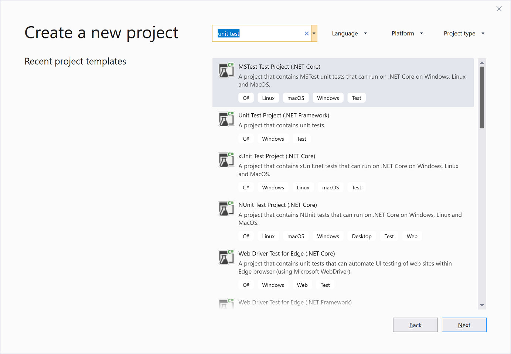

# Create a unit test project

 [!INCLUDE [Visual Studio](~/includes/applies-to-version/vs-windows-only.md)]

Unit tests often mirror the structure of the code under test. For example, a unit test project would be created for each code project in the product. The test project can be in the same solution as the production code, or it can be in a separate solution. You can have multiple unit test projects in a solution.

> [!NOTE]
> The location of unit tests for native code and the test project structure can be different than the structure that's described in this article. For more information, see [Writing unit tests for C/C++](writing-unit-tests-for-c-cpp.md).

## To create a unit test project

1. On the **File** menu, select **New** > **Project**, or press **Ctrl**+**Shift**+**N**.

2. On the **Create a new project** page, type **unit test** into the search box. Select the project template for the test framework that you want to use, for example **MSTest Test Project** or **NUnit Test Project**, and then select **Next**.

   ::: moniker range=">=vs-2022"
<<<<<<< HEAD
   
=======
   
>>>>>>> d2ef0bf9d0678644c2f09a773dcf584ccc9728d5
   ::: moniker-end
   ::: moniker range="vs-2019"
   
   ::: moniker-end

3. On the **Configure your new project** page, enter a name for your project, and then select **Create**.

4. In your unit test project, add a reference to the code under test. To add a reference to a code project in the same solution:

   1. Select the test project in **Solution Explorer**.

   2. On the **Project** menu, select **Add Reference**.

   3. In **Reference Manager**, select the **Solution** node under **Projects**. Select the code project you want to test, and then select **OK**.

   If the code that you want to test is in another location, see [Managing references in a project](../ide/managing-references-in-a-project.md) for information about adding a reference.

## Next steps

See one of the following sections:

**Writing unit tests**

- [Unit test your code](../test/unit-test-your-code.md)

- [Writing unit tests for C/C++](writing-unit-tests-for-c-cpp.md)

- [Use the MSTest framework in unit tests](using-microsoft-visualstudio-testtools-unittesting-members-in-unit-tests.md)

**Running unit tests**

- [Run unit tests with Test Explorer](../test/run-unit-tests-with-test-explorer.md)