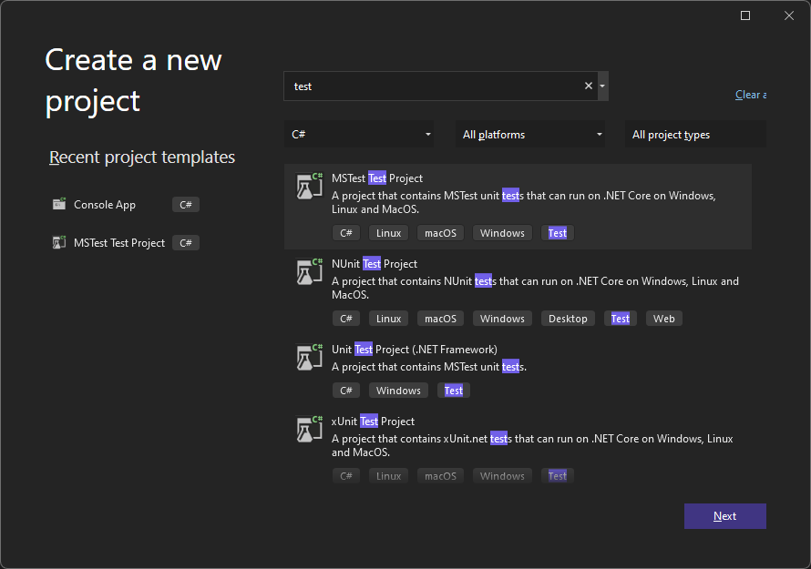
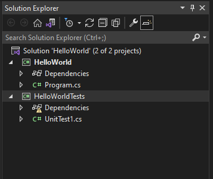
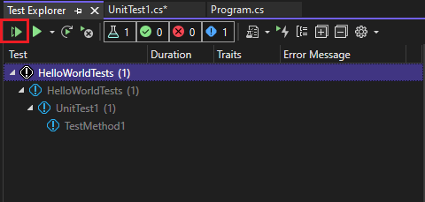
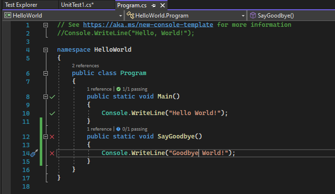
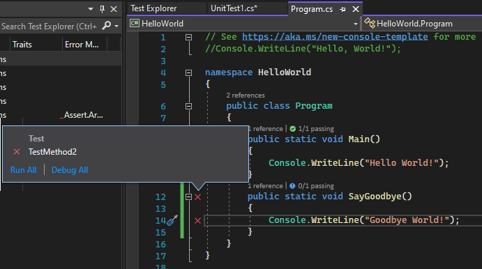
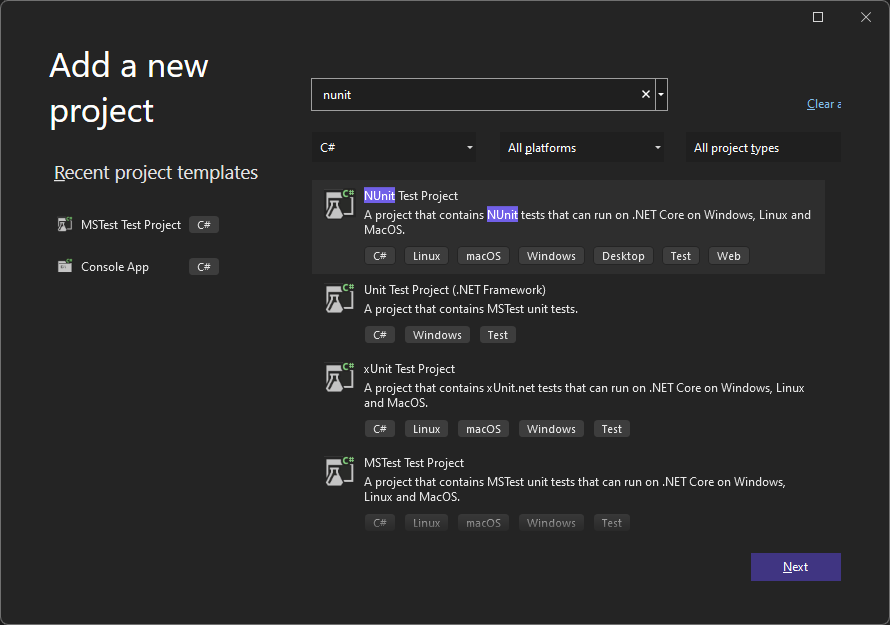
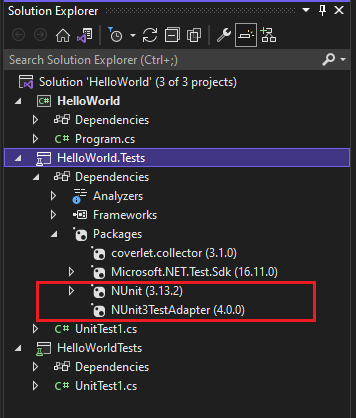
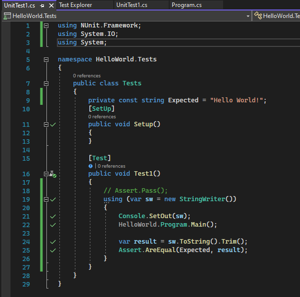

# Get started with unit testing

 [!INCLUDE [Visual Studio](~/includes/applies-to-version/vs-windows-only.md)]

Use Visual Studio to define and run unit tests to maintain code health, ensure code coverage, and find errors and faults before your customers do. Run your unit tests frequently to make sure your code is working properly.

In this article, the code uses C# and C++, illustrations are in C#, but the concepts and features apply to .NET languages, C++, Python, JavaScript, and TypeScript.

## Create unit tests

This section describes how to create a unit test project.

1. Open the project that you want to test in Visual Studio.

   For the purposes of demonstrating an example unit test, this article tests a simple "Hello World" C# or C++ Console project named **HelloWorld**. The sample code for such a project is as follows:

   ### [.NET](#tab/dotnet)
   ```csharp
   namespace HelloWorld
   {
      public class Program
      {
         public static void Main()
         {
            Console.WriteLine("Hello World!");
         }
      }
   }
   ```

   ### [C++](#tab/cpp)
   ```cpp
   #include <iostream>

   int main()
   {
      std::cout << "Hello World!\n";
   }
   ```
   ---

1. In **Solution Explorer**, select the solution node. Then, from the top menu bar, select **File** > **Add** > **New Project**.

1. In the new project dialog box, find the unit test project to use.

   Type **test** in the search box to find a unit test project template for the test framework you want to use, such as **MSTest** (C#) or the **Native Unit Test** project (C++), and select it.

   Starting in Visual Studio 2017 version 14.8, the .NET languages include built-in templates for NUnit and xUnit. For C++, in this example select the **Native Unit Test** project, which uses Microsoft Native Unit Test Framework. (To use a different C++ test framework, see [Writing unit tests for C/C++](../test/writing-unit-tests-for-c-cpp.md)). For Python, see [Set up unit testing in Python code](../python/unit-testing-python-in-visual-studio.md) to set up your test project.

   > [!TIP]
   > For C# only, you can create unit test projects from code using a faster method. For more information, see [Create unit test projects and test methods](../test/unit-test-basics.md#create-unit-test-projects-and-test-methods-c). To use this method with .NET Core or .NET Standard, Visual Studio 2019 or later is required.

   The following illustration shows an MSTest unit test, which is supported in .NET.

   ::: moniker range=">=vs-2022"

   

   Click **Next**, choose a name for the test project, and then click **Create**.

   ::: moniker-end
   ::: moniker range="vs-2019"

   

   Click **Next**, choose a name for the test project, and then click **Create**.

   ::: moniker-end

   The project is added to your solution.

   ::: moniker range=">=vs-2022"
   
   ::: moniker-end
   ::: moniker range="<=vs-2019"
   
   ::: moniker-end

1. In the unit test project, add a reference to the project you want to test by right-clicking on **References** or **Dependencies** and then choosing **Add Reference** or **Add Project Reference**.

1. Select the project that contains the code you'll test and click **OK**.

   ::: moniker range=">=vs-2022"
   
   ::: moniker-end
   ::: moniker range="<=vs-2019"
   
   ::: moniker-end

1. Add code to the unit test method.

   For example, you might use the following code by selecting the correct documentation tab that matches your test framework: MSTest, NUnit, or xUnit (supported on .NET only), or C++ Microsoft Native Unit Test Framework.

   ### [MSTest](#tab/mstest)

   ```csharp
   using Microsoft.VisualStudio.TestTools.UnitTesting;
   using System.IO;
   using System;

   namespace HelloWorldTests
   {
      [TestClass]
      public class UnitTest1
      {
         private const string Expected = "Hello World!";
         [TestMethod]
         public void TestMethod1()
         {
            using (var sw = new StringWriter())
            {
               Console.SetOut(sw);
               HelloWorld.Program.Main();

               var result = sw.ToString().Trim();
               Assert.AreEqual(Expected, result);
            }
         }
      }
   }
   ```

   ### [NUnit](#tab/nunit)

   ```csharp
   using NUnit.Framework;
   using System.IO;
   using System;

   namespace HelloWorldTests
   {
      public class Tests
      {
         private const string Expected = "Hello World!";

         [SetUp]
         public void Setup()
         {
         }
         [Test]
         public void TestMethod1()
         {
            using (var sw = new StringWriter())
            {
               Console.SetOut(sw);
               HelloWorld.Program.Main();

               var result = sw.ToString().Trim();
               Assert.AreEqual(Expected, result);
            }
         }
      }
   }
   ```

    ### [xUnit](#tab/xunit)

    ```csharp
    using System;
    using Xunit;
    using System.IO;
    
    namespace HelloWorldTests
    {
        public class UnitTest1
        {
            private const string Expected = "Hello World!";
            [Fact]
            public void Test1()
            {
                using (var sw = new StringWriter())
                {
                    Console.SetOut(sw);
                    HelloWorld.Program.Main();
    
                    var result = sw.ToString().Trim();
                    Assert.Equal(Expected, result);
                }
            }
        }
    }
    ```

    ### [Microsoft Native Unit Test Framework](#tab/msunittest)

    ```cpp
    #include "pch.h"
    #include "CppUnitTest.h"
    #include "../HelloWorldUnitTestCPP/HelloWorldUnitTestCPP.cpp"   // Update using your project name

    using namespace Microsoft::VisualStudio::CppUnitTestFramework;

    namespace HelloWorldTests
    {
       TEST_CLASS(HelloWorldTests)
       {
       public:

          TEST_METHOD(TestMethod)
          {
             std::string expected = "Hello World!\n";

             std::stringstream buffer;
             std::streambuf* sbuf = std::cout.rdbuf(); // Save cout's buffer
             std::cout.rdbuf(buffer.rdbuf()); // Redirect cout to the stringstream buffer

             // Call main() in your test
             int result = main();

             // When finished, redirect cout to the original buffer 
             std::cout.rdbuf(sbuf);
             std::cout << "std original buffer: \n";
             std::cout << buffer.get();

             // Test
             Assert::AreEqual(expected, buffer.str());
          }
       };
    }
    ```

    ---

## Run unit tests

1. Open [Test Explorer](../test/run-unit-tests-with-test-explorer.md).

   To open Test Explorer, choose **Test** > **Test Explorer** from the top menu bar (or press **Ctrl** + **E**, **T**).

1. Run your unit tests by clicking **Run All** (or press **Ctrl** + **R**, **V**).

   ::: moniker range=">=vs-2022"
   
   ::: moniker-end
   ::: moniker range="<=vs-2019"
   
   ::: moniker-end

   After the tests have completed, a green check mark indicates that a test passed. A red "x" icon indicates that a test failed.

   ::: moniker range=">=vs-2022"
   
   ::: moniker-end
   ::: moniker range="<=vs-2019"
   
   ::: moniker-end

> [!TIP]
> You can use [Test Explorer](../test/run-unit-tests-with-test-explorer.md) to run unit tests from the built-in test framework (MSTest) or from third-party test frameworks. You can group tests into categories, filter the test list, and create, save, and run playlists of tests. You can also debug tests and analyze test performance and code coverage.

## View live unit test results (Visual Studio Enterprise)

If you are using the MSTest, xUnit, or NUnit testing framework in Visual Studio 2017 or later, you can see live results of your unit tests.

> [!NOTE]
> To follow these steps, Visual Studio Enterprise is required, along with .NET code and one of the following test frameworks: MSTest, xUnit, or NUnit.

1. Turn live unit testing from the **Test** menu by choosing **Test** > **Live Unit Testing** > **Start**.

   ::: moniker range="vs-2019"

   

   ::: moniker-end

   ::: moniker range=">=vs-2022"

   

   ::: moniker-end

1. View the results of the tests within the code editor window as you write and edit code.

   ::: moniker range="<=vs-2019"
   
   ::: moniker-end
   ::: moniker range=">=vs-2022"
   
   ::: moniker-end

1. Click a test result indicator to see more information, such as the names of the tests that cover that method.

   ::: moniker range="<=vs-2019"
   
   ::: moniker-end
   ::: moniker range=">=vs-2022"
   
   ::: moniker-end

For more information about live unit testing, see [Live unit testing](../test/live-unit-testing-intro.md).

## Use a third-party test framework

You can run unit tests in Visual Studio by using third-party test frameworks such as NUnit, Boost, or Google C++ Testing Framework, depending on your programming language. To use a third-party framework:

- Use the **NuGet Package Manager** to install the NuGet package for the framework of your choice.

- (.NET) Starting in Visual Studio 2017 version 14.6, Visual Studio includes pre-configured test project templates for NUnit and xUnit test frameworks. The templates also include the necessary NuGet packages to enable support.

- (C++) In Visual Studio 2017 and later versions, some frameworks like Google C++ Testing Framework are already included. For more information, see [Write unit tests for C/C++ in Visual Studio](../test/writing-unit-tests-for-c-cpp.md).

To add a unit test project:

1. Open the solution that contains the code you want to test.

2. Right-click on the solution in **Solution Explorer** and choose **Add** > **New Project**.

3. Select a unit test project template.

   In this example, select [NUnit](https://nunit.org/)

   ::: moniker range=">=vs-2022"
   
   ::: moniker-end

   ::: moniker range="vs-2019"
   

   Click **Next**, name the project, and then click **Create**.
   ::: moniker-end

   The project template includes NuGet references to NUnit and NUnit3TestAdapter.

   ::: moniker range=">=vs-2022"
   
   ::: moniker-end
   ::: moniker range="<=vs-2019"
   
   ::: moniker-end

4. Add a reference from the test project to the project that contains the code you want to test.

   Right-click on the project in **Solution Explorer**, and then select **Add** > **Reference**. (You can also add a reference from the right-click menu of the **References** or **Dependencies** node.)

5. Add code to your test method.

   ::: moniker range=">=vs-2022"
   
   ::: moniker-end
   ::: moniker range="<=vs-2019"
   
   ::: moniker-end

6. Run the test from **Test Explorer** or by right-clicking on the test code and choosing **Run Test(s)** (or **Ctrl** + **R**, **T**).

## Next steps

> [!div class="nextstepaction"]
> [Unit test basics](../test/unit-test-basics.md)

> [!div class="nextstepaction"]
> [Create and run unit tests for managed code](walkthrough-creating-and-running-unit-tests-for-managed-code.md)

> [!div class="nextstepaction"]
> [Write unit tests for C/C++](../test/writing-unit-tests-for-c-cpp.md)
