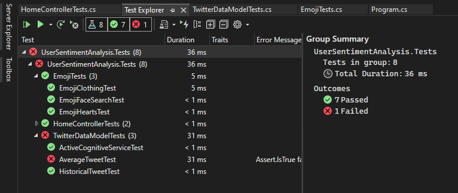
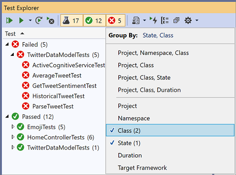
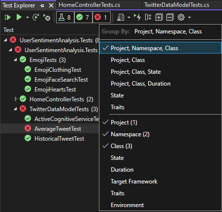
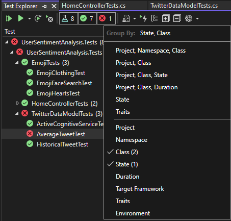
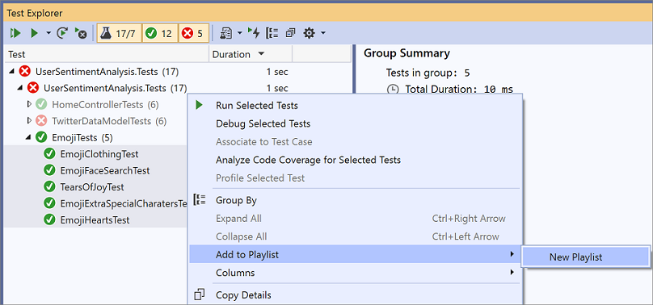
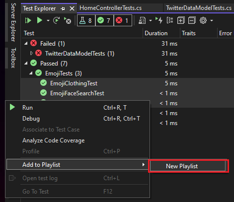
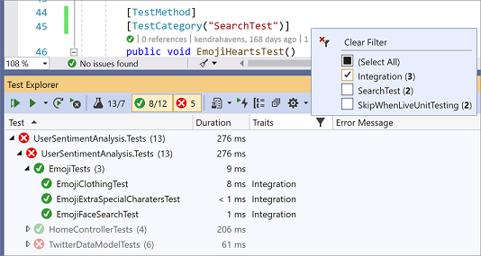
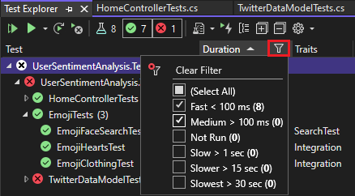

# Run unit tests by using Test Explorer

Use Test Explorer to run unit tests from Visual Studio or third-party unit test projects. In Test Explorer, you can group tests into categories, filter the test list, and create, save, and run playlists of tests. You can also use Test Explorer to [debug unit tests](../test/debug-unit-tests-with-test-explorer.md) and, in Visual Studio Enterprise, to [analyze code coverage](../test/using-code-coverage-to-determine-how-much-code-is-being-tested.md).

Test Explorer can run tests from multiple test projects in a solution and from test classes that are part of the production code projects. Test projects can use various unit test frameworks. When the code under test is written for .NET, the test project can be written in any language that also targets .NET, regardless of the language of the target code. You must test native C and C++ code projects by using a C++ unit test framework.

## Build your test project

If you don't already have a test project set up in your Visual Studio solution, you must first create and build a test project. Use these resources:

- [Get started with unit testing (.NET)](../test/getting-started-with-unit-testing.md)
- [Write unit tests for C/C++](writing-unit-tests-for-c-cpp.md)

Visual Studio includes the Microsoft unit test frameworks for both managed and native code. However, Test Explorer can also run any unit test framework that has implemented a Test Explorer adapter. For more information about installing third-party unit test frameworks, see [Install unit test frameworks](../test/install-third-party-unit-test-frameworks.md).

## Run tests in Test Explorer

When you build the test project, the tests appear in Test Explorer. If Test Explorer is not visible, select **Test** on the Visual Studio menu, and then select **Test Explorer** (or select Ctrl+E, T).

::: moniker range="vs-2019"

::: moniker-end

::: moniker range=">=vs-2022"

::: moniker-end

As you run, write, and rerun your tests, Test Explorer displays the results in a default grouping of **Project**, **Namespace**, and **Class**. You can change the way Test Explorer groups your tests.

You can perform much of the work of finding, organizing, and running tests from the **Test Explorer** toolbar.

::: moniker range="vs-2019"

::: moniker-end

::: moniker range=">=vs-2022"
:::image type="content" source="../test/media/vs-2022/test-explorer-toolbar-diagram-17-0.png" alt-text="Screenshot that describes icons for running tests from the Test Explorer toolbar.":::
::: moniker-end

### Run tests

Choose one of these options for running tests:

- To run all the tests in a solution, select the **Run All** icon (or select Ctrl+R, V).

- To run all the tests in a default group, select the **Run** icon and then select the group on the menu.

- To run individual tests, select one or more tests, right-click on the pane, and then select **Run Selected Tests** (or select Ctrl+R, T).

  If individual tests have no dependencies that prevent them from being run in any order, turn on parallel test execution on the settings menu of the toolbar. This action can reduce the time for running all the tests.

> [!NOTE]
> To configure the target platform (process architecture) for running unit tests, see [Configure process architecture for a unit test](../test/run-a-unit-test-as-a-64-bit-process.md).

### Run tests after every build

To run your unit tests after each local build, select the settings icon on the Test Explorer toolbar and then select **Run Tests After Build**.

## View test results

As you run, write, and rerun your tests, Test Explorer displays the results in groups of **Failed Tests**, **Passed Tests**, **Skipped Tests**, and **Not Run Tests**. The details pane at the bottom or side of Test Explorer displays a summary of the test run.

### View test details

To view the details of an individual test, select the test.

::: moniker range="vs-2019"

::: moniker-end

::: moniker range=">=vs-2022"

::: moniker-end

The pane for test details displays:

- The source file name and the line number of the test method.

- The status of the test.

- The elapsed time that the test method took to run.

If the test fails, the details pane also displays:

- The message that the unit test framework returns for the test.

- The stack trace at the time that the test failed.

### View the source code of a test method

To display the source code for a test method in the Visual Studio editor, select the test, right-click on the pane, and then select **Open Test** (or select the F12 key).

## Group and filter the test list

In Test Explorer, you can group your tests into predefined categories. Most unit test frameworks that run in Test Explorer let you define your own categories and category/value pairs to group your tests. You can also filter the list of tests by matching strings against test properties.

### Group tests in the test list

::: moniker range="vs-2019"
Test Explorer lets you group your tests into a hierarchy. The default hierarchy grouping is **Project**, **Namespace**, and then **Class**. To change the way that tests are organized, select the **Group By** button  and then select a new grouping criterion.


You can define your own levels of the hierarchy (group by **State** and then **Class**, for example) by selecting **Group By** options in your preferred order.


::: moniker-end

::: moniker range=">=vs-2022"
Test Explorer lets you group your tests into a hierarchy. The default hierarchy grouping is **Project**, **Namespace**, and then **Class**. To change the way that tests are organized, select the **Group By** button  and then select a new grouping criterion.



You can define your own levels of the hierarchy (group by **State** and then **Class**, for example) by selecting **Group By** options in your preferred order.


::: moniker-end

### Test Explorer groups

|Group|Description|
|-|-----------------|
|**Duration**|Groups tests by execution time: **Fast**, **Medium**, **Slow**.|
|**State**|Groups tests by execution results: **Failed Tests**, **Skipped Tests**, **Passed Tests**, **Not Run**.|
|**Target Framework** | Groups tests by the framework that their projects target.|
|**Namespace**|Groups tests by the containing namespace.|
|**Project**|Groups tests by the containing project.|
|**Class**|Groups tests by the containing class.|

### Traits

A trait is usually a category name/value pair, but it can also be a single category. Traits can be assigned to methods that the unit test framework identifies as test methods.

A unit test framework can define trait categories. You can add values to the trait categories to define your own category name/value pairs. The unit test framework defines the syntax to specify trait categories and values.

#### Traits in the Microsoft Unit Testing Framework for Managed Code

In the Microsoft Unit Testing Framework for Managed Code, you define a trait name/value pair in a <xref:Microsoft.VisualStudio.TestTools.UnitTesting.TestPropertyAttribute> attribute. The test framework also contains these predefined traits:

|Trait|Description|
|-|-----------------|
|<xref:Microsoft.VisualStudio.TestTools.UnitTesting.OwnerAttribute>|The `Owner` category is defined by the unit test framework and requires you to provide a string value of the owner.|
|<xref:Microsoft.VisualStudio.TestTools.UnitTesting.PriorityAttribute>|The `Priority` category is defined by the unit test framework and requires you to provide an integer value of the priority.|
|<xref:Microsoft.VisualStudio.TestTools.UnitTesting.TestCategoryAttribute>|The `TestCategory` attribute enables you to specify the category of a unit test.|
|<xref:Microsoft.VisualStudio.TestTools.UnitTesting.TestPropertyAttribute>|The `TestProperty` attribute enables you to define a trait category/value pair.|

#### Traits in the Microsoft Unit Testing Framework for C++

See [Use the Microsoft Unit Testing Framework for C++ in Visual Studio](how-to-use-microsoft-test-framework-for-cpp.md).

## Create custom playlists

::: moniker range="vs-2019"
You can create and save a list of tests that you want to run or view as a group. When you select a playlist, the tests in the list appear on a new Test Explorer tab. You can add a test to more than one playlist.

To create a playlist:

1. Choose one or more tests in Test Explorer.
1. Right-click on the pane, point to **Add to Playlist**, and then select **New Playlist**.



The playlist opens on a new Test Explorer tab. You can use this playlist once and then discard it. Or you can select the **Save** button on the playlist window's toolbar, and then select a name and location to save the playlist.


To open a playlist:

1. On the Visual Studio toolbar, select the playlist icon.
1. On the menu, select a previously saved playlist file.

To edit a playlist, use one of these options:

- Right-click any test, and then use the menu commands to add or remove it from a playlist.
- On the toolbar, select the **Edit Playlist** button. Checkboxes that appear next to your tests show what tests are included and excluded in the playlist. Edit groups as desired. This capability started in Visual Studio 2019 version 16.7.

  

You can also select or clear the boxes for the parent groups in the hierarchy. This action creates a dynamic playlist that always updates the playlist based on the tests that are in that group.

For example, if you select a checkbox next to a class, any test added from that class becomes part of this playlist. If you delete a test from that class, it's removed from the playlist.

You can learn more about the rules by saving the playlist via the **Save** button on the toolbar, and then opening the *.playlist* XML file that's created on your disk. This file lists all the rules and individual tests that make up a playlist.


If you want to make a playlist for traits, use the following format for the Microsoft Testing Framework (MSTest):

```xml
<Playlist Version="2.0">
  <Rule Name="Includes" Match="Any">
    <Property Name="Trait" Value="SchemaUpdateBasic" />
  </Rule>
</Playlist>
```

Use the following format for the xUnit framework. Make sure there's a space between your `TestCategory` name and the `[Value]` value.

```xml
<Playlist Version="2.0">
  <Rule Name="Includes" Match="Any">
    <Rule Match="All">
      <Property Name="Solution" />
        <Rule Match="Any">
            <Property Name="Trait" Value="TestCategory [Value]" />
        </Rule>
    </Rule>
  </Rule>
</Playlist>
```
::: moniker-end

::: moniker range=">=vs-2022"
You can create and save a list of tests that you want to run or view as a group. When you select a playlist, the tests in the list appear on a new Test Explorer tab. You can add a test to more than one playlist.

To create a playlist:

1. Choose one or more tests in Test Explorer.
1. Right-click on the pane, point to **Add to Playlist**, and then select **New Playlist**.



The playlist opens on a new Test Explorer tab. You can use this playlist once and then discard it. Or you can select the **Save** button on the playlist window's toolbar, and then select a name and location to save the playlist.


To open a playlist:

1. On the Visual Studio toolbar, select the playlist icon.
1. On the menu, select a previously saved playlist file.

To edit a playlist, use one of these options:

- Right-click any test, and then use the menu commands to add or remove it from a playlist.
- On the toolbar, select the **Edit Playlist** button. Checkboxes that appear next to your tests show what tests are included and excluded in the playlist. Edit groups as desired. This capability started in Visual Studio 2019 version 16.7.

  

You can also select or clear the boxes for the parent groups in the hierarchy. This action creates a dynamic playlist that always updates the playlist based on the tests that are in that group.

For example, if you select a checkbox next to a class, any test added from that class becomes part of this playlist. If you delete a test from that class, it's removed from the playlist.

You can learn more about the rules by saving the playlist via the **Save** button on the toolbar, and then opening the *.playlist* XML file that's created on your disk. This file lists all the rules and individual tests that make up a playlist.


If you want to make a playlist for traits, use the following format for the Microsoft Testing Framework (MSTest):

```xml
<Playlist Version="2.0">
  <Rule Name="Includes" Match="Any">
    <Property Name="Trait" Value="SchemaUpdateBasic" />
  </Rule>
</Playlist>
```

Use the following format for the xUnit framework. Make sure there's a space between your `TestCategory` name and the `[Value]` value.

```xml
<Playlist Version="2.0">
  <Rule Name="Includes" Match="Any">
    <Rule Match="All">
      <Property Name="Solution" />
        <Rule Match="Any">
            <Property Name="Trait" Value="TestCategory [Value]" />
        </Rule>
    </Rule>
  </Rule>
</Playlist>
```
::: moniker-end

::: moniker range="vs-2019"
### Test Explorer columns

[Groups](#test-explorer-groups) are also available as columns in Test Explorer, along with **Trait**, **Stack Trace**, **Error Message**, and **Fully Qualified Name**. Most columns are not visible by default. You can customize which columns appear and their order.


### Filter, sort, and rearrange test columns

Columns can be filtered, rearranged, and sorted:

- To filter to specific traits, select the filter icon at the top of the **Traits** column.

  

- To change the order of the columns, select a column header and drag it left or right.

- To sort a column, select the column header. Not all columns can be sorted. You can also sort by a secondary column by holding the Shift key and selecting an additional column header.

  
::: moniker-end

::: moniker range=">=vs-2022"
### Test Explorer columns

[Groups](#test-explorer-groups) are also available as columns in Test Explorer, along with **Trait**, **Stack Trace**, **Error Message**, and **Fully Qualified Name**. Most columns are not visible by default. You can customize which columns appear and their order.


### Filter, sort, and rearrange test columns

Columns can be filtered, rearranged, and sorted:

- To filter to specific traits, select the filter icon at the top of the **Traits** column.

  

- To change the order of the columns, select a column header and drag it left or right.

- To sort a column, select the column header. Not all columns can be sorted. You can also sort by a secondary column by holding the Shift key and selecting an additional column header.

  
::: moniker-end

## Search and filter the test list

You can also use Test Explorer search filters to limit the test methods in your projects that you view and run.

When you type a string in the **Test Explorer** search box and select **Enter**, the test list is filtered to display only those tests whose fully qualified names contain the string.

To filter by a different criterion:

1. Open the dropdown list to the right of the search box.

2. Choose a new criterion.

3. Enter the filter value between the quotation marks. If you want to search for an exact match on the string instead of a containing match, use an equal sign (=) instead of the colon (:).

::: moniker range="vs-2019"

::: moniker-end

::: moniker range=">=vs-2022"

::: moniker-end

> [!NOTE]
> Searches are case insensitive and match the specified string to any part of the criterion value.

|Qualifier|Description|
|-|-----------------|
|**State**|Searches the Test Explorer category names for matches: **Failed Tests**, **Skipped Tests**, **Passed Tests**.|
|**Traits**|Searches both trait categories and values for matches. The unit test framework defines the syntax to specify trait categories and values.|
|**Fully Qualified Name**|Searches the fully qualified name of test namespaces, classes, and methods for matches.|
|**Project**|Searches the test project names for matches.|
|**Target Framework**|Searches the test frameworks for matches.|
|**Namespace**|Searches the test namespaces for matches.|
|**Class**|Searches the test classes names for matches.|

To exclude a subset of the results of a filter, use the following syntax:

```
FilterName:"Criteria" -FilterName:"SubsetCriteria"
```

For example, `FullName:"MyClass" - FullName:"PerfTest"` returns all tests that include "MyClass" in their name, except tests that also include "PerfTest" in their name.

### Analyze unit test code coverage

You can determine the amount of product code that your unit tests are actually testing by using the Visual Studio Code coverage tool that's available in Visual Studio Enterprise. You can run code coverage on selected tests or on all tests in a solution.

To run code coverage for test methods in a solution:

- Right-click in Test Explorer, and then select **Analyze Code Coverage for Selected tests**.

The **Code Coverage Results** window displays the percentage of the blocks of product code that were exercised by line, function, class, namespace, and module.

For more information, see [Use code coverage to determine how much code is being tested](../test/using-code-coverage-to-determine-how-much-code-is-being-tested.md).

## Test shortcuts

You can run tests from Test Explorer by either:

- Right-clicking in the code editor on a test and then selecting **Run test**
- Using the default [Test Explorer shortcuts](../ide/default-keyboard-shortcuts-in-visual-studio.md#bkmk_testexplorerGLOBAL) in Visual Studio

Some of the shortcuts are context based. They run, [debug](../test/debug-unit-tests-with-test-explorer.md), or [profile](../test/debug-unit-tests-with-test-explorer.md#diagnose-performance-problems-with-a-test-method) tests based on where your cursor is in the code editor. If your cursor is inside a test method, then that test method runs. If your cursor is at the class level, then all the tests in that class run. The same behavior is true for the namespace level.

|Frequent commands| Keyboard shortcuts|
|-|------------------------|
|`TestExplorer.DebugAllTestsInContext`|Ctrl+R, Ctrl+T|
|`TestExplorer.RunAllTestsInContext`|Ctrl+R, T|
|`TestExplorer.RunAllTests`|Ctrl+R, A|
|`TestExplorer.RepeatLastRun`|Ctrl+R, L|

> [!NOTE]
> You can't run a test in an abstract class, because tests are only defined in abstract classes and not instantiated. To run tests in abstract classes, create a class that derives from the abstract class.

## Set up audio cues

Test Explorer can play one of these sounds when a test run finishes:

- A sound that indicates that the test run succeeded with all passing tests
- A sound that indicates that the test run finished with at least one failing test

You can set up these sounds in the default Windows 11 **Sound** dialog. This feature is available starting in Visual Studio 2019 Update 16.9 Preview 3.

1. Open the default Windows 11 **Sound** dialog.
2. Go to the **Sounds** tab.
3. Find the **Microsoft Visual Studio** category. Choose the **Test Run Succeeded** or **Test Run Failed** preset sounds, or browse to your own audio file.  


## Related content

- [Unit test your code](../test/unit-test-your-code.md)
- [Debug unit tests with Test Explorer](../test/debug-unit-tests-with-test-explorer.md)
- [Run a unit test as a 64-bit process](../test/run-a-unit-test-as-a-64-bit-process.md)
- [Test Explorer FAQ](test-explorer-faq.md)
