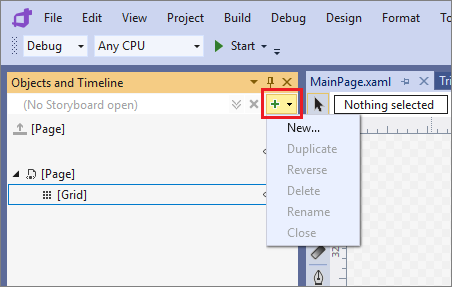

# Animate objects in XAML Designer

Blend for Visual Studio lets you easily create short animations that move objects or fade them in and out, for example.

To create an animation, you need a *storyboard*. A storyboard contains one or more *timelines*. Set *keyframes* on a timeline to mark property changes. Then, when you run the animation, Blend for Visual Studio interpolates the property changes over the designated period of time. The result is a smooth transition. You can animate any property that belongs to an object, even nonvisual properties.

The following images shows a storyboard named **Storyboard1**. The timeline contains keyframes that mark the X and Y position of a rectangle. When this animation runs, the rectangle moves from one position to another smoothly.

## Create an animation

1. To create a storyboard, select the **Storyboard Options** button in the **Objects and Timeline** window, and then select **New**.

   

2. In the **Create Storyboard Resource** dialog box, enter a name for the storyboard.

3. From the **Assets** panel in Design view, add a rectangle to the lower left-hand side of the page.

   

4. In the **Objects and Timeline** window, move the yellow time pointer to **3** seconds.

   

5. In the Design view for the page, drag the rectangle to the right-hand side of the page.

6. Press **Play** to watch the rectangle move from the left-hand side to the right-hand side of the page.

Play around with other changes to the rectangle at different points in time. For example, you can change the fill color or flip the orientation in the Properties window.

## Related content

- [Create a UI by using Blend for Visual Studio](../xaml-tools/creating-a-ui-by-using-blend-for-visual-studio.md)
