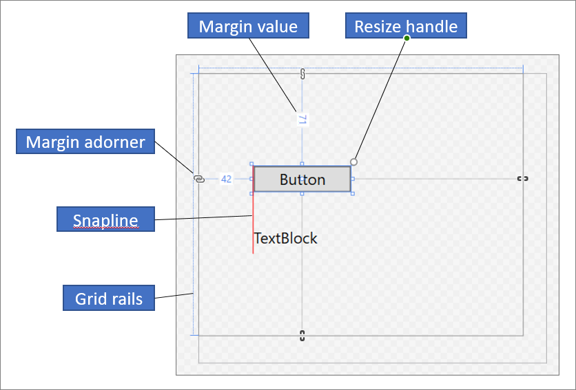
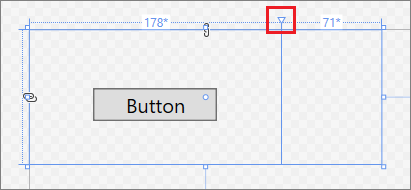
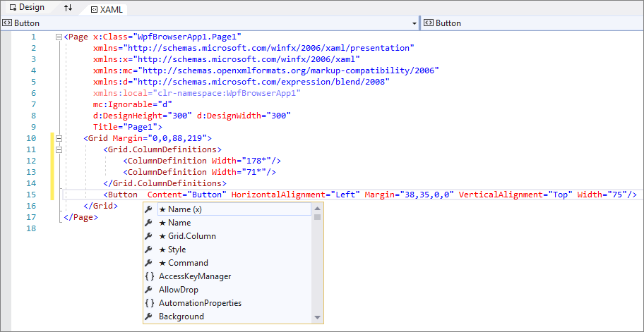
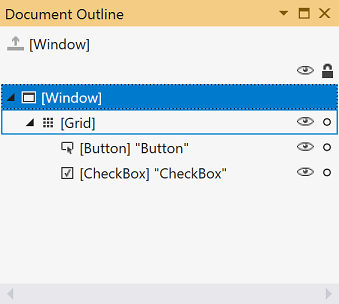
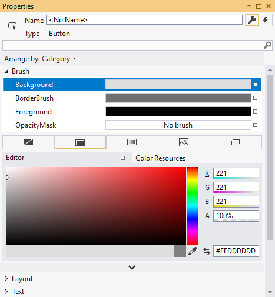

# Create a UI by using XAML Designer

 [!INCLUDE [Visual Studio](~/includes/applies-to-version/vs-windows-only.md)]

The XAML Designer in Visual Studio and Blend for Visual Studio provides a visual interface to help you design XAML-based apps, such as WPF and UWP. You can create user interfaces for your apps by dragging controls from the Toolbox window (Assets window in Blend for Visual Studio) and setting properties in the Properties window. You can also edit XAML directly in XAML view.

For advanced users, you can even [customize the XAML Designer](https://github.com/microsoft/xaml-designer-extensibility/blob/master/documents/xaml-designer-extensibility-migration.md).

> [!NOTE]
> Xamarin.Forms does not support a XAML designer. To view your Xamarin.Forms XAML UIs and edit them while the app is running, use XAML Hot Reload for Xamarin.Forms. For more information, see the [XAML Hot Reload for Xamarin.Forms (Preview)](/xamarin/xamarin-forms/xaml/hot-reload/) page.

> [!NOTE]
> WinUI 3 / .NET MAUI XAML designer is not supported in Visual Studio 2022. To view your WinUI 3 / .NET MAUI XAML UIs and edit them while the app is running, use XAML Hot Reload for WinUI 3 / .NET MAUI. For more information, see the [XAML Hot Reload](../xaml-tools/xaml-hot-reload.md) page.

## XAML Designer workspace

The workspace in XAML Designer consists of several visual interface elements. These include the *artboard* (which is the visual design surface), XAML editor, Document Outline window (Objects and Timeline window in Blend for Visual Studio), and Properties window. To open the XAML Designer, right-click a XAML file in **Solution Explorer** and choose **View Designer**.

XAML Designer provides a XAML view and a synchronized Design view of your app's rendered XAML markup. With a XAML file open in Visual Studio or Blend for Visual Studio, you can switch between Design view and XAML view by using the **Design** and **XAML** tabs. You can use the **Swap Panes** button  to switch which window appears on top: either the artboard or the XAML editor.

### Design view

In Design view, the window containing the artboard is the active window and you can use it as a primary work surface. You can use it to visually design a page in your app by adding, drawing, or modifying elements. For more information, see [Work with elements in XAML Designer](../xaml-tools/working-with-elements-in-xaml-designer.md). This illustration shows the artboard in Design view.

These features are available in the artboard:

**Snaplines**

Snaplines are *alignment boundaries* that appear as red-dashed lines to show when the edges of controls are aligned or when text baselines are aligned. Alignment boundaries appear only when **snapping to snaplines** is enabled.

**Grid rails**

Grid rails are used to manage rows and columns in a [Grid](xref:Windows.UI.Xaml.Controls.Grid) panel. You can create and delete rows and columns, and you can adjust their relative widths and heights. The vertical Grid rail, which appears on the left of the artboard, is used for rows, and the horizontal line, which appears at the top, is used for columns.

**Grid adorners**

A Grid adorner appears as a triangle that has a vertical or horizontal line attached to it on the Grid rail. When you drag a Grid adorner, the widths or heights of adjacent columns or rows update as you move the mouse.

Grid adorners are used to control the width and height of a Grid's rows and columns. You can add a new column or row by clicking in the Grid rails. When you add a new row or column line for a Grid panel that has two or more columns or rows, a mini-toolbar appears outside of the rail that enables you to set width and height explicitly. The mini-toolbar enables you to set sizing options for Grid rows and columns.

**Resize handles**

Resize handles appear on selected controls and enable you to resize the control. When you resize a control, width and height values typically appear to help you size the control. For more information about manipulating controls in **Design** view, see [Work with elements in XAML Designer](../xaml-tools/working-with-elements-in-xaml-designer.md).

**Margins**

Margins represent the amount of fixed space between the edge of a control and the edge of its container. You can set the margins of a control by using the [Margin](xref:Windows.UI.Xaml.FrameworkElement.Margin) properties under **Layout** in the **Properties** window.

**Margin adorners**

Use margin adorners to change the margins of an element relative to its layout container. When a margin adorner is open, a margin is not set and the margin adorner displays a broken chain. When the margin is not set, elements remain in place when the layout container is resized at run time. When a margin adorner is closed, a margin adorner displays an unbroken chain, and elements move with the margin as the layout container is resized at run time (the margin remains fixed).

**Element handles**

You can modify an element by using the element handles that appear on the artboard when you move the pointer over the corners of the blue box that surrounds an element. These handles enable you to rotate, resize, flip, move, or add a corner radius to the element. The symbol for the element handle varies by function and changes depending on the exact location of the pointer. If you don't see the element handles, make sure the element is selected.

In **Design** view, additional artboard commands are available in the lower-left area of the window, as shown here:

These commands are available on this toolbar:

**Zoom**

Zoom enables you to size the design surface. You can zoom from 12.5% to 800% or select options such as **Fit selection** and **Fit all**.

**Show/Hide snap grid**

Displays or hides the snap grid that shows the gridlines. Gridlines are used when you enable either **snapping to gridlines** or **snapping to snaplines**.

**Turn on/off snapping to gridlines**

If **snapping to gridlines** is enabled, an element tends to align with the closest horizontal and vertical gridlines when you drag it onto the artboard.

**Toggle artboard background**

Toggles between a light and dark background.

**Turn on/off snapping to snaplines**

Snaplines help you align controls relative to each other. If **snapping to snaplines** is enabled, when you drag a control relative to other controls, alignment boundaries appear when the edges and the text of some controls are aligned horizontally or vertically. An alignment boundary appears as a red-dashed line.

**Disable project code**

Disables [project code](debugging-or-disabling-project-code-in-xaml-designer.md), for example, custom controls and value converters, and reloads the designer.

### XAML view

In **XAML** view, the window containing the XAML editor is the active window, and the XAML editor is your primary authoring tool. The Extensible Application Markup Language (XAML) provides a declarative, XML-based vocabulary for specifying an application's user interface. XAML view includes IntelliSense, automatic formatting, syntax highlighting, and tag navigation. The following image shows XAML view with an IntelliSense menu open:

## Document Outline window

The Document Outline window in Visual Studio is similar to the [Objects and Timeline window](creating-a-ui-by-using-blend-for-visual-studio.md#objects-and-timeline-window) in Blend for Visual Studio. Document Outline helps you perform these tasks:

- View the hierarchical structure of all elements on the artboard.

- Select elements so that you can modify them. For example, you can move them around in the hierarchy or set their properties in the Properties window. For more information, see [Work with elements in XAML Designer](../xaml-tools/working-with-elements-in-xaml-designer.md).

- Create and modify templates for elements that are controls.

- [Create animations](animate-objects-in-xaml-designer.md) (Blend for Visual Studio only).

To view the Document Outline window in Visual Studio, on the menu bar select **View** > **Other Windows** > **Document Outline**.
To view the Objects and Timeline window in Blend for Visual Studio, on the menu bar select **View** > **Document Outline**.

The main view in the Document Outline/Objects and Timeline window displays the hierarchy of a document in a tree structure. You can use the hierarchical nature of the document outline to examine the document at varying levels of detail and to lock and hide elements singly or in groups. The following options are available in the Document Outline/Objects and Timeline window:

**Show/hide**

Displays or hides artboard elements. Appears as a symbol of an eye when shown. You can also press **Ctrl**+**H** to hide an element and **Shift**+**Ctrl**+**H** to show it.

**Lock/unlock**

Locks or unlocks artboard elements. Locked elements can't be modified. Appears as a padlock symbol when locked. You can also press **Ctrl**+**L** to lock an element and **Shift**+**Ctrl**+**L** to unlock it.

**Return scope to pageRoot**

The option at the top of the Document Outline/Objects and Timeline window, which shows an up arrow symbol, moves to the previous scope. Scoping up is applicable only when you're in the scope of a style or template.

## Properties window

The **Properties** window enables you to set property values on controls. Here's what it looks like:

There are various options at the top of the **Properties** window:

- Change the name of the currently selected element in the **Name** box.
- In the upper-left corner, there's an icon that represents the currently selected element.
- To arrange the properties by category or alphabetically, click **Category**, **Name**, or **Source** in the **Arrange by** list.
- To see the list of events for a control, click the **Events** button, which appears as a lightning bolt symbol.
- To search for a property, start to type the name of the property in the search box. The **Properties** window displays the properties that match your search as you type.

Some properties allow you to set advanced properties by selecting a down arrow button.

To the right of each property value is a *property marker* that appears as a box symbol. The appearance of the property marker indicates whether there's a data binding or a resource applied to the property. For example, a white box symbol indicates a default value, a black box symbol typically indicates that a local resource has been applied, and an orange box typically indicates a data binding has been applied. When you click the property marker, you can navigate to the definition of a style, open the data binding builder, or open the resource picker.

For more information about using properties and handling events, see [Intro to controls and patterns](/windows/uwp/design/controls-and-patterns/controls-and-events-intro).

## See also

- [Work with elements in XAML Designer](../xaml-tools/working-with-elements-in-xaml-designer.md)
- [How to create and apply a resource](../xaml-tools/how-to-create-and-apply-a-resource.md)
- [Walkthrough: Bind to data in XAML Designer](../xaml-tools/walkthrough-binding-to-data-in-xaml-designer.md)
