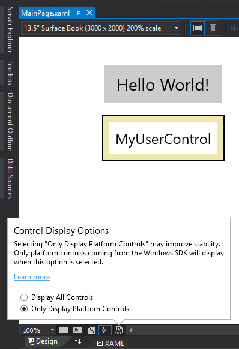

# Debug or disable project code in XAML Designer

 [!INCLUDE [Visual Studio](~/includes/applies-to-version/vs-windows-only.md)]

In many cases, unhandled exceptions in the XAML Designer can be caused by project code attempting to access properties or methods that return different values or work in a different way when your application runs in the designer. You can resolve these exceptions by debugging the project code in another instance of Visual Studio, or temporarily prevent exceptions by disabling project code in the designer.

Project code includes:

- Custom controls and user controls

- Class libraries

- Value converters

- Bindings against design time data generated from project code

When project code is disabled, Visual Studio shows placeholders. For example, Visual Studio shows the name of the property for a binding where the data is no longer available, or a placeholder for a control that's no longer running.

## To determine if project code is causing an exception

1. In the unhandled exception dialog, choose the **Click here to reload the designer** link.

2. On the menu bar choose **Debug** > **Start Debugging** to build and run the application.

     If the application builds and runs successfully, the design-time exception may be caused by your project code running in the designer.

## To debug project code running in the designer

1. In the unhandled exception dialog, choose the **Click here to disable running project code and reload designer** link.

2. In the Windows Task Manager, choose the **End Task** button to close any instances of the Visual Studio XAML Designer that are currently running.

     

3. In Visual Studio, open the XAML page that contains the code or control you want to debug.

4. Open a new instance of Visual Studio, and then open a second instance of your project.

5. Set a breakpoint in your project code.

6. In the new instance of Visual Studio, on the menu bar, choose **Debug** > **Attach to Process**.

7. In the **Attach to Process** dialog, in the **Available Processes** list, choose the process that matches the version of Visual Studio you're using and the platform you're developing for (see the following table), and then choose the **Attach** button.

    |Visual Studio version | Platform      | Process name   |
    |----------------------|---------------|----------------|
    |2017&ndash;2022       | UWP apps      | UwpSurface.exe |
    |2017&ndash;2022       | WPF Core apps | WpfSurface.exe |
    |2019 only             | WPF Framework | xDesProc.exe   |
    |2022 only             | WPF Framework | WpfSurface.exe |

    > [!IMPORTANT]
    > In Visual Studio 2019, it's WpfSurface.exe if **New WPF XAML Designer** is enabled in **Tools** > **Options** > **Environment** > **Preview Features**.

8. In the first instance of Visual Studio, on the menu bar, choose **Debug** > **Start Debugging**.

     You can now step into your code which is running in the designer.

## To disable project code in the designer

- In the unhandled exception dialog, choose the **Click here to disable running project code and reload designer** link.

- Alternatively, on the toolbar in the **XAML designer**, choose the **Disable project code** button.

     

     You can toggle the button again to re-enable project code.

    > [!NOTE]
    > For projects that target ARM or X64 processors, Visual Studio cannot run project code in the designer, so the **Disable project code** button is disabled in the designer.

- Either option causes the designer to reload and then disable all code for the associated project.

    > [!NOTE]
    > Disabling project code can lead to a loss of design-time data. An alternative is to debug the code running in the designer.

## Control display options

> [!NOTE]
> **Control Display Options** is only available for Universal Windows Platform applications that target the Windows 10 Fall Creators Update (build 16299) or later. The **Control Display Options** feature is available in Visual Studio 2017 version 15.9 or later.

In the XAML designer, you can change your control display options to only display platform controls from the Windows SDK. This may improve reliability of the XAML designer.

To change control display options, click the icon in the bottom left of the designer window, and then select an option under **Control Display Options**:

When you select **Only Display Platform Controls**, all custom controls coming from SDKs, customer user controls, and more, will not render completely. Instead, they are replaced by fallback controls to demonstrate the size and position of the control.

## See also

- [Design XAML in Visual Studio and Blend for Visual Studio](designing-xaml-in-visual-studio.md)
