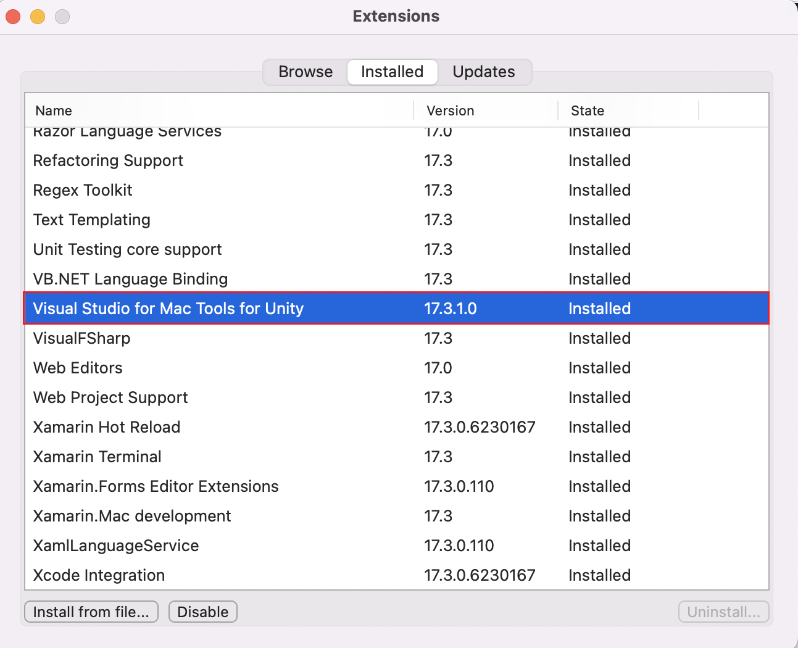
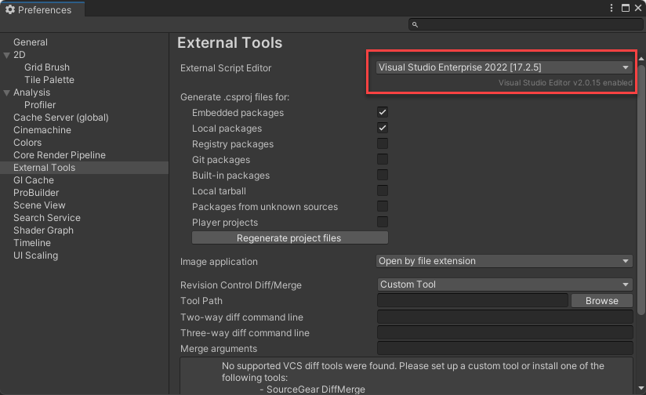
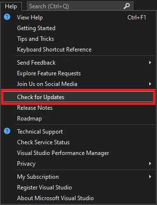

# Quickstart: Configure Visual Studio for cross-platform development with Unity

In this quickstart, you'll learn how to install the Visual Studio Tools for Unity extension and configure it for developing cross-platform games and apps with Unity.  The Visual Studio Tools for Unity extension is free and provides support for writing and debugging C# and more. Visit the [Tools for Unity overview](./visual-studio-tools-for-unity.md) for a complete list of what the extensions includes.

> [!NOTE]
> For Visual Studio Code & Unity, visit the [Unity Development with VS Code documentation](https://code.visualstudio.com/docs/other/unity).

## Install Visual Studio and Unity

:::zone pivot="windows"

1. [Download the Visual Studio installer](/visualstudio/install/install-visual-studio), or open it if already installed.
2. Select **Modify** (if already installed) or **Install** (for new installations) for your desired version of Visual Studio.
3. Select the **Workloads** tab, then select the **Game development with Unity** workload.    
4. If Unity is not already installed, select the Unity Hub checkbox in the Optional section of the installer.
5. Select **Modify** or **Install** to complete the installation.

When Visual Studio completes the installation process you're ready to setup Unity.

1. Open the Unity Hub, which was installed during the Visual Studio Tools for Unity installation.
1. On the left of the Unity Hub window, select the **Installs** tab.
1. Select the **Add** button.
1. In the Add Unity Version window, select a version of Unity to install.
1. Select **Next** to continue the installation.
1. In the **Add modules to your install** step, select **Done**.

>[!NOTE]
>If you've already installed Visual Studio 2022, you can deselect the Microsoft Visual Studio Community 2019 option.

The Unity Hub will continue installing Unity in the background. When it's complete, you can create a new project by selecting the **Projects** tab and selecting the **New** button.

>[!TIP]
>Projects are created using the Unity Editor and not Visual Studio.

:::zone-end
:::zone pivot="macos"

> [!NOTE]
> This installation guide is for Visual Studio for Mac. If you're using Visual Studio Code, please visit the [Unity Development with VS Code documentation](https://code.visualstudio.com/docs/other/unity).

Visual Studio for Mac Tools for Unity is included with the installation of Visual Studio for Mac and no separate installation steps are required. You can verify this in the **Visual Studio for Mac > Extensions > Game Development** menu. **Visual Studio for Mac Tools for Unity** should be enabled.

:::zone-end

## Configure Unity to use Visual Studio

By default, Unity should already be configured to use Visual Studio or Visual Studio for Mac as a script editor. You can confirm this or change the external script editor to a specific version of Visual Studio from the Unity Editor.

:::zone pivot="windows"

1. In the Unity Editor, select the **Edit > Preferences** menu.
2. On the left, select the **External Tools** tab.

    

### Add a version of Visual Studio that is not listed
It's possible to select other versions of Visual Studio that are unlisted and installed in a custom directory.

1. Select **Browse...** from the dropdown list.
2. Navigate to the **Common7/IDE** directory inside your Visual Studio installation directory and select **devenv.exe**. Then, click **Open**.
3. For Unity 2019 and older only, confirm that the **Editor Attaching** checkbox is selected.
4. Close the **Preferences** dialog to complete the configuration process.

:::zone-end
:::zone pivot="macos"

1. In the Unity Editor, select the **Unity > Preferences** menu.
2. On the left, Select the **External Tools** tab.
3. Use the **External Script Editor** dropdown list provides a way to choose different installations of Visual Studio for Mac.

    

4. Close the **Preferences** dialog to complete the configuration process.

:::zone-end

### Install or update the Visual Studio Editor package

In Unity versions 2020 and newer, a separate Unity Package is required for the best experience working with IDEs like Visual Studio and Visual Studio for Mac. This should be included by default, but updates are released to this package that you can update to at any time.

1. In the Unity Editor, select the **Windows > Package Manager** menu.
1. Select the **Visual Studio Editor** package.
1. If a new version is available, select the **Update** button.

## Check for updates

It's recommended to keep Visual Studio and Visual Studio for Mac updated so you have the latest bug fixes, features, and Unity support. This doesn't require an update of Unity versions.

:::zone pivot="windows"

1. Click the **Help > Check for Updates** menu.

        

2. If there is an update available, the Visual Studio Installer will show a new version. Click the **Update** button.

:::zone-end
:::zone pivot="macos"

1. Click the **Visual Studio for Mac > Check for Updates...** menu to open the **Visual Studio Update** dialog.
2. If there is an update available, click the **Install** button.

:::zone-end

## Next steps

Learn about this extension's [integration and productivity features, and how to use the Visual Studio debugger for Unity development](using-visual-studio-tools-for-unity.md).
