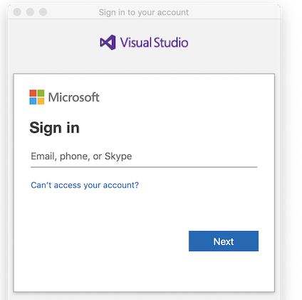

# Sign in to Visual Studio for Mac

Signing in to Visual Studio for Mac is how you [activate your subscription](enable-subscription.md). When you download Visual Studio for Mac, you'll always get the Community edition by default. If you have a [Professional or Enterprise license](https://visualstudio.microsoft.com/vs/compare/), you should sign-in on first run to unlock any additional features. In addition you'll also get the following:

* **Access to the Visual Studio Dev Essentials program** – This program includes free software offerings, training, support, and more. See [Visual Studio Dev Essentials](https://visualstudio.microsoft.com/dev-essentials/) for more information.

* **Automatically connect to Azure** in the IDE without prompting again for credentials for the same account.

When you launch Visual Studio for Mac for the first time, you're prompted to log in using a Microsoft account. Use a Microsoft account that is connected to the license that you wish to use. If you do not have a Microsoft account, see [How do I sign up for an account](https://support.microsoft.com/account-billing/how-to-create-a-new-microsoft-account-a84675c3-3e9e-17cf-2911-3d56b15c0aaf).

If you do decide not to log in straight away, you'll be able to use an evaluation copy for 30 days. After 30 days you must log in to continue using your copy of Visual Studio for Mac.

## How to sign in to Visual Studio for Mac

> [!TIP]
> Make sure that you're connected to the internet before signing in to Visual Studio for Mac. > Subscriptions can only be activated online. If you're not connected, choose "I'll do this later" and log in through the menu when you get connected.

To sign in to Visual Studio for Mac on first launch, do the following steps:

1. Click the **Sign in with Microsoft** button on the sign-in window:

    

2. Enter your Microsoft Credentials:

    

4. After you've logged in, you'll see an option to select keyboard shortcuts. Pick the option you wish to use and **Continue**. You'll then be prompted with the Visual Studio 2019 for Mac start window. From here, you can open or create a new project:

    

Alternatively, you can use the **Visual Studio > Sign in…** menu item to sign in and out at any time.

> [!TIP]
> If you run into any issues signing in, then please try the **Sign in with web browser** option in the **Can't sign in?** drop down menu at the bottom of the **Sign into your account** window. This may be necessary if your Mac is a managed device that uses conditional access.

## Adding multiple user accounts

Visual Studio for Mac supports adding multiple accounts to your personalization account. These additional accounts will allow you to access resources, such as Azure, from any added account.

To add additional user accounts, choose the **Visual Studio > Account...** menu from Visual Studio for Mac. Click the **Add...** button to enter additional account credentials.

## View or change your profile information

1. Go to **Visual Studio > Account…** and select the **My profile** button.

2. In the browser window, choose **Edit profile** and change the settings that you want.

3. When you're done, choose **Save changes**.

## See also

- [Sign in to Visual Studio (on Windows)](/visualstudio/ide/signing-in-to-visual-studio)
- [Work with multiple user accounts (Visual Studio on Windows)](/visualstudio/ide/work-with-multiple-user-accounts)
