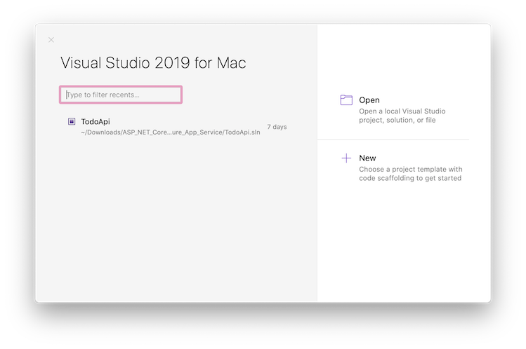

# Sign in to Visual Studio for Mac

Signing in to Visual Studio for Mac is how you [activate your subscription](enable-subscription.md). When you download Visual Studio for Mac, you'll always get the Community edition by default. If you have a [Professional or Enterprise license](https://visualstudio.microsoft.com/vs/compare/), you should sign in on first run to unlock any additional features. In addition you'll also get the following:

* **Access to the Visual Studio Dev Essentials program** – This program includes free software offerings, training, support, and more. See [Visual Studio Dev Essentials](https://visualstudio.microsoft.com/dev-essentials/) for more information.

* **Automatically connect to Azure** in the IDE without prompting again for credentials for the same account.

When you launch Visual Studio for Mac for the first time, you're prompted to sign in using a Microsoft account. Use a Microsoft account that is connected to the license that you wish to use. If you don't have a Microsoft account, see [How do I sign up for an account](https://support.microsoft.com/account-billing/how-to-create-a-new-microsoft-account-a84675c3-3e9e-17cf-2911-3d56b15c0aaf).

By signing-in, you enable access to all the services associated with your user account, as well as all the accounts that are linked to that account. Your account settings roam with you wherever you use Visual Studio for Mac. You can configure permissions levels on a specific Visual Studio instance for individual users.

If you do decide not to log in straight away, you'll be able to use an evaluation copy for 30 days. After 30 days, you must log in to continue using your copy of Visual Studio for Mac.

## How to sign in to Visual Studio for Mac

> [!TIP]
> Make sure that you're connected to the internet before signing in to Visual Studio for Mac. Subscriptions can only be activated online. If you're not connected, select "I'll do this later" and log in through the menu when you get connected.

To sign in to Visual Studio for Mac on first launch, follow these steps:

::: moniker range="vsmac-2019"

1. Select the **Sign in with Microsoft** button on the sign in window:

    

2. Enter your Microsoft account credentials:

    

3. After you've logged in, you'll see an option to select keyboard shortcuts. Choose the option you wish to use and **Continue**. You'll then be prompted with the Visual Studio 2019 for Mac start window. From here, you can open or create a new project:

    

Alternatively, you can use the **Visual Studio > Sign in…** menu item to sign in and out at any time.

::: moniker-end

::: moniker range="vsmac-2022"

1. Select the **Sign in with Microsoft** button on the Sign in Account dialog:

    :::image type="content" source="media/vsmac-2022/start-sign-in.png" alt-text="Screenshot of Sign in accounts dialog in Visual Studio 2022 for Mac.":::

> [!NOTE]
> If you select **I'll do this later**, you can sign in later by selecting **Visual Studio > Sign in…** from the **Visual Studio** menu.

2. Enter your Microsoft account credentials:

    :::image type="content" source="media/vsmac-2022/enter-sign-in-account-details.png" alt-text="Screenshot of entering sign in account details in Visual Studio 2022 for Mac.":::

3. After you've logged in, you'll see an option to select keyboard shortcuts. Select the option you wish to use and **Continue**. You'll then be prompted with the Visual Studio 2022 for Mac start window. From here, you can open or create a new project.

4. Select **Visual Studio > Account...** from the **Visual Studio** menu to sign in and out or to add additional accounts.

    :::image type="content" source="media/vsmac-2022/account-window-after-sign-in.png" alt-text="Screenshot of Account window in Visual Studio 2022 for Mac after signing in.":::

::: moniker-end

> [!TIP]
> If you run into any issues signing in, then please try the **Sign in with web browser** option in the **Can't sign in? > Other Options** drop down menu at the bottom of the **Sign in to your account** window. This may be necessary if your Mac is a managed device that uses conditional access.

## Adding multiple user accounts

Visual Studio for Mac supports adding multiple accounts to your personalization account. These accounts will allow you to access resources, such as Azure, from any added account.

To add additional user accounts, choose the **Visual Studio > Account...** menu from Visual Studio for Mac. Select the **Add...** button to enter additional account credentials.

::: moniker range="vsmac-2022"

:::image type="content" source="media/vsmac-2022/add-additional-accounts.png" alt-text="Screenshot of Account window in Visual Studio 2022 for Mac to manage accounts":::

::: moniker-end

## View or change your profile information

1. Go to **Visual Studio > Account…** and select the **My profile** button.

2. In the browser window, choose **Edit profile** and change the settings that you want.

3. When you're done, choose **Save changes**.

## See also

- [Enable Subscription](enable-subscription.md)
- [Sign in to Visual Studio (on Windows)](/visualstudio/ide/signing-in-to-visual-studio)
- [Work with multiple user accounts (Visual Studio on Windows)](/visualstudio/ide/work-with-multiple-user-accounts)
