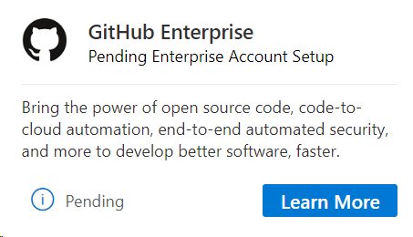
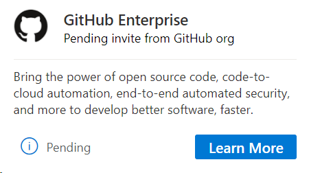
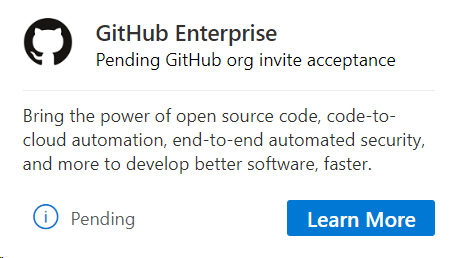
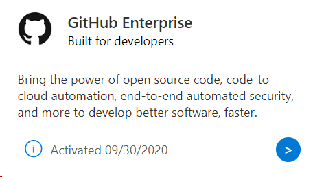

# Visual Studio subscriptions with GitHub Enterprise 

Customers who have Enterprise Agreements (EA) with Microsoft are eligible to purchase a new subscription offer that brings together Visual Studio standard subscriptions and GitHub Enterprise. It's an easy and economical way for Visual Studio subscribers to acquire GitHub Enterprise. 

- Innovate at scale with Visual Studio and GitHub by securely bringing open source code, community, and best practices into your IDE and workflows.
- Use best-in-class development tools and services for developers with the most comprehensive set of resources to create, deploy, and manage great applications. 
- Collaborate and manage "pull requests" on GitHub Enterprise and review source code where it was written - in the editor. 

## What's available? 

The following options are available:

- Visual Studio Enterprise with GitHub Enterprise
- Visual Studio Professional with GitHub Enterprise

Visual Studio Enterprise, Visual Studio Professional, and GitHub Enterprise will also continue to be available separately. 

To learn more about benefits and options, visit <https://visualstudio.microsoft.com/subscriptions/visual-studio-github>. 

## What is the Visual Studio subscription with GitHub Enterprise setup process?

Visual Studio subscriptions with GitHub Enterprise are managed in two parts:
1. The Visual Studio subscription (Enterprise or Professional)
2. GitHub Enterprise 

When you are assigned a Visual Studio subscription with GitHub Enterprise, you'll receive an email letting you know that your Visual Studio subscriptions admin has assigned a subscription to you.  At that point, you will be able to view available subscription benefits at <https://my.visualstudio.com/benefits>.  This includes the GitHub Enterprise benefit as seen below.

   > [!div class="mx-imgBorder"]
   >   

GitHub Enterprise is managed by a GitHub admin separately from Visual Studio subscriptions.  When your company has set up a GitHub Enterprise account, you will receive an email from GitHub notifying you that your Visual Studio subscription has been linked and the benefit tile will be updated as seen below.  Setting up this account may take some time and is dependent on your company completing the setup process. After you receive the email, you can reach out to the appropriate GitHub organization admin to request an invitation to their organization and/or repo.  

   > [!div class="mx-imgBorder"]
   >   

When an invitation is sent by your GitHub organization admin, you will receive an email from GitHub and the benefit tile will update again:

   > [!div class="mx-imgBorder"]
   >   

After you accept the GitHub organization invitation, the status shown on the tile will change from "Pending" to "Activated".

   > [!div class="mx-imgBorder"]
   >   

## Get started with GitHub

If you're new to GitHub, here are some helpful resources:

| Subject                                  | GitHub Help Topic                                     |
|------------------------------------------|-------------------------------------------------------|
| General   questions/information          | [GitHub Help](https://help.github.com)             |
| What is   GitHub?  How do I learn more?  | [About GitHub](https://help.github.com/categories/about-github)                                       |
| How do I   get started using GitHub?     | [Bootcamp](https://help.github.com/categories/bootcamp)                                              |
| How do I manage my   user account and profile?       | [Setting up and   managing your GitHub user account](https://help.github.com/categories/setting-up-and-managing-your-github-user-account)    |
| How do I manage my   access to GitHub?   | [Authenticating to   GitHub](https://help.github.com/categories/authenticating-to-github)                           |
| How does GitHub use and protect my data? | [Understanding how   GitHub uses and protect your data](https://help.github.com/categories/understanding-how-github-uses-and-protects-your-data)|

## Frequently asked questions

### Q:  Where is my GitHub subscription?
A:  The process for setting up a GitHub Enterprise account can take a while.  If you've been waiting and haven't heard anything, you may want to reach out to your GitHub admin.  It's possible that your admin is still working on it or has elected not to create a GitHub Enterprise account. 

### Q: Do I get the full Visual Studio subscription benefits?
A:  Along with GitHub Enterprise, you receive all of the benefits of a standard Visual Studio subscription including software downloads, cloud services, technical support, and partner benefits just as if the subscription was purchased separately.

## Support resources
- Learn more about GitHub assignment at [GitHub Docs](https://docs.github.com/github/setting-up-and-managing-your-enterprise-account/managing-licenses-for-the-github-enterprise-and-visual-studio-bundle)
- Find answers to questions on a wide array of GitHub topics at [GitHub Help](https://help.github.com).
- Need more help?  Contact [GitHub Support](https://support.github.com/)
- Get help from other GitHub users in the [GitHub Community Forum](https://github.community/).
- For assistance with sales, subscriptions, accounts, and billing for Visual Studio Subscriptions, please visit our [Get Help](https://aka.ms/vssubscriberhelp) page.
- Have a question about Visual Studio IDE, Azure DevOps Services or other Visual Studio products or services?  Visit [Visual Studio Support](https://visualstudio.microsoft.com/support/).
- Get [technical support](https://support.microsoft.com/en-us/supportforbusiness/productselection?sapId=b77fe80f-5417-80bd-4b2a-275cf0018c24) for GitHub Enterprise.   

## See also
- [Visual Studio documentation](https://docs.microsoft.com/visualstudio/)
- [Azure DevOps documentation](https://docs.microsoft.com/azure/devops/)
- [Azure documentation](https://docs.microsoft.com/azure/)
- [Microsoft 365 documentation](https://docs.microsoft.com/microsoft-365/)

## Next steps
If you're new to GitHub, check out the [GitHub Learning Lab](https://lab.github.com/), which takes you through a series of fun and practical projects, sharing helpful feedback along the way.
