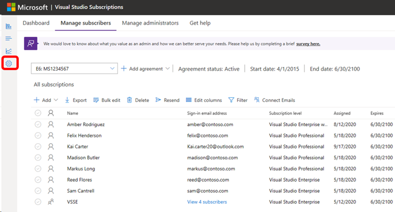
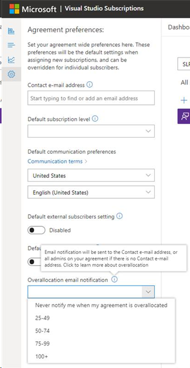

# Set preferences for your agreements in the admin portal
Super admins can set certain preferences in the Administration Portal (admin portal) that will be applied globally for each agreement.  These preferences will automatically populate subscription details for your admins when they are adding subscribers, and can only be modified globally by super admins.  

## Access preferences
You must be signed in to the [admin portal](https://manage.visualstudio.com) using a sign in ID that has super admin rights on the agreement in order to view or modify the preferences.  

To set your preferences:
1. Sign in to the admin portal with an ID that has super admin privileges.
2. Click on the setting icon in the left pane.
   > [!div class="mx-imgBorder"]
   > 

3. Click **Agreement Preferences**.
A panel will open on the left and your available preferences will be displayed. 

   > [!div class="mx-imgBorder"]
   > 

## Set your preferences
Let's explore each of the available preferences, and their effects. 

### Agreement
If you have multiple agreements for which you're a super admin, you'll be able to choose the desired agreement in the drop-down to the right of the expanded settings panel.  The preferences you set will apply only to that agreement.  Individual admins can override some of these preferences on a case-by-case basis when assigning subscriptions. 

If there is only one agreement associated with the email address you used to sign in, it will be displayed to the right of the expanded settings panel and the drop-down will be disabled. 

### Contact email address
This preference provides a way for your subscribers to reach out to admins through the use of the **Contact my Admin** button on the [subscriptions page](https://my.visualstudio.com/subscriptions) of the subscriber portal.  If this preference is left blank, subscriber messages will be forwarded to all admins and super admins on the agreement.  We recommend using a group email alias or security group to tailor your audience for this contact email. You can also choose to input an individual’s email address if you prefer.

> [!NOTE]
> The email address you list here will NOT be provided to subscribers.  When a subscriber submits a **Contact my Admin** request in the subscriber portal, the message will be forwarded to the alias without exposing it to the subscriber. 

### Default subscription level
You can use this setting to determine which of the subscription levels included in your agreement is selected by default when a subscription is assigned to a user.  Admins can change the setting to any subscription level in your agreement -- this just prevents having to repeatedly make your most common choice. 

### Default communication preferences
Setting a default communication language and locale can streamline the process of assigning subscriptions.  For example, if your development team is based in a different country than your admin team, you can set the preferences best suited to the subscribers' location. These settings can still be changed by all admins for individual subscribers. 

### Default external subscribers setting
This preference allows you to decide whether admins can add subscribers from outside your organization's tenant/directory.  If you turn this off, no outside subscribers will be allowed.  If you enable it and an admin attempts to add an outside subscriber, they will be asked to confirm their choice, and will be allowed to assign the subscription. Admins cannot override this setting. 

### Default downloads setting
Enabling this setting, which is on by default, will enable subscribers to access downloads when admins create new subscriptions.  Admins can still disable downloads on an individual subscription basis.  Disabling access to downloads also disables access to product keys.  

### Overallocation notification 
Opt-in to receive an email when assignments on your agreement become overallocated. This email notification will be sent to the [Contact e-mail address](admin-preferences.md#contact-email-address), or all admins on your agreement if there is no Contact e-mail address. Use the drop down menu to configure the threshold at which you'd like to be notified. 

 
## Frequently asked questions
### Q:  Can I disable the **Contact email address** so subscribers cannot contact admins?
A:  No - while you can determine which admins are contacted using a security group, group email alias or an individual email address, the feature cannot be disabled.

### Q: If I answer a subscriber's email, will they have my email address?
A:  Since your response will come from whatever email client you're using, the response the subscriber receives will show whatever email address you're using.  So, if you're responding from a group alias, they'll see the group alias.  If you respond from your own email address, they will see that.  

### Q: Where can I find out more about the **Contact my Admin** feature in the subscriber portal?
A:  Check out our [Contact my Admin](contact-my-admin.md) article. 

### Q: If we don't complete the **Contact email address** and a subscriber uses the **Contact my Admin** feature, who receives their request?
A:  If no specific email address is set in the **Contact email address** preference, all admins on the agreement will receive the request. 

## Resources
- [Visual Studio administration and subscriptions support](https://aka.ms/vsadminhelp)

## See also
- [Visual Studio documentation](/visualstudio/)
- [Azure DevOps documentation](/azure/devops/)
- [Azure documentation](/azure/)
- [Microsoft 365 documentation](/microsoft-365/)

## Next steps
Learn more about managing Visual Studio subscriptions.
- [Assign individual subscriptions](assign-license.md)
- [Assign multiple subscriptions](assign-license-bulk.md)
- [Edit subscriptions](edit-license.md)
- [Determine maximum usage](maximum-usage.md)